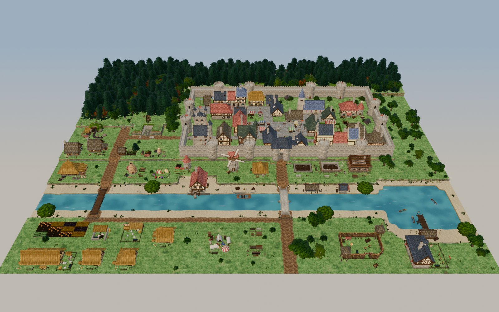
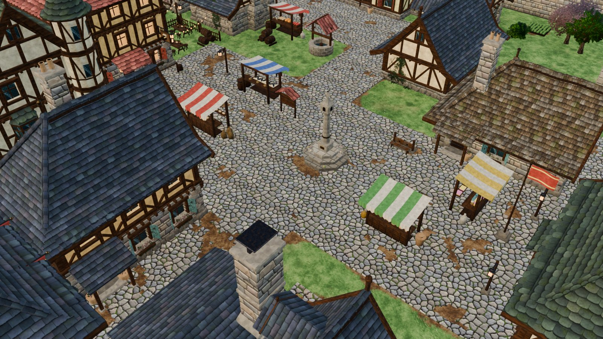
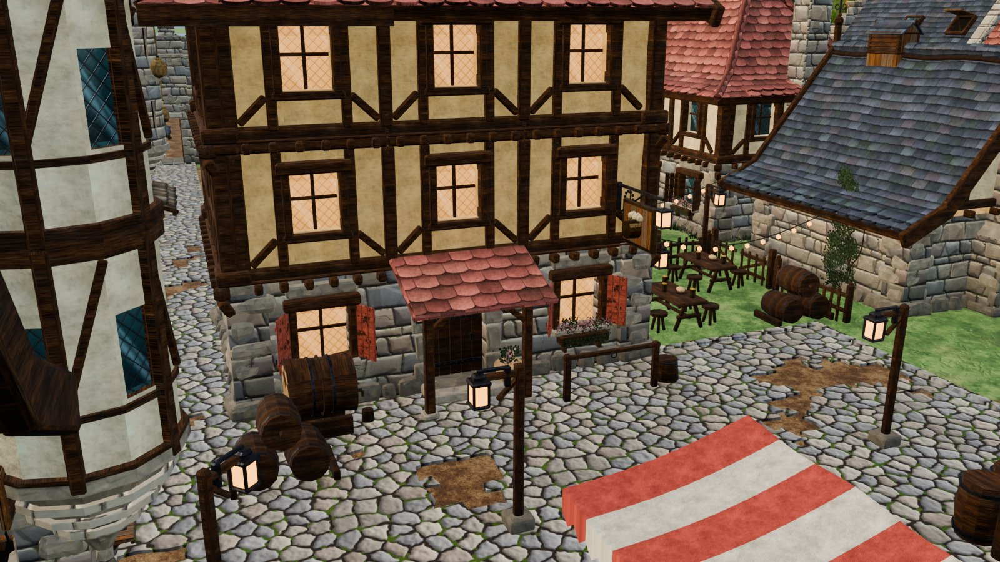
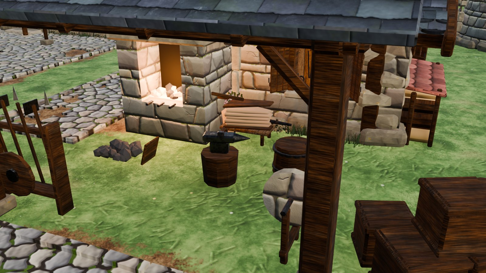
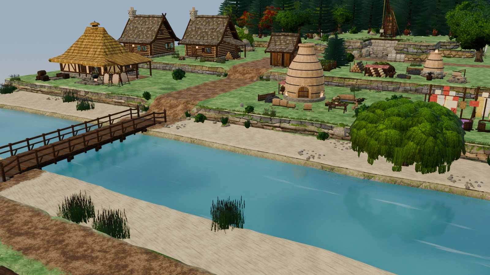
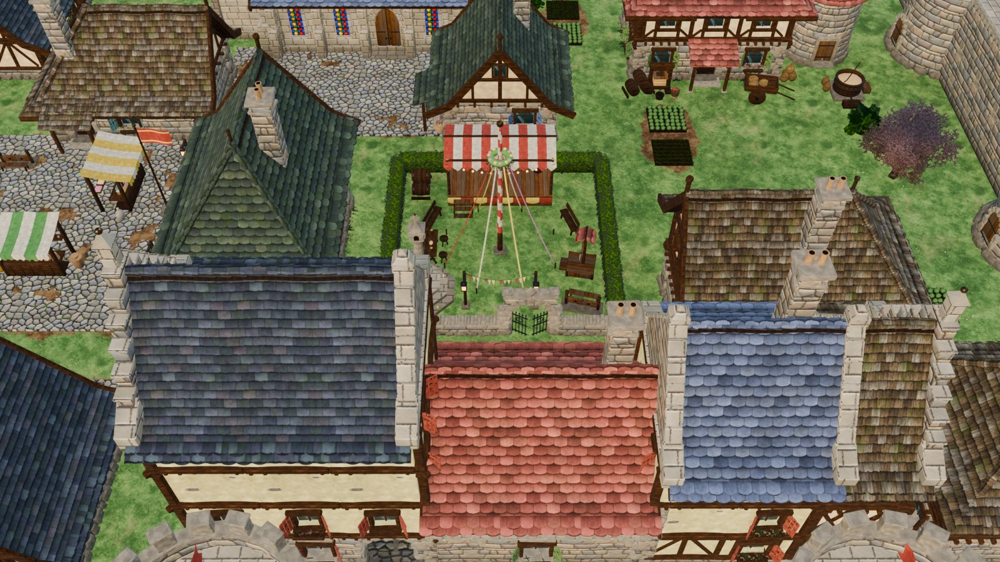
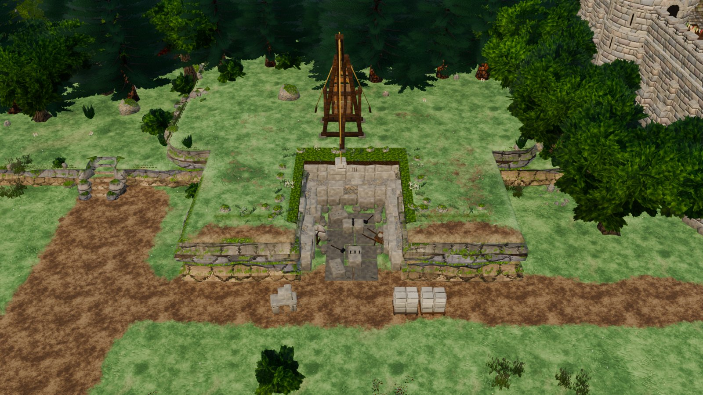
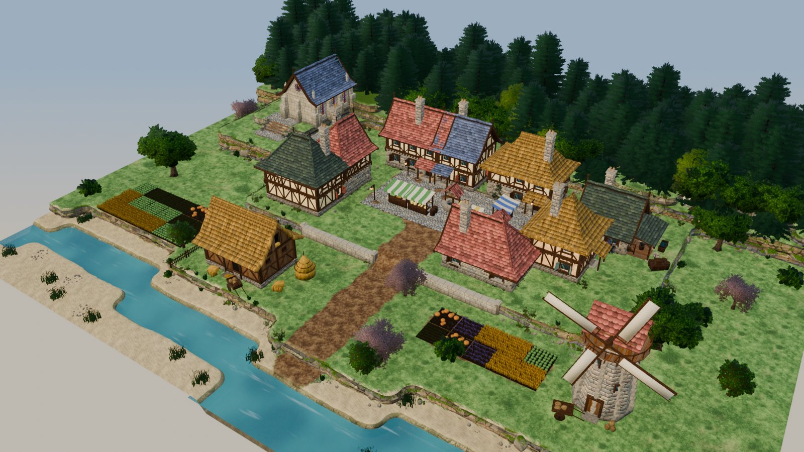

# Medieval Village Kit

A procedural, hand-painted (World of Warcraft–style) medieval building and terrain kit made in Blender 4.4, for a Unity
colony sim. Everything — meshes, PBR textures, materials, the marching-squares terrain and the showcase maps — is
generated by the Python code in `src/`, which also lives inside the .blend as Blender texts.

- **Kit:** about 420 building pieces (walls, roofs, props, 8 themed modules, landmark smithy and inn, market stalls),
  39 nature pieces, 26 terrain tiles. Catalogue: [docs/PIECES.md](docs/PIECES.md).
- **Terrain:** dual-grid marching-squares tiles connected by their corners: cliffs, shores, ramps and stairs with cliff
  transitions, water, cobble paving with curbs.
- **Showcase:** a 216 × 168 m valley town (walls, gatehouse, river, lake, districts) plus a small terrain demo.

Continuing the work (a person or an agent): read **[HANDOFF.md](HANDOFF.md)** first.

## Gallery

Blender (EEVEE) renders of the generated valley town. Every building, prop, tree, terrain tile and texture in them
comes from the code in `src/`.



<table>
<tr>
<td width="50%"><br><sub>Market plaza: cobbles on a curb with patches of missing stones, and stalls that each sell different goods.</sub></td>
<td width="50%"><br><sub>The tavern: three storeys, lit windows, a tankard sign and a beer garden.</sub></td>
</tr>
<tr>
<td><br><sub>The blacksmith: glowing forge, anvil, grindstone and tool rack under an open workshop roof.</sub></td>
<td><br><sub>River with a sandy bank, watermill, windmill and the town wall.</sub></td>
</tr>
<tr>
<td><br><sub>Festival green with a maypole, stage and benches, among coloured roofs.</sub></td>
<td><br><sub>A quarry cut into a terrace. The cliff tiles get rock relief, boulders, rubble and plants.</sub></td>
</tr>
</table>



<sub>The terrain demo: dual-grid marching-squares tiles (terraces, cliffs, shores, ramps, water) with a small village.</sub>

## Folder map

| Folder | What is in it |
|---|---|
| `blender/` | `medievalDiorama.blend`, the working file (scene **VillageKit**). Not in git (370+ MB). |
| `src/` | The generator code, one file per Blender text: `core/` (loader, kit core, materials, render helper), `textures/`, `modules/` (8 building modules), `nature/`, `terrain/`, `maps/` (valley town), `workshop/`, `early_scenes/` (first colony diorama, stone wall kit, hero tree). |
| `tools/` | `kit_sync.py` (sync `src/` ⇄ Blender texts), `render_showcase.py` (re-renders the gallery into `docs/images/`) and `workflows/` (the multi-agent workflow scripts used to build and review the kit). |
| `blender_addons/` | `unity_nav.py`: Unity-style viewport navigation (installed in Blender 4.4). |
| `docs/` | [KIT_README.md](docs/KIT_README.md) (how the .blend and the code are organised, common tasks, conventions), [VALLEY_MAP.md](docs/VALLEY_MAP.md) (the showcase map), [PIECES.md](docs/PIECES.md), `images/` (the gallery above), `feedback_screenshots/`, `history/` (design briefs, specs and panels from the build). |
| `reviews/` | Review findings (valley reviews 1 and 2, module-build agent reports) and the raw workflow results. |
| `assets/` | `textures/` (all generated PBR textures; also packed in the .blend), `tree_asset/` (hero oak FBX + textures), `stone_wall_kit_fbx/`, `texture_dev/` (texture experiments). |
| `renders/` | Every render made while building: `showcase/`, `final/`, `fix/`, `nature/`, `modules/<module>/`, `valley_review_1/`, `valley_review_2/`, `misc/`. New renders from `shot()` go to `renders/wip/`. |
| `archive/` | History: `script_logs/` (every script run in Blender, chronological, from the session transcripts), `patches/` (one-shot edit scripts), `dev_scripts/`, `dev_data/`, `workshop_modules/` (pre-integration module versions), `backups/`. |

## Quick start

1. Run `open_in_blender.bat` (Blender 4.4). The Blender MCP add-on starts its server on port 9876 by itself.
2. In Blender (Text Editor or MCP), load the kit and sync the code:

```python
import bpy
exec(open(r"E:\Unity\Projects\GameArtGeneration\MedievalVillageKit\tools\kit_sync.py", encoding="utf8").read())
status()                                   # texts vs src/ files; push("name") after editing a file
exec(bpy.data.texts["vk_kit"].as_string()); g = vk_kit_ns()
g["full_rebuild"]()                        # rebuild all kit pieces in place
exec(bpy.data.texts["vk_town_map"].as_string(), g); g["build_valley_town"]()   # rebuild the valley (60–90 s)
```

More commands (nature rebuild, terrain tests, renders): [docs/KIT_README.md §3](docs/KIT_README.md).

## Repository

Git tracks the code, tools, docs (with the gallery images), reviews, script logs and the small assets. The large
binaries stay on disk but are ignored (see `.gitignore`): the .blend (370+ MB, over GitHub's 100 MB limit),
`renders/` (~1.7 GB of work-in-progress renders), `assets/textures/` (generated, and packed inside the .blend) and
`assets/texture_dev/`. Back those up separately, or switch them to Git LFS (`git lfs track "*.blend"`) if a remote with
enough LFS storage is used.

The .blend is not published for a second reason: besides the kit it holds a `SpriteRig` scene with third-party
character assets that may not be redistributed. Strip that scene (and anything it references) before sharing the file.

Unity export is deliberately deferred until the Blender files are finished. Target project: `E:\Unity\Projects\MedievalSetting`.
