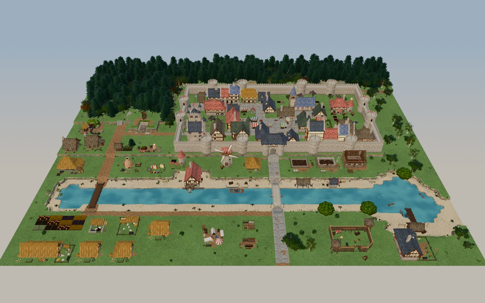
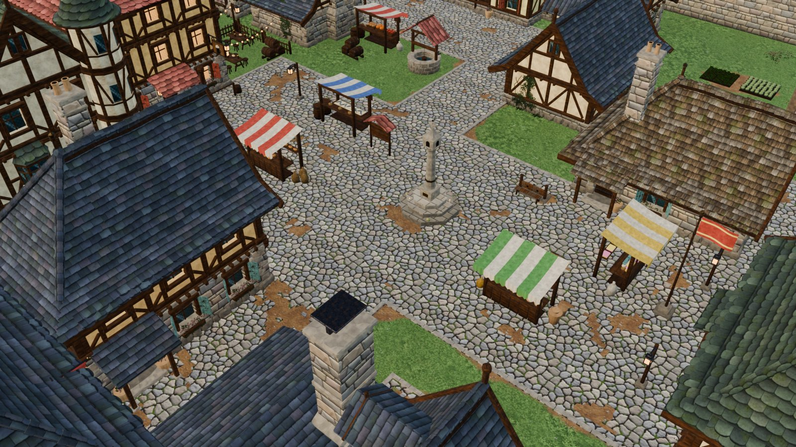
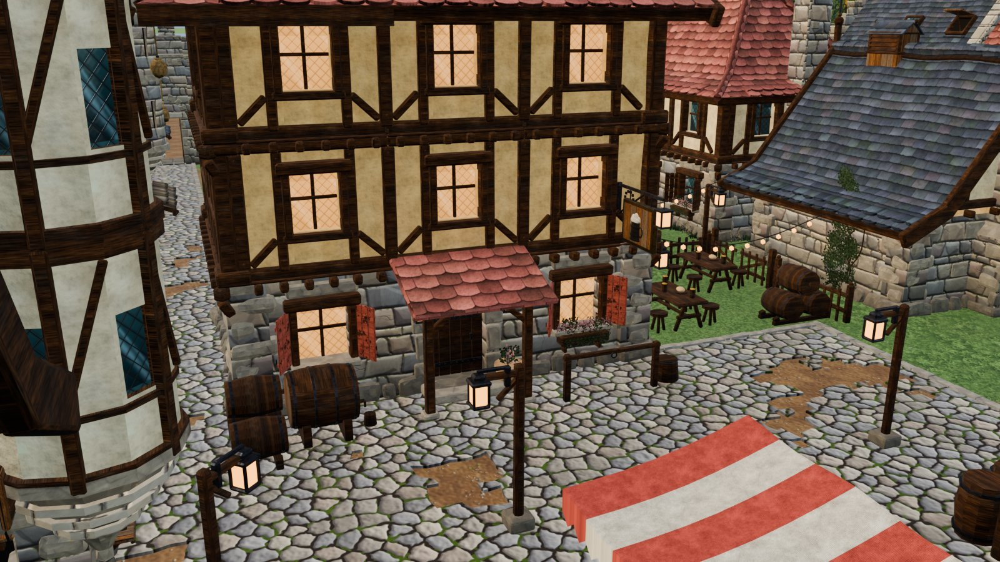
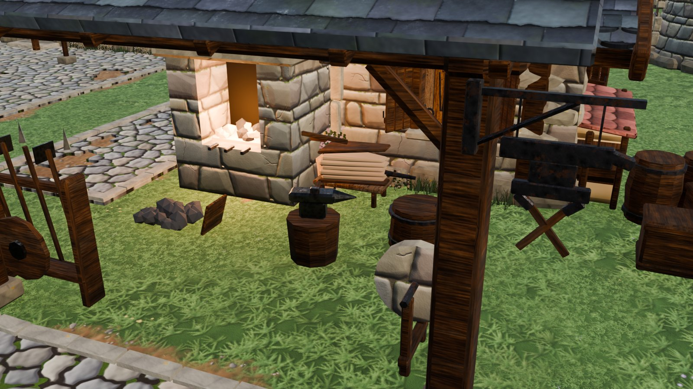
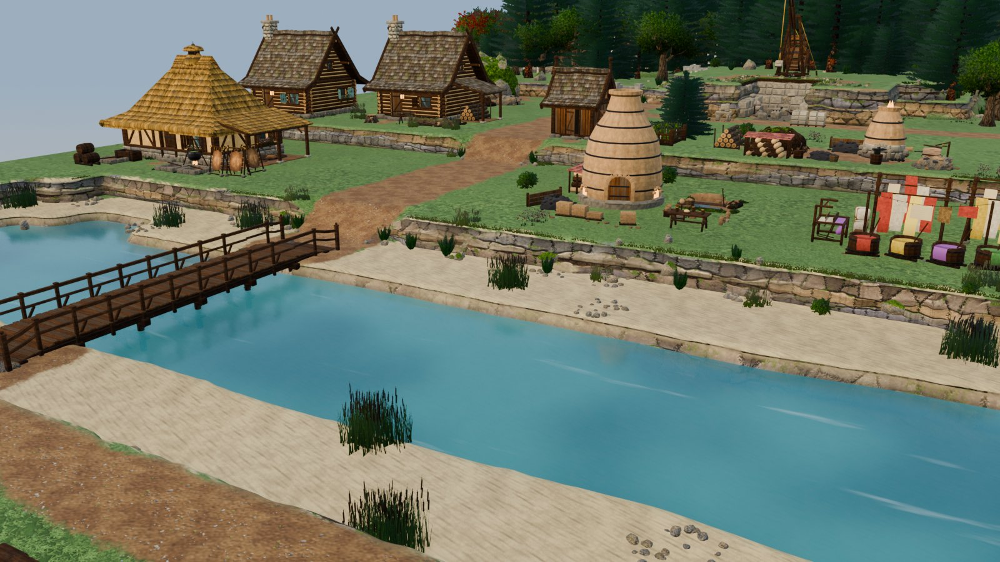
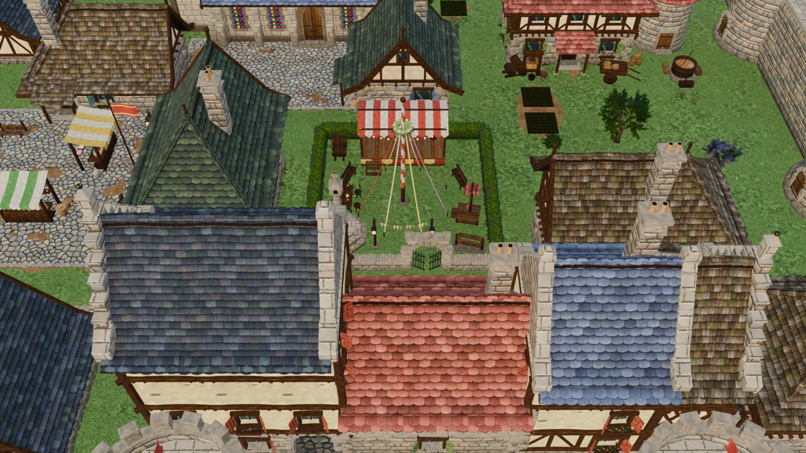
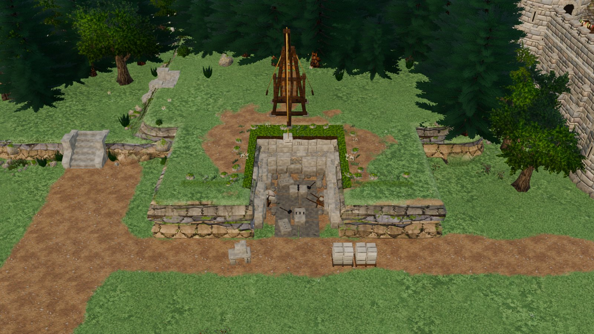
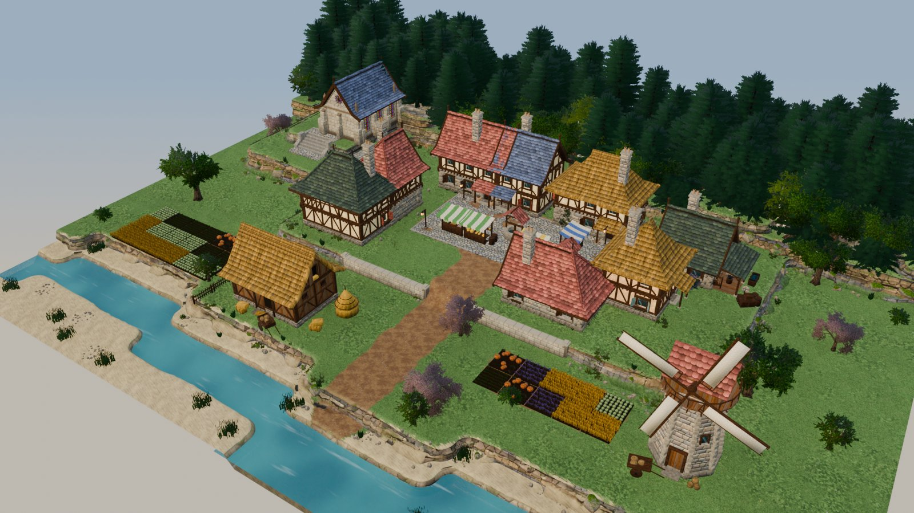
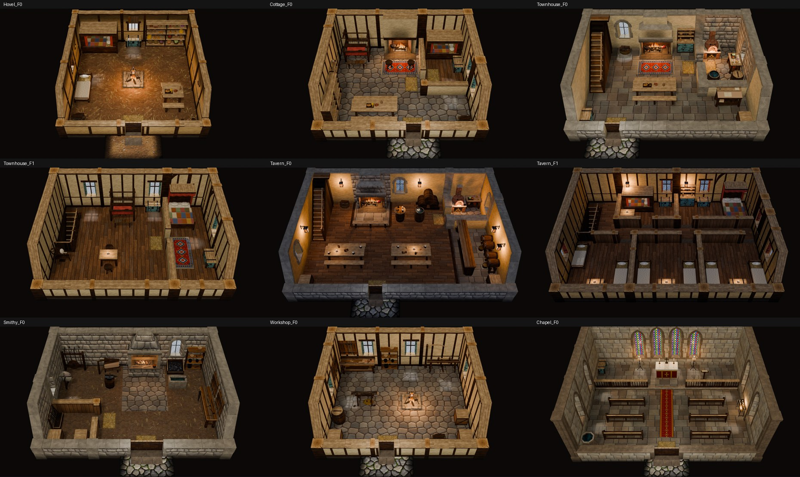

# Medieval Village Kit

A procedural, hand-painted (World of Warcraft–style) medieval building and terrain kit made in Blender 4.4, for a Unity
colony sim. Everything — meshes, PBR textures, materials, the marching-squares terrain and the showcase maps — is
generated by the Python code in `src/`, which also lives inside the .blend as Blender texts.

- **Kit:** about 420 building pieces (walls, roofs, props, 8 themed modules, landmark smithy and inn, market stalls),
  39 nature pieces, 26 terrain tiles. Catalogue: [docs/PIECES.md](docs/PIECES.md).
- **Terrain:** dual-grid marching-squares tiles connected by their corners: cliffs, shores, ramps and stairs with cliff
  transitions, water, cobble paving with curbs.
- **Showcase:** a 216 × 168 m valley town (walls, gatehouse, river, lake, districts) plus a small terrain demo.
- **Interiors:** a modular interior kit for a top-down camera (146 pieces on a 1.5 m grid, walls in full and cut-away
  heights, furniture for homes, tavern, smithy, workshop and chapel) and nine showcase interiors, one scene per floor.
  Reference: [docs/INTERIOR_KIT.md](docs/INTERIOR_KIT.md).
- **Dungeons:** a dungeon kit on the same framework (46 pieces: dark masonry, iron bars and gates, light grates, ossuary
  niches, stone stairs, torches, cages, sarcophagi, treasure) and two linked levels, a gaol and a crypt.
  Reference: [docs/DUNGEON_KIT.md](docs/DUNGEON_KIT.md).
- **Adventuring places:** an adventure kit on top of it (331 pieces: traps and mechanisms, a sunken temple's ruins,
  organic caves on a painted cell map with winding chasms and pools, monster lairs, loot, transitions where masonry
  breaks into caves, a cave generator) and three more levels down the same descent: a trapped temple, caverns crossed
  by a rope bridge, a goblin warren. Reference: [docs/ADVENTURE_KIT.md](docs/ADVENTURE_KIT.md).
- **Sewers:** a sewer kit (30 pieces: brick tunnels, water channels as dual-grid tiles, culverts, an outfall, a
  sluice, bridges, a ladder up to the street, breaches into caves) and a town sewer level.
  Reference: [docs/SEWER_KIT.md](docs/SEWER_KIT.md).
- **Natural water:** a water kit (61 pieces: streams that wind through the cave maps, waterfalls from rock faces and
  over a chasm's lip, stepping stones, flow directions for Unity's water shaders) and an underground river level.
  Reference: [docs/WATER_KIT.md](docs/WATER_KIT.md).
- **Dwarven halls:** a dwarf kit (36 pieces: granite walls with a gilded rune band, corbelled doorways, a great gate
  with rune-carved stone leaves, lava channels with a hot core, pillars, a throne, king statues, braziers, a forge,
  red clan banners, a stone arch bridge, a gold floor medallion) and a great hall carved into the mountain, with a
  treasury and a foundry. Reference: [docs/DWARF_KIT.md](docs/DWARF_KIT.md).
- **Points of interest:** six landmark pieces, one per theme, each placed once in a level: a great wyrm's bones, a
  fallen colossus's head, a dwarven foundry's crucible, a necromancer's circle, the rat king's throne of junk, a sacred
  spring. Reference: [docs/POINTS_OF_INTEREST.md](docs/POINTS_OF_INTEREST.md).
- **Debris:** twenty pieces of loose debris (rocks, rubble, broken pottery, splintered wood, fallen masonry, lost
  gear, a cold campfire, ore, slag, rags) and a scatter pass that strews them over every adventure level by theme,
  gathering stone at the feet of walls and rock faces. Reference: [docs/DEBRIS.md](docs/DEBRIS.md).
- **Mines:** a mine kit (35 pieces: rail track laid from polylines with turntables at the junctions, carts, timber sets
  with lanterns, timber lining for the galleries, gold, iron and crystal veins, a timbered shaft with a great treadwheel
  over it, a timbered adit, ore piles, a sorting bench, a cave-in) and a mine under the dwarf hall, its galleries
  timber-lined, with its lift down and its adit up toward the town. Reference: [docs/MINE_KIT.md](docs/MINE_KIT.md).

Continuing the work (a person or an agent): read **[HANDOFF.md](HANDOFF.md)** first.

How it was made: the kit was built by Claude (Claude Code, driving Blender) from a conversation. Every prompt, word
for word, is in **[docs/conversation/CONVERSATION_PROMPTS.md](docs/conversation/CONVERSATION_PROMPTS.md)**, with the
screenshots that came with them.

## Gallery

Blender (EEVEE) renders of the generated valley town. Every building, prop, tree, terrain tile and texture in them
comes from the code in `src/`.



<table>
<tr>
<td width="50%"><br><sub>Market plaza: cobbles on a curb with patches of missing stones, and stalls that each sell different goods.</sub></td>
<td width="50%"><br><sub>The tavern: three storeys, lit windows, a tankard sign and a beer garden.</sub></td>
</tr>
<tr>
<td><br><sub>The blacksmith: glowing forge, anvil, grindstone and tool rack under an open workshop roof.</sub></td>
<td><br><sub>River with a sandy bank, watermill, windmill and the town wall.</sub></td>
</tr>
<tr>
<td><br><sub>Festival green with a maypole, stage and benches, among coloured roofs.</sub></td>
<td><br><sub>A quarry cut into a terrace. The cliff tiles get rock relief, boulders, rubble and plants.</sub></td>
</tr>
</table>



<sub>The terrain demo: dual-grid marching-squares tiles (terraces, cliffs, shores, ramps, water) with a small village.</sub>



<sub>The interior kit: hovel, cottage, townhouse (two floors), tavern (two floors), smithy, workshop and chapel, each a
separate scene entered through its door. Walls toward the camera use the cut-away pieces.</sub>


<sub>The dungeon kit: the gaol (level B1) with barred cells under light grates, a holding pen, the guard table and a
brazier; stairs lead up to the surface and down to the crypt.</sub>


<sub>The adventure kit: the sunken temple (level B3): a gallery of traps, a portcullis, guardian statues round a golden
idol, and a vault behind a rolling stone door. Below it lie the caverns and a goblin warren.</sub>


<sub>The sewer kit: brick tunnels in solid rock with water channels, bridges, a culvert, a sluice under an outfall and a
ladder to the street; the south wall is broken into a natural grotto.</sub>

## Folder map

| Folder | What is in it |
|---|---|
| `blender/` | `medievalDiorama.blend`, the working file (scene **VillageKit**). Not in git (370+ MB). |
| `src/` | The generator code, one file per Blender text: `core/` (loader, kit core, materials, render helper), `textures/`, `modules/` (8 building modules), `nature/`, `terrain/`, `maps/` (valley town), `workshop/`, `interior/` (the interior kit: core, textures, wall families, furniture, the room assembler), `early_scenes/` (first colony diorama, stone wall kit, hero tree). |
| `tools/` | `kit_sync.py` (sync `src/` ⇄ Blender texts), `render_showcase.py` (re-renders the gallery into `docs/images/`) and `workflows/` (the multi-agent workflow scripts used to build and review the kit). |
| `blender_addons/` | `unity_nav.py`: Unity-style viewport navigation (installed in Blender 4.4). |
| `docs/` | [KIT_README.md](docs/KIT_README.md) (how the .blend and the code are organised, common tasks, conventions), [VALLEY_MAP.md](docs/VALLEY_MAP.md) (the showcase map), [PIECES.md](docs/PIECES.md), `images/` (the gallery above), `conversation/` (every prompt that built the kit), `feedback_screenshots/`, `history/` (design briefs, specs and panels from the build). |
| `reviews/` | Review findings (valley reviews 1 and 2, module-build agent reports) and the raw workflow results. |
| `assets/` | `textures/` (all generated PBR textures; also packed in the .blend), `tree_asset/` (hero oak FBX + textures), `stone_wall_kit_fbx/`, `texture_dev/` (texture experiments). |
| `renders/` | Every render made while building: `showcase/`, `final/`, `fix/`, `nature/`, `modules/<module>/`, `valley_review_1/`, `valley_review_2/`, `misc/`. New renders from `shot()` go to `renders/wip/`. |
| `archive/` | History: `script_logs/` (every script run in Blender, chronological, from the session transcripts), `patches/` (one-shot edit scripts), `dev_scripts/`, `dev_data/`, `workshop_modules/` (pre-integration module versions), `backups/`. |

## Quick start

1. Run `open_in_blender.bat` (Blender 4.4). The Blender MCP add-on starts its server on port 9876 by itself.
2. In Blender (Text Editor or MCP), load the kit and sync the code:

```python
import bpy
exec(open(r"E:\Unity\Projects\GameArtGeneration\MedievalVillageKit\tools\kit_sync.py", encoding="utf8").read())
status()                                   # texts vs src/ files; push("name") after editing a file
exec(bpy.data.texts["vk_kit"].as_string()); g = vk_kit_ns()
g["full_rebuild"]()                        # rebuild all kit pieces in place
exec(bpy.data.texts["vk_town_map"].as_string(), g); g["build_valley_town"]()   # rebuild the valley (60–90 s)
```

More commands (nature rebuild, terrain tests, renders): [docs/KIT_README.md §3](docs/KIT_README.md).

## Repository

Git tracks the code, tools, docs (with the gallery images), reviews, script logs and the small assets. The large
binaries stay on disk but are ignored (see `.gitignore`): the .blend (370+ MB, over GitHub's 100 MB limit),
`renders/` (~1.7 GB of work-in-progress renders), `assets/textures/` (generated, and packed inside the .blend) and
`assets/texture_dev/`. Back those up separately, or switch them to Git LFS (`git lfs track "*.blend"`) if a remote with
enough LFS storage is used.

The .blend is not published for a second reason: besides the kit it holds a `SpriteRig` scene with third-party
character assets that may not be redistributed. Strip that scene (and anything it references) before sharing the file.

Unity export is deliberately deferred until the Blender files are finished. Target project: `E:\Unity\Projects\MedievalSetting`.
