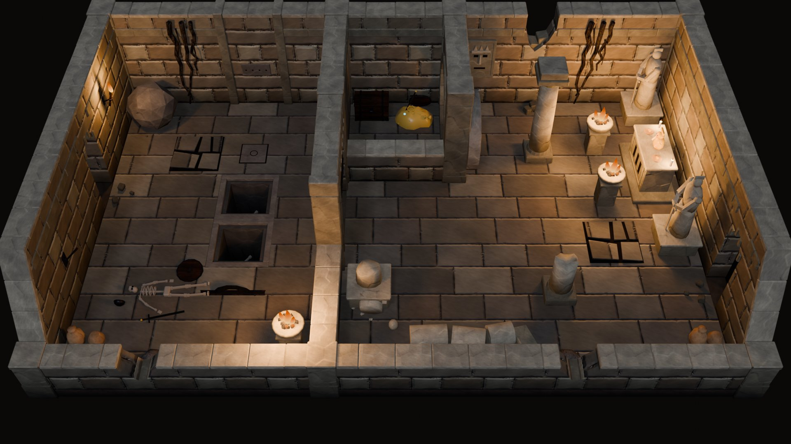
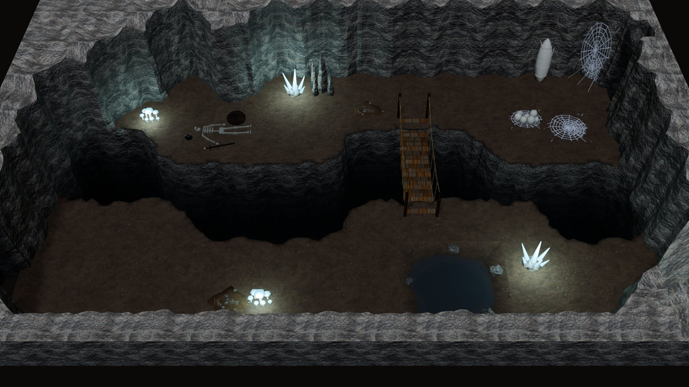
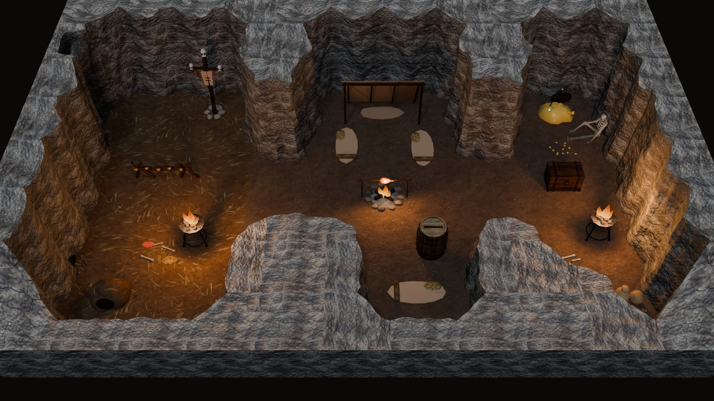
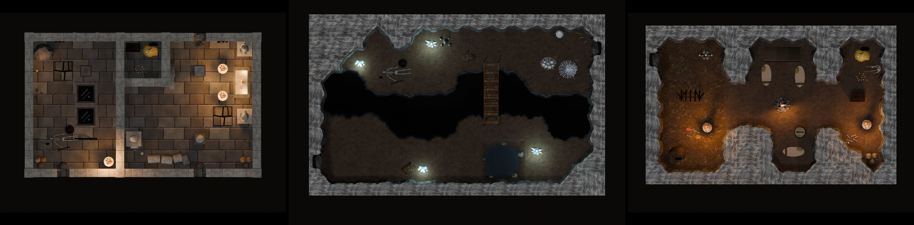
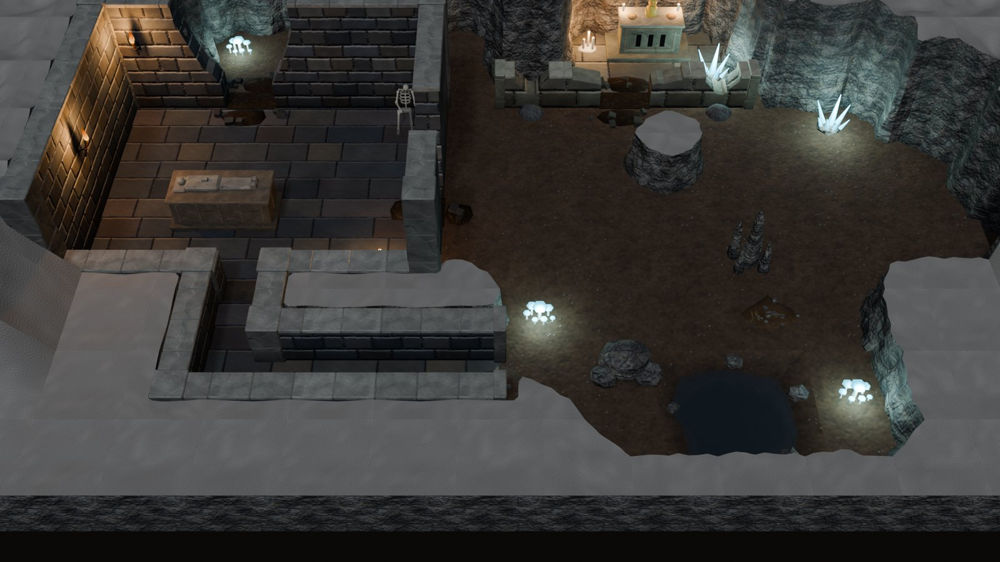
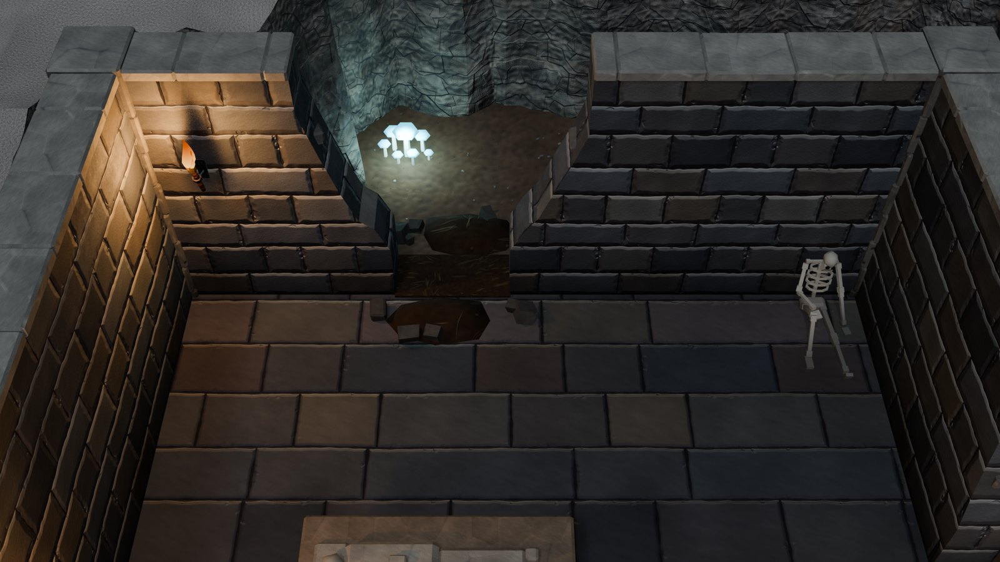
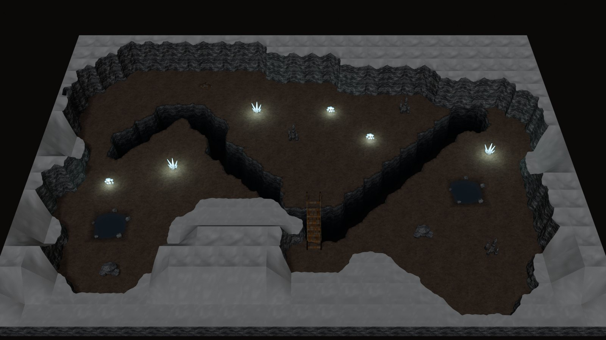
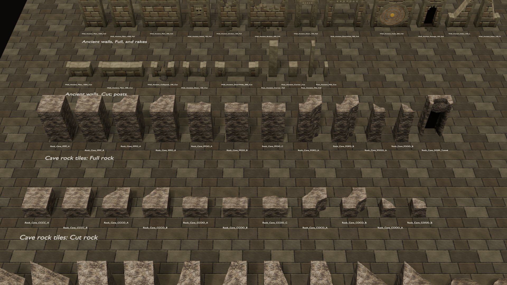
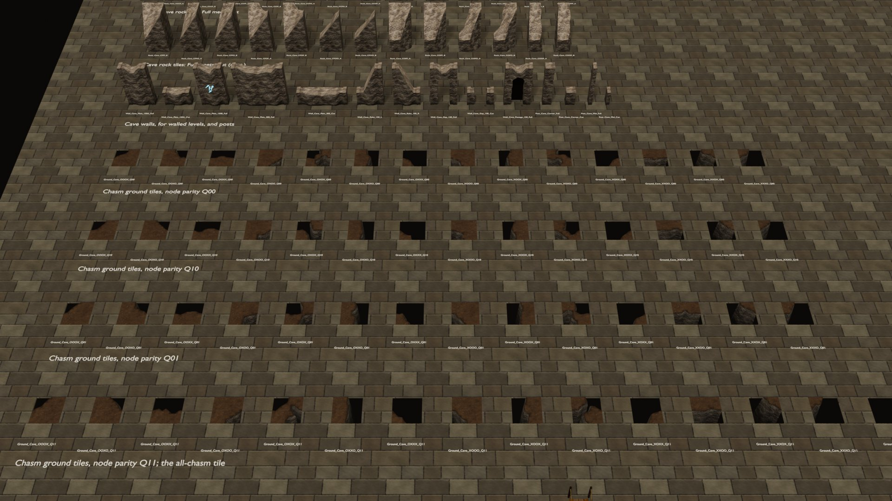
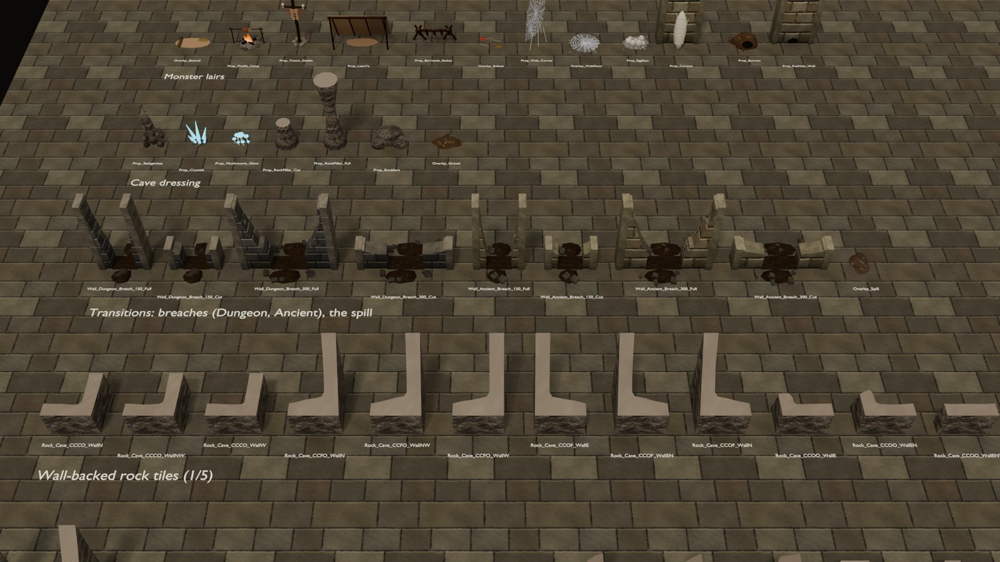

# Adventure kit

An extension of the dungeon kit ([DUNGEON_KIT.md](DUNGEON_KIT.md)) from a classic gaol and crypt to places worth
adventuring in: traps and mechanisms, ancient ruins, monster lairs and natural caves. It is built on the interior kit
([INTERIOR_KIT.md](INTERIOR_KIT.md)): the same 1.5 m grid, top-down camera, Full / Cut cutaway, posts, floors, scene links,
mounts, tests and Unity metadata.

The kit adds:
- two wall families: **Ancient** (a sunken temple's huge pale blocks) and **Cave** (rock walls for walled levels);
- **organic caves**: a cave level is a painted cell map, and dual-grid rock tiles give it natural outlines -- lobes,
  spurs, bays and pillars, cliffs that lean back from a flared foot, ragged tops;
- **a winding chasm**: chasm cells are painted too, and dual-grid ground tiles cut them into the floor with curving,
  swelling and narrowing rims and walls that drop 4 m into the dark; a rope bridge spans it;
- **pits**, a piece class that replaces the floor of its cells: spike pits, straight chasm segments for walled
  levels, an underground pool;
- traps and mechanisms: a dart wall, a pressure plate, a blade slot, a rolling boulder, a wall lever, a portcullis, a
  secret stone door, a vault door that rolls aside;
- loot, temple furniture, monster-lair dressing and cave dressing (51 props and overlays);
- **passages**: a breach in a wall, or a tunnel in cave rock, that links two scenes;
- **transitions** where masonry meets the cave: walls drawn inside a cave map, wall-backed rock tiles that stop the
  rock just behind a wall, breaches knocked through Dungeon and Ancient walls, and an earth spill for floor seams;
- six textures and a **Cavern** lighting preset;
- three more levels that continue the dungeon's descent, a transitions demo, a **cave generator** for large test
  maps, and a catalog scene.

It has 331 masters and 128,132 triangles in all.



<table>
<tr>
<td width="50%"><br><sub>The caverns (B4): a chasm winds the width of the cave, crossed by a rope bridge; an underground pool, glowing crystals and mushrooms, and a spider nest.</sub></td>
<td width="50%"><br><sub>The goblin warren (B5): rock tongues part a rat-run entry, the camp round its fire and the chief's hoard off a central hall.</sub></td>
</tr>
</table>



<table>
<tr>
<td width="50%"><br><sub>Transitions (VKI_Cave_Breach): a dungeon hall dug into the rock, its north wall broken into a cave pocket and its east wall into the cavern; a corridor through the rock runs out into the cave; an ancient shrine's ruined front, breached.</sub></td>
<td width="50%"><br><sub>The hall's north wall, broken through (<code>Wall_Dungeon_Breach_300_Full</code>): earth spills over the flagstones; the rock behind the unbroken wall stops just behind it (wall-backed tiles).</sub></td>
</tr>
</table>

## 1. What it adds

**Wall families.**

| Family | Class (thickness) | Full height | Look | Posts |
|---|---|---|---|---|
| Ancient | O (0.50) | 3.0 | huge weathered pale blocks (`AncientIn`), a carved frieze course under the coping on Full walls, heavy coping slabs (`AncientCap`) | Corner: monolithic pier with a plinth and capital; Mid: pilaster |
| Cave (`vki_fam_cavewall`) | O (0.50) | 3.0, ragged | rock walls for **walled** levels (a mine, a cave-like cellar): both faces bulge up to 0.26 m, faceted, the skyline dips up to 0.40 m between nodes; the slice is the cut section (`CaveCut`, pale). The cave levels themselves use the organic tiles below. | rock masses |

- **Post priority** is now Cave > Ancient > Dungeon > Stone > Ashlar > Timber > Wattle > Board > Bars.
- **Cave walls stay modular:** bulge and dip fade to zero within 0.32 m of every piece-end node (T2, T3). Keep props
  ~0.3 m off them mid-span.
- **Ancient** gets the automatic B variant (pop-out blocks) like Stone and Dungeon.

**Organic caves: dual-grid rock tiles** (`vki_fam_cave`, class `rock`). A cave level has no walls. Its plan is a cell
map: each 1.5 m cell is open floor or rock (`##`), and everything outside the map is rock.

- **Heights.** A rock cell is Cut (1.0) in the south ring and the map's south row, and wherever open floor lies within
  two cells to its north: a 3 m rock would hide that floor from the camera. Every other rock cell is Full (3.0). So
  back walls and spurs from them stand tall, while islands and tongues into a chamber stay low.
- **The dual grid.** A rock tile is 1.5 m square and centred on a node. Its four corners are the centres of the four
  cells around that node, and its shape comes from their states: O (open), C (Cut rock) or F (Full rock). That makes
  80 corner codes in 23 rotation classes. Each class has one master in two variants (three for the straight Full and
  Cut faces, the commonest), placed at 0/90/180/270 by `vki_cav_canon`. The assembler picks the variant by a hash of
  the node.
- **Inside a tile** the outline is the zero contour of a field: the bilinear blend of the corners (+1 rock, −1 open)
  plus windowed noise, marching squares on a 9 × 9 grid.
  - The noise is biased so the rock grows into open space (lobes, spurs, rounded pillars, up to ~0.4 m) and never
    recedes off its own cells, so nothing outside the map needs a floor.
  - The top blends the rock corners' heights, so a Full–Cut edge ramps down, and dips raggedly: up to 0.35 on Full
    rock, 0.10 on Cut.
  - The cliffs lean back ~0.1 m from a foot that flares ~0.1 m onto the floor, with lumps. They are faceted (flat
    shading) and textured along the contour.
- **Seamless.** Along a tile edge the field is linear, the noise is zero and the cliff section is fixed. The outline
  crosses a rock–open edge exactly at its midpoint, so any two neighbours meet without a seam.
- **The tunnel tile** `SM_VKI_Rock_Cave_OOFF_Tunnel` is a straight Full face with a cleft into the rock under a fallen
  lintel, and darkness at its back. It is the cave's scene link, like a passage.
- **Colliders** are the tile's floor-level footprint, a 0.25 m raster merged into boxes. Keep openings between rock
  two cells wide: the rock's lobes and foot take up to ~0.6 m off each side of a gap, so a one-cell gap can close to
  under the 0.6 m walker.
- **Props near rock** stand off it with the hug off (`{"hug": False}`): there are no walls to hug. Webs, the cocoon and
  the rat hole carry `vki_wall_anchor` and may enter rock.
- **Open underneath.** The rock, chasm and stream tiles leave their solids open at the bottom, where nothing sees
  them (the mesher's `bottom=False`); such a master carries `vki_open_bottom`, the z of its open rim, and T7 accepts
  one-sided edges there. The closed bottoms had been 14–25 % of every cave level's triangles (2026-09-30,
  [DWARF_KIT.md](DWARF_KIT.md) section 6).
- **Tri budget:** 153–364 per tile (T9 limit 1200). A 10 × 6 cave takes 43–51 tiles, about 11–13k triangles of rock
  (B4 11,456, B5 13,136).

**The chasm: dual-grid ground tiles** (`vki_fam_cave`, class `ground`). In a cave map, cells coded `vv` (and `==`
under a bridge) are chasm.

- **Where they go.** A ground tile stands on every node with chasm among its four cells. Its code is SW SE NE NW, with
  X (chasm) or O (ground).
- **What a tile holds.** Each tile carries the floor of its whole 1.5 m footprint, with the chasm's hole cut out of
  it. The outline comes from the same kind of field as the rock (bilinear X +1 / O −1 plus windowed noise, both
  ways). So the chasm can curve, bend, swell and pinch through cells freely, and it meets its neighbours exactly at
  every tile edge.
- **Walls and depth.** Rock walls drop from the rim to −4 m, stepping in by up to 0.2 m as they fall and darkening
  to black. A VOID floor lies at −4.1.
- **Never rotated.** The tile's floor is world-locked like any floor (t 3.0), so ground tiles are never rotated.
  Each code comes in the four node parities `Q00`…`Q11`, and each parity has its own noise, so a code has four
  shapes: 14 codes × 4 plus the all-chasm `XXXX`, 57 masters.
- **Floor around the chasm.** Cells no ground tile touches get `Floor_150` as usual. A cell partly under ground tiles
  gets `Floor_075_R<a><b>` quarters (0.75 m, 16 world-lock offsets) on the quarters the tiles leave.
- **The rope bridge** `SM_VKI_Prop_RopeBridge_420` spans a chasm two cells wide: a 4 m sagging deck, four posts,
  rope rails. Put it on the node between the two chasm cells, in a cell-centre column; there the rims sit exactly on
  the cell lines. Its `vki_bridge` deck is where the walk BFS crosses the chasm's colliders.
- **Chasm ends.** The chasm can end in open floor (a rounded tip), or run in under the rock, where the rock's foot
  overhangs it.
- **Tri budget:** 12–376 per ground tile (T9 limit 1500), open underneath like the rock.

**Transitions: masonry meets the cave.** A cave map may carry walls, so dungeon rooms and corridors can be dug into
the rock or stand in the open cave (section 2, plans).

- **Wall-backed rock tiles** (`SM_VKI_Rock_Cave_<code>_Wall<arms>`, 115 masters). A wall on a grid line runs through
  the middle of the rock tiles on its nodes, and plain rock would bulge through it (up to ~0.4 m). A wall-backed tile
  knows its **wall arms** (S, E, N, W: the half-segments from its node to the tile edge) and keeps the rock 0.33 m
  off each arm's line and off the post square on the node. Where one side of an arm is rock, the rock stops just
  behind the wall, and its face there is straight and upright (hidden behind the wall, no foot or lean). Where both
  sides are open, the rock is cut back round the wall's end, so the end is let into the rock face. Every corner code
  comes with every set of arms that has open floor beside each arm: 115 rotation classes, one master each, 87–346
  triangles. Their outline meets the plain tiles' at every tile edge that no wall crosses.
- **Breaches** (`Wall_<Dungeon|Ancient|Sewer>_Breach_150 / _300`, Full and Cut). The wall is knocked through to the floor.
  Both ends stay intact (the plain section and coping), and the masonry between them breaks down in ragged steps
  (Full from ~2.5 m, Cut from 0.85 m) to reveals 0.7 m tall either side of the opening (150: x 0.33–1.17; 300:
  x 0.90–2.10). The rubble core shows on the break, with loose blocks on the Full break. Earth mounds and fallen
  blocks spill to **both** sides and cover the floor seam in the opening. A breach is passable (`vki_nav` door) with
  no link or leaf. Full and Cut are twins (identical below 0.65 m). Ancient Full keeps the frieze on its intact ends.
- **Overlay_Spill**: earth and rock chips (the FLOOR slot, CaveFloor), 0.8 × 1.0 m, for a seam where a cave floor
  meets flagstones with no wall on it. Lay it on the cell edge's midpoint, long across the seam; it clears the posts.
- **Posts** at the walls' ends and corners are the usual ones. A free end against rock sits in the slot the
  wall-backed tile leaves.

**Wall kinds.**

| Piece | What it is |
|---|---|
| `Wall_Ancient_Door_150` / `DoorWide_300`, Full and Cut | trilithon doorways; `DoorWide_300_Full` takes the portcullis |
| `Wall_Ancient_Relief_150_Full` | a carved face in the wall |
| `Wall_Ancient_Broken_150_Full` / `_300_Full` | the wall broken down mid-span, fallen blocks at its foot |
| `Wall_Ancient_Collapsed_150_Cut` | a Cut wall collapsed into rubble |
| `Wall_Ancient_Vault_300_Full` | a round vault opening (Ø 2.1) for `Leaf_VaultDisc_300` |
| `Wall_Cave_Gap_150_Full` / `_Cut` | a natural opening, 0.84 m, ragged jambs; Full has rock arching over it at 2.0–2.35 |
| `Wall_<fam>_Passage_150_Full` (Dungeon, Ancient, Cave) | a breach / tunnel mouth with a VOID card behind it: a scene link with a trigger, spawn and prompt (`Go through`) |
| `Wall_Dungeon_DartTrap_150_Full` | a dressed band pierced by four dart holes; the emitters are in `vki_trap` |
| `Wall_Dungeon_Secret_150_Full` | a plain-looking wall with a hidden doorway for `Leaf_SecretStone_Full` |

**Leaves.** All of them carry `vki_openable=1`: the walk BFS ignores them, since they open in play.

| Piece | Motion |
|---|---|
| `Leaf_Iron_Full` | a locked (`vki_locked`) iron-bound door for `Door_150_Full`, with a judas grille; hinged |
| `Leaf_SecretStone_Full` | the secret door's stone slab, faced so that closed it continues the wall's blocks; hinged |
| `Leaf_Portcullis_300` | slides up (`slide_z`) by up to 0.75, the bars' tips then under the lintel |
| `Leaf_VaultDisc_300` | a stone disc with iron hoops and a gold boss; rolls aside (`roll_x`) |

**Pits** (class `pit`). A pit's origin is its min corner; it is never rotated (`vki_rot_lock` world0). It covers its
cells (`vki_covers_floor`), so the assembler leaves the room floor out there. Its collider blocks the walk BFS.

| Piece | Cells | What it is |
|---|---|---|
| `Pit_SpikePit_150` | 1 × 1 | a stone-lined pit with iron spikes and a victim's bones |
| `Pit_Chasm_150x300` | 1 × 2 | a straight chasm segment for walled levels: jagged rims, rock walls stepping down in three bands to 4 m, darkening to black. Tiles chain along x, wall to wall. (Cave maps use the ground tiles above.) |
| `Pit_ChasmBridge_150x300` | 1 × 2 | the same with a sagging rope bridge across; its colliders leave the 0.9 m bridge path open |
| `Pit_Pool_300x300` | 2 × 2 | an underground pool: a rocky shore down to a dark bed, a glossy water film (`M_VKI_Puddle`), boulders |

**Props and overlays.**

| Group | Pieces |
|---|---|
| Traps | `Overlay_PressurePlate`, `Overlay_BladeSlot_150`, `Prop_Boulder` (a rolling-boulder trap), `Prop_Lever_Wall` (`vki_mechanism`) |
| Loot | `Prop_Chest_Iron` (closed, padlocked), `Prop_Urns` (breakable: an amphora, a pot, shards), `Prop_LootPile`, `Overlay_GoldCoins`, `Prop_Skeleton_Fallen` (a dead adventurer with sword and shield) |
| Temple | `Prop_Statue_Guardian`, `Prop_Statue_Broken`, `Prop_Altar_Idol` (a gold idol, candles, light), `Prop_Column_Ancient` / `_Broken` / `_Fallen`, `Prop_Brazier_Stone` (fire, light), `Overlay_CrackedFloor`, `Prop_Roots_Floor`, `Prop_Roots_Wall` |
| Lairs | `Overlay_Bedroll`, `Prop_FirePit_Camp` (a spitted haunch, light), `Prop_Totem_Goblin`, `Prop_LeanTo`, `Prop_Barricade_Stakes`, `Overlay_Refuse`, `Prop_Web_Corner`, `Overlay_WebFloor`, `Prop_EggSacs`, `Prop_Cocoon`, `Prop_Burrow`, `Prop_RatHole_Wall`; outdoors, a goblin warcamp's own: `Prop_Goblin_Watchtower` (stakes on a platform at 4.18, astride a palisade, front -Y outward, ladder +Y), `Prop_Goblin_Tent` (patched hide A-frame), `Prop_Goblin_ChiefTent` (a tipi behind two tusks), `Prop_Goblin_Bonfire` (light), `Prop_Goblin_Gate` (the doors of the exterior `Palisade_Gate` frame: lashed stakes, barred inside, `vki_breakable`, `vki_broken` = `Prop_Goblin_Gate_Broken`, the smashed state: a leaf fallen in, one hanging open, the bar snapped; both fill the slits beside the frame's posts and collide across them) |
| Caves | `Prop_Stalagmites`, `Prop_Crystals` (glowing, light), `Prop_Mushrooms_Glow` (light), `Prop_RockPillar_Cut` / `_Full`, `Prop_Boulders`, `Overlay_Gravel` |
| Burnt (outdoors, `vki_props_orc`, 2026-10-05: the RPG's orc chapter) | `Prop_Ruin_Farmhouse_Burnt` (hero tier, 7.2 x 5 m: coursed stone footings broken down to 0.3-1.6 m, a door gap at the front -Y, a fallen run at the back, charred corner posts two of them snapped, the chimney standing in courses with its top broken off and its hearth blackened, the ridge beam and rafters fallen in, ash and rubble over the floor, embers still in the ash), `Prop_BurntTree_A` (a charred trunk, 6 m, top snapped, stub branches) and `_B` (split and leaning), `Prop_BurntStump`, `Overlay_Ash` (a burnt patch: ash in layers over black ground, charred sticks, cinders), `Overlay_Tracks_Orc` (two furrows where logs were dragged and big bootprints either side, running +Y). Charred wood is the WOOD slot ("Dark") darkened (`VKI_ORC_CHAR`), with COAL where it burned through |
| Orc camps (outdoors) | `Prop_Orc_WarTable` (three thick planks on crooked trestles, a hide map of a walled town pinned on it -- the wall ring and towers, the north gate ringed twice in red, the south road struck through in red, log tallies, a sketch of a frame on wheels with a long beam -- a dagger through it, a skull candle; the map's lines are single strips, each crossing line a step over the one below, so nothing paints in one plane), `Prop_Orc_Banner` (3.6 m: a cairn, a pole with an iron spike, an orc skull with tusks, a red-dyed hide with a black tusk -- the warlord's sign -- facing -Y, two tusks hung from the bar) |
| Siege yard (outdoors, 2026-10-05: the RPG's burnt march) | `Prop_Siege_Ram` (hero tier, 2.8 x 6.1 m: two sills on four solid iron-tyred wheels, posts and a steep roof of hides over rafters -- the right slope's back half still bare, a roll of hides on the chassis -- the front gable a red hide with the black tusk, iron spikes on the ridge; the ram a bark log on two chains, its iron head and two iron tusks out of the front, -Y), `Prop_Siege_Tower` (half built, 7.3 m to its tallest post: a chassis on four wheels, four corner posts leaning in, the first storey boarded and its front hung with hides and the black tusk, the second storey's front half boarded and its floor half laid, the back open on cross braces and two ladders, a gin pole at the back corner hoisting a beam), `Prop_Siege_Catapult` (an onager, 2.8 x 4.4 m: a skein of rope in iron washers, the arm drawn back with a stone in its cup, the padded stop braced to the front, a windlass, stones stacked by it; it throws toward -Y), each with a `_Burnt` twin (the hides burned to rags, the roof or the upper frame fallen, the arm snapped, charred, on a bed of ash with coals: the RPG swaps it in when the player fires the engine); `Prop_Orc_Cage` (2.7 x 1.9 m, see-through: squared posts with iron spikes, round bars 0.24 apart, poles across the top, iron straps, the door in -Y chained with a padlock, straw inside; room for three standing) and `_Open` (the door swung out 110 degrees, the chain hanging, the lock on the ground); `Prop_Orc_WarDrum` (a great red drum tipped toward the drummer at -Y, the black tusk on its hide head, laced head to head, on a cradle with an orc skull on each front post, two thigh-bone beaters); `Overlay_Orc_BearTrap` (toothed jaws lying open, a pan, leaf springs, a chain to a stake; walkable) and `_Sprung` (the jaws shut, standing); `Prop_Orc_Totem` (3.4 m: a pole banded red and black in a cairn, two orc skulls, a great beast's horned skull on top, hide strips and tusks from a crossbar, a round hide shield with the black tusk at its foot facing -Y) |

**Metadata for the game.**

| Key | On | Meaning |
|---|---|---|
| `vki_trap` | traps, pits | `kind` (`darts`, `spike_pit`, `pressure_plate`, `blade`, `rolling_boulder`, `chasm`, `bridge`) and its data: dart emitters and direction, depth, trigger box, blade axis and reach, boulder radius |
| `vki_mechanism` | `Prop_Lever_Wall` | states, current state, pivot |
| `vki_openable`, `vki_leaf_motion`, `vki_leaf_state` | leaves | opens in play; `swing`, `slide_z`, `roll_x`; the state the level placed it in |
| `vki_link` `passage`, `vki_target`, `vki_link_id` | passages, tunnel tiles | set by the assembler from `R["passages"]` / `R["tunnels"]` and `R["links"]` |
| `vki_corners`, `vki_node` | rock tiles | the master's corner code (SW SE NE NW); the node an instance stands on |
| `vki_loot`, `vki_breakable` | the loot pile, coins, the idol; the urns | lootable / breakable |
| `vki_covers_floor`, `vki_water` | pits | the rectangle the pit replaces; the pool holds water |
| `vki_see_through` | webs | T19 sight rays pass (as bars) |
| `vki_wall_anchor` | `Prop_Web_Corner`, `Prop_Cocoon`, `Prop_RatHole_Wall` | may enter a wall or rock face; T12's prop-in-wall test lets them |

**Textures** (from `vki_tex_dungeon`, run on demand):
- `T_VKI_AncientIn` / `T_VKI_AncientFlag`: huge weathered blocks, big pale floor slabs (`vki_gen_blocks`);
- `T_VKI_CaveRock`: natural rock, painted by the new `vki_gen_rockface`: fracture facets at two scales, broad lumps,
  wavy bedding with a pale mineral seam, hairline cracks along some fracture edges, damp runs; no joints (the two
  earlier attempts read as cobbles and as stacked masonry);
- `T_VKI_CaveTop`: the rock tops (`M_VKI_CaveCut`): a calm pale rock with faint grain and no facets, so wide tops
  do not show the 1.5 m repeat (`vki_gen_rocktop`);
- `T_VKI_CaveFloor`: packed cave earth with pebbles and a grey dust haze;
- `T_VKI_Web`: an RGBA orb web (alpha-clipped, `M_VKI_Web`).
- `T_VKI_Hide` (tile 2.0 m): sewn hides, twelve wavy-edged pieces in five tones laced across the seams with pale thongs
  (`M_VKI_Hide`). The goblin pieces (bedroll, totem banner, lean-to, the warcamp's tents, tipi and tower awning) put it
  on their HIDE slot per master (`vki_lair_hide_mats`) and project their hides at its tile; the exterior's
  `M_VK_Hide` (a flat colour) is unchanged.

Floor styles `AncientFlag`, `CaveFloor`; wall style `AncientIn`; cap styles `AncientCap`, `AncientBlock`. Rock tiles
use `M_VKI_CaveRock` on their cliffs and `M_VKI_CaveCut` (pale) on their tops. Gold is `M_VKI_Gold` (flat, on the TEXTILE slot: BRONZE read dark). Bones use the WAX slot.

**Preset `Cavern`.** Caves are lit by glowing crystals and fungus more than by torches, so the preset is the Dungeon one
with a stronger cold key (0.85). With the Dungeon key the rock tops sat too close to the floor for the palette rule
(caps ≥ floor + 0.15). It is a dark preset (floor target 0.15).

## 2. Plans

New plan tokens:

| Token | E-W / N-S | Meaning |
|---|---|---|
| Passage | `PP` / `P` | the family's `Passage_150_Full`, a scene link (`R["passages"]`) |
| Named piece | `S1`…`S4` (Full), `s1` `s2` (Cut) / `1`…`4` | the piece named in `R["specials"][token]`; it may be another family's (a Dungeon dart wall in a temple); a `_300` piece takes two segments |
| Gap | `OO` / `O` (Full), `oo` / `o` (Cut) | the family's `Gap_150` (the Cave wall family's doors); its cells count as door cells |
| Breach | `XX` / `X` (Full), `xx` / `x` (Cut) | the family's `Breach_150`; two in a row starting on an even node pair into `Breach_300`, like plain walls; door cells |

Room options:

| Option | Meaning |
|---|---|
| `specials` | `{token: piece}` for the named tokens |
| `passages` | `{(ori, k, line): link id}`; the link's `R["links"]` entry `(id, "passage", target scene)` gives the target. The spawn comes from the piece's `vki_spawn_local`. |
| `pits` | `[(piece, x, y)]` at their min corners |
| `door_leaves` | `{(ori, k, line): dict(piece, deg=0, z=0, socket=None, state)}`: a leaf on a door piece: a portcullis raised by `z`, a vault disc rolled to `socket`, a locked door, a secret door ajar |
| zone `cap` | a zone may set the cap style of its walls (a Dungeon dart wall in an Ancient gallery gets `AncientCap`) |

`(ori, k, line)` is the plan segment: `("EW", i, j)` for the E-W segment from node (i, j); `("NS", r, i)` for the N-S
segment on line i from row r.

**Cave levels** (`cave=True`). The plan's cells coded `##` are rock and cells coded `vv` (or `==` under a bridge) are
chasm. The wall tokens on the plan's frame only border the map. **Walls inside a cave map:** tokens on its inner grid
lines are laid out like partitions in a walled level, with `R["family"]["partition"]`, named pieces, doors,
breaches, posts and door cells (`vki_cave_walls`, through `vki_rooms_layout` with the room and plan passed in). The
rock tiles on their nodes become the wall-backed ones. A wall between two rock cells is an error: it would be buried.

| Option | Meaning |
|---|---|
| `tunnels` | `{(i, j): link id}`: the tunnel tile on a perimeter node whose rock is a straight Full face |
| `cave_heights` | `{(c, r): "C" \| "F"}` overrides a rock cell's height |
| `zones` | floor styles only |

`vki_cave_layout` returns the rock tiles, the chasm's ground tiles, the floors, the pit cells and the walls, posts and
doors drawn inside the map. The floors are Floor_150 on every map cell no ground tile touches, rock or open, and Floor_075 quarters where
ground tiles cover part of a cell. A pit must keep a cell clear of the chasm.

The checks treat rock tiles as structure: BFS colliders, prop clashes, T19 sight rays, and cap tops in the palette.
Ground tiles count as floor: floor coverage is now checked per quarter cell, and their FLOOR counts in the palette.
Their hole colliders are soft in the BFS: a capsule on a bridge deck crosses them.

## 3. The levels

The levels continue the dungeon's descent. B2's east wall now has a breach (a Dungeon passage) on to B3.

surface → B1 gaol → B2 crypt → **B3 temple** → **B4 caverns** → **B5 goblin warren**

| Scene | Walls | Preset | Links | Contents |
|---|---|---|---|---|
| `VKI_Dungeon_B3` | Ancient (+ a Dungeon dart wall) | Dungeon | `crypt` passage → B2, `caverns` passage → B4 | the sunken temple. A gallery of traps: two spike pits across the direct way, a pressure plate under the dart wall, a blade slot with its victim, a boulder, a lever. A trilithon gateway with a half-raised portcullis. The sanctum: guardian statues, the golden idol on its altar, stone braziers, columns standing, broken and fallen, roots by a broken wall, a relief. A vault (low front wall) behind a stone disc rolled a metre aside, with a chest and a heap of gold. |
| `VKI_Dungeon_B4` | cave map, 12 × 7 | Cavern | `temple` tunnel → B3, `warren` tunnel → B5, `falls` and `sewer` tunnels (the north shelf's back wall) → `VKI_Cave_Falls`, `VKI_Sewer_S1` | the caverns. A chasm winds the width of the cave from under the west rock to under the east rock: one to two cells wide, swinging up and down, pinching twice. One rope bridge crosses it where it runs two cells wide. The south shelf has an underground pool, glowing mushrooms and crystals. The north shelf has a mass of rock in its west corner and a knob from the back wall, a fallen adventurer, stalagmites, and a spider nest (a corner web, egg sacs, a cocoon, webbed floor) before the tunnel on down. |
| `VKI_Dungeon_B5` | cave map | Cavern | `caverns` tunnel → B4 | the goblin warren. Tall rock tongues from the back wall and low ones from the front part three chambers off a hall that runs the width of the cave. The rat-run entry behind a stake barricade (burrow, rat hole, refuse, a totem). The camp: fire pit with a spitted haunch, lean-to, bedrolls. The chief's hoard: loot heap, coins, iron chest, a skeleton, bones, urns. Braziers light the side chambers. |

**Transitions demo: `VKI_Cave_Breach`** (a cave map with walls, 14 × 9, Cavern preset, a tunnel on east). A dungeon
hall is dug into the rock. Its north and west walls are backed by the rock, and its low south wall has rock under it
on the far side. Its north wall is broken through (`Breach_300_Full`) into a cave pocket lit by glowing mushrooms, and
its east wall stands free in the cavern with a breach (`Breach_150_Full`). A corridor leaves the hall's door
through the rock, between low walls with a band of rock between it and the hall. It runs out into the cave, its walls
let into the rock, with earth spilt over the seam. In the cavern stands the ruined front of an ancient shrine (Cut:
collapsed walls either side of `Wall_Ancient_Breach_300_Cut`), with its altar and idol behind. Before it lies the head of
the shrine's fallen colossus, face up: the level's point of interest (`POI_ColossusHead`,
[POINTS_OF_INTEREST.md](POINTS_OF_INTEREST.md); a free-standing rock knob was cleared for it, and a lane stays clear
to the breach). It checks at 0 errors and 0 warnings. It has 49,712 triangles with the head's 2,848, and 56,322 with its
25 pieces of debris ([DEBRIS.md](DEBRIS.md)). The first build had 58,306:
102 rock tiles (27 wall-backed) took 33,588, walls and posts 15,880; the rock tiles are open underneath since. BFS
reach is 1,310 / 1,332.

**The cave generator** (`vki_cave_generate`). This builds a large random cave map to test the tileset on,
registered like any level and rebuilt from the scene's record (`scene["vki_generated"]`).

- **Rock.** It starts from 44 % random rock and carves a meandering main passage from the west edge to the east edge
  (three cells tall) plus a few round chambers. Five cellular-automaton passes smooth it. An open cell is kept only if
  it lies in some 2 × 2 open block, so every passage is two cells wide, and only the largest open region is kept.
- **Chasm.** A chasm winds west–east (one to two cells wide, a row step of at most one per column). The rope bridge
  goes where the chasm runs two cells wide and has clear landings. Where the chasm still splits the floor, natural
  land bridges close a chasm column.
- **Contents.** A tunnel is placed in the west and east walls, then an optional point of interest, then pools and cave
  dressing on cells with open ground all round.
- **A point of interest.** `poi=(piece, w, h, code)` puts one ([POINTS_OF_INTEREST.md](POINTS_OF_INTEREST.md)) on the
  w × h block of open cells nearest the map's centre, with a cell of open ground all round, clear of the chasm; the
  pools and dressing then avoid it.
- **Output.** `VKI_Cave_Test` (24 × 16, seed 7, with the wyrm's bones) builds in ~41 s: 76,720 triangles, 0 errors,
  full reach (6,077 / 6,077); with its 79 pieces of debris ([DEBRIS.md](DEBRIS.md)), 98,484 in ~65 s. Its floor luma is 0.131, under the dark target of 0.15 (a warning it had from the first
  build: the generated cave has few lights for its size). The first build, without the wyrm and with closed rock
  bottoms, had 107,052 triangles. Seeds 3 and 11 also check clean.
- **Rock tops.** Two changes came from these larger maps: the tops use `T_VKI_CaveTop`, a calm rock texture
  (`vki_gen_rocktop`; the rock face texture showed its 1.5 m repeat across wide tops), and the tops are
  smooth-shaded.

```python
g["vki_cave_generate"]("VKI_Cave_Test", nc=24, nr=16, seed=7, chasm=True, pools=2, props=18,
                       poi=("POI_WyrmBones", 3, 4, "WY"))
```



B3 and B5 are 10 × 6 cells and frame at D 20.6. B4 is 12 × 7, which gives the chasm room to wind. `vki_check`
reports **0 errors** in each; B1 and B2 stay at 0. B4's figures are from after the town connection, which added its
tunnels to the falls and the sewer ([WORLD_GRAPH.md](WORLD_GRAPH.md)).

| | B3 | B4 | B5 |
|---|---|---|---|
| Triangles (whole level) | 40,742 | 26,278 (44 rock tiles, 11,460; 40 ground tiles, 8,344) | 24,042 (51 rock tiles, 13,136) |
| With the debris ([DEBRIS.md](DEBRIS.md)) | 46,922 (22 pieces) | 31,520 (20 pieces) | 27,814 (16 pieces) |
| Walk BFS reach (raster nodes) | 952 / 956 | 924 / 948 | 703 / 705 |
| Floor luma | 0.220 | 0.154 | 0.168 |
| Cap tops luma | 0.378 | 0.362 | 0.354 |

Every use point and trigger is reached from every spawn; the few unreached raster nodes are pockets behind props
(pockets between rock lobes and the chasm, corners behind props). The only warning left is B4's corner web rising
over a walk lane (R-occ3); it is see-through.

`VKI_Adventure_Catalog` shows every adventure master, labelled, in thirty-eight groups, with a camera each
(`VKI_AdvCat_Cam_G0`…`G37`). The rock tiles take four rows, the ground tiles four (one per parity), the Cave walls
one, the breaches and the spill one, the wall-backed rock tiles five, the sewer kit two, the water kit five, the
dwarf kit two ([DWARF_KIT.md](DWARF_KIT.md)), the points of interest one
([POINTS_OF_INTEREST.md](POINTS_OF_INTEREST.md)), the debris one ([DEBRIS.md](DEBRIS.md)) and the mine kit three
([MINE_KIT.md](MINE_KIT.md))
([WATER_KIT.md](WATER_KIT.md))
([SEWER_KIT.md](SEWER_KIT.md)). The vault and the secret door show their leaves; the floor leaves the pits open.

<table>
<tr>
<td width="50%"><br><sub>Catalog: the Full rock tiles and the tunnel.</sub></td>
<td width="50%"><br><sub>Catalog: the Cave walls and chasm ground tiles.</sub></td>
</tr>
</table>



## 4. Code

| Text (`src/interior/`) | Contents |
|---|---|
| `vki_fam_ancient` | the Ancient family: plain, rakes, posts, trilithon doors, broken and collapsed walls, relief, vault and its disc, passage (22 masters); the breaches for the Dungeon and Ancient families (`vki_brk_breach`, `VKI_BRK_NAMES`; 8) |
| `vki_fam_cave` | the dual-grid rock tiles (`vki_cav_tile`; 49 masters), the wall-backed ones (`vki_cav_wall_clamp`, `vki_cav_canon_arms`, `VKI_CAV_BACKED_NAMES`; 115) and the chasm's ground tiles (`vki_cav_ground`; 57), all on the shared marching-squares mesher `vki_cav_ms_solid` (field, heights, cliff profile, colliders); the Floor_075 quarters (16), the rope bridge, the straight chasm and pool pits, cave dressing and the spill (11) |
| `vki_fam_cavewall` | the Cave wall family for walled levels: plain, rakes, gaps, passage, posts (14 masters) |
| `vki_props_adventure` | spike pit, traps, loot, temple furniture, roots (20 masters) |
| `vki_props_lair` | monster-lair dressing and webs (12 masters) |
| `vki_fam_dungeon` | also the dungeon family's adventure additions: passage, dart wall, secret door, the iron, secret and portcullis leaves (6 masters) |
| `vki_rooms_adventure` | `VKI_PLANS` / `VKI_ROOMS` entries for B3–B5 and the demo `VKI_Cave_Breach` (`VKI_ADVENTURE_SCENES`, `VKI_ADVENTURE_DEMOS`), the cave levels (`vki_cave_cells`, `vki_cave_walls`, `vki_cave_tiles`, `vki_cave_ground`, `vki_cave_layout`, `vki_cave_tunnel`), the generator (`vki_cave_generate`, `vki_rooms_mkplan`), `vki_adventure_catalog()` |
| `vki_tex_dungeon` | also the six adventure texture jobs, `vki_gen_rockface` and `vki_gen_rocktop` |

Changes to the shared texts:
- `vki_core`: the Ancient and Cave families, materials, styles, the `Cavern` preset, the `pit`, `rock` and `ground`
  classes and the load order.
- `vki_rooms`: the passage, named and breach tokens; `vki_rooms_layout(name, R, P)` (room and plan passed in,
  `R["open_frame"]`: no closed perimeter); pits, passages, door leaves; zone caps; the Ancient B variant; BFS and
  floor coverage for pits; openable leaves; the `vki_wall_anchor` exemption; the cave-level hooks (layout, rock and
  ground tiles in the build, rock as structure in the checks); floor coverage per quarter cell; soft chasm colliders
  and bridge decks in the BFS.
- `vki_rooms_dungeon`: B2's breach, and `vki_kit_catalog` (the generic catalog builder behind both catalogs; pits
  and ground tiles snap to the cell grid with the floor left out under them).
- `vki_test`: the pit budget (6000 tris, as links); the rock and ground classes (budgets 1200 / 1500, lattice,
  `vki_corners`, the ground tiles' node parity); the quarter floors' 0.75 lattice and parity (T11).

The nine interiors still check at 0 errors, and `vki_test_all()` passes for all 713 masters (with the sewer kit's
30, [SEWER_KIT.md](SEWER_KIT.md), the water kit's 61, [WATER_KIT.md](WATER_KIT.md), the dwarf kit's 36,
[DWARF_KIT.md](DWARF_KIT.md), the six points of interest, [POINTS_OF_INTEREST.md](POINTS_OF_INTEREST.md), the
twenty debris pieces, [DEBRIS.md](DEBRIS.md), and the mine kit's 35, [MINE_KIT.md](MINE_KIT.md)).

```python
g0={}; exec(bpy.data.texts["vki_core"].as_string(), g0); g=g0["vki_ns"]()
names = g["VKI_ANC_NAMES"] + g["VKI_BRK_NAMES"] + g["VKI_CAV_NAMES"] + g["VKI_CWL_NAMES"] + g["VKI_ADV_NAMES"] + \
    g["VKI_LAIR_NAMES"]
g["vki_rebuild"](names)                                     # rebuild the adventure masters in place
g["vki_build_all"](g["VKI_ADVENTURE_SCENES"] + g["VKI_ADVENTURE_DEMOS"])   # rebuild B3-B5 and the transitions demo
g["vki_rooms_shots"]("VKI_Dungeon_B4"); g["vki_check"]("VKI_Dungeon_B4", full=True, palette=True)   # shots first
g["vki_adventure_catalog"]()                                # the viewer scene
# textures (one per call): g={}; for t in ("vk_tex","vk_texgen","vk_tex2","vk_mat","vki_tex","vki_tex_dungeon"): exec(...)
#   g["vki_tex_run"]("T_VKI_CaveRock")
```

## 5. Pieces

Triangles and footprint in 1.5 m cells for each master in `VKI_Pieces`.

### Ancient (22)

| Piece | Tris | Cells |
|---|---|---|
| `SM_VKI_Wall_Ancient_Plain_150A_Full` | 528 | 1,1 |
| `SM_VKI_Wall_Ancient_Plain_150A_Cut` | 252 | 1,1 |
| `SM_VKI_Wall_Ancient_Plain_150B_Full` | 712 | 1,1 |
| `SM_VKI_Wall_Ancient_Plain_300_Full` | 1064 | 2,1 |
| `SM_VKI_Wall_Ancient_Plain_300_Cut` | 508 | 2,1 |
| `SM_VKI_Wall_Ancient_Rake_150_L` / `_R` | 722 | 1,1 |
| `SM_VKI_Wall_Ancient_Door_150_Full` | 932 | 1,1 |
| `SM_VKI_Wall_Ancient_Door_150_Cut` | 408 | 1,1 |
| `SM_VKI_Wall_Ancient_DoorWide_300_Full` | 1272 | 2,1 |
| `SM_VKI_Wall_Ancient_DoorWide_300_Cut` | 512 | 2,1 |
| `SM_VKI_Wall_Ancient_Broken_150_Full` | 1236 | 1,1 |
| `SM_VKI_Wall_Ancient_Broken_300_Full` | 2308 | 2,1 |
| `SM_VKI_Wall_Ancient_Collapsed_150_Cut` | 640 | 1,1 |
| `SM_VKI_Wall_Ancient_Relief_150_Full` | 968 | 1,1 |
| `SM_VKI_Wall_Ancient_Vault_300_Full` | 2292 | 2,1 |
| `SM_VKI_Wall_Ancient_Passage_150_Full` | 1236 | 1,1 |
| `SM_VKI_Post_Ancient_Corner_Full` / `_Cut`, `Mid_Full` / `_Cut` | 132 each | 1,1 |
| `SM_VKI_Leaf_VaultDisc_300` | 712 | 2,1 |

### Cave (249)

| Piece | Tris | Cells |
|---|---|---|
| `SM_VKI_Rock_Cave_<code>_<A\|B\|C>`: 23 codes × 2 variants, 3 for `FFOO` / `CCOO` (48) | 153–364 (13,078 in all) | 1,1 |
| `SM_VKI_Rock_Cave_OOFF_Tunnel` | 288 | 1,1 |
| `SM_VKI_Rock_Cave_<code>_Wall<arms>`: wall-backed, every code with every set of wall arms S E N W that has open floor beside each arm (115) | 87–346 (23,764 in all) | 1,1 |
| `SM_VKI_Ground_Cave_<code>_Q<p>`: 14 codes × 4 node parities (56) | 141–376 (13,750 in all) | 1,1 |
| `SM_VKI_Ground_Cave_XXXX` | 12 | 1,1 |
| `SM_VKI_Floor_075_R<a><b>` (16) | 12 each | 1,1 |
| `SM_VKI_Prop_RopeBridge_420` | 552 | 1,3 |
| `SM_VKI_Pit_Chasm_150x300` | 588 | 1,2 |
| `SM_VKI_Pit_ChasmBridge_150x300` | 1532 | 1,2 |
| `SM_VKI_Pit_Pool_300x300` | 388 | 2,2 |
| `SM_VKI_Prop_Stalagmites` | 270 | 1,1 |
| `SM_VKI_Prop_Crystals` | 160 | 1,1 |
| `SM_VKI_Prop_Mushrooms_Glow` | 350 | 1,1 |
| `SM_VKI_Prop_RockPillar_Cut` / `_Full` | 76 / 136 | 1,1 |
| `SM_VKI_Prop_Boulders` | 240 | 1,1 |
| `SM_VKI_Overlay_Gravel` | 392 | 1,1 |
| `SM_VKI_Overlay_Spill` | 364 | 1,1 |

The 23 rock codes (corners SW SE NE NW; O open, C Cut rock, F Full rock): CCCC, CCCF, CCCO, CCFF, CCFO, CCOF, CCOO,
CFCF, CFCO, CFFF, CFFO, CFOF, CFOO, COCO, COFF, COFO, COOF, COOO, FFFF, FFFO, FFOO, FOFO, FOOO. The ground codes are
every X / O corner code but OOOO (XXXX has one master, the others four).

### Cave walls (14)

| Piece | Tris | Cells |
|---|---|---|
| `SM_VKI_Wall_Cave_Plain_150A_Full` | 960 | 1,1 |
| `SM_VKI_Wall_Cave_Plain_150A_Cut` | 440 | 1,1 |
| `SM_VKI_Wall_Cave_Plain_150B_Full` | 1080 | 1,1 |
| `SM_VKI_Wall_Cave_Plain_300_Full` | 1920 | 2,1 |
| `SM_VKI_Wall_Cave_Plain_300_Cut` | 880 | 2,1 |
| `SM_VKI_Wall_Cave_Rake_150_L` / `_R` | 802 / 846 | 1,1 |
| `SM_VKI_Wall_Cave_Gap_150_Full` / `_Cut` | 1084 / 400 | 1,1 |
| `SM_VKI_Wall_Cave_Passage_150_Full` | 1100 | 1,1 |
| `SM_VKI_Post_Cave_Corner_Full` / `_Cut` | 296 / 136 | 1,1 |
| `SM_VKI_Post_Cave_Mid_Full` / `_Cut` | 176 / 80 | 1,1 |

### Traps, loot, temple (20)

| Piece | Tris | Cells | Mount, tier |
|---|---|---|---|
| `SM_VKI_Pit_SpikePit_150` | 636 | 1,1 | pit |
| `SM_VKI_Overlay_PressurePlate` | 184 | 1,1 | overlay |
| `SM_VKI_Overlay_BladeSlot_150` | 96 | 1,1 | overlay |
| `SM_VKI_Prop_Lever_Wall` | 124 | 1,1 | wall_hung, dressing |
| `SM_VKI_Prop_Boulder` | 180 | 1,1 | floor, furniture |
| `SM_VKI_Prop_Chest_Iron` | 496 | 1,1 | floor, furniture |
| `SM_VKI_Prop_Urns` | 408 | 1,1 | floor, furniture |
| `SM_VKI_Prop_LootPile` | 944 | 1,1 | floor, hero |
| `SM_VKI_Overlay_GoldCoins` | 336 | 1,1 | overlay |
| `SM_VKI_Prop_Skeleton_Fallen` | 1212 | 2,2 | floor, furniture |
| `SM_VKI_Prop_Statue_Guardian` | 612 | 1,1 | floor, hero |
| `SM_VKI_Prop_Statue_Broken` | 440 | 1,2 | floor, hero |
| `SM_VKI_Prop_Altar_Idol` | 1022 | 2,1 | floor, hero |
| `SM_VKI_Prop_Column_Ancient` | 378 | 1,1 | floor, furniture |
| `SM_VKI_Prop_Column_Broken` | 198 | 1,1 | floor, furniture |
| `SM_VKI_Prop_Column_Fallen` | 224 | 2,1 | floor, furniture |
| `SM_VKI_Overlay_CrackedFloor` | 232 | 1,1 | overlay |
| `SM_VKI_Prop_Roots_Floor` | 420 | 2,1 | floor, furniture |
| `SM_VKI_Prop_Roots_Wall` | 544 | 1,1 | wall_hung, furniture |
| `SM_VKI_Prop_Brazier_Stone` | 1032 | 1,1 | floor, furniture |

### Lairs (18)

| Piece | Tris | Cells | Mount, tier |
|---|---|---|---|
| `SM_VKI_Overlay_Bedroll` | 140 | 1,1 | overlay |
| `SM_VKI_Prop_FirePit_Camp` | 954 | 1,1 | floor, furniture |
| `SM_VKI_Prop_Totem_Goblin` | 468 | 1,1 | floor, furniture |
| `SM_VKI_Prop_LeanTo` | 168 | 2,1 | floor, furniture |
| `SM_VKI_Prop_Barricade_Stakes` | 220 | 2,1 | floor, furniture |
| `SM_VKI_Overlay_Refuse` | 336 | 1,1 | overlay |
| `SM_VKI_Prop_Web_Corner` | 60 | 1,1 | floor, furniture |
| `SM_VKI_Overlay_WebFloor` | 24 | 1,1 | overlay |
| `SM_VKI_Prop_EggSacs` | 608 | 1,1 | floor, furniture |
| `SM_VKI_Prop_Cocoon` | 500 | 1,1 | wall_floor, furniture |
| `SM_VKI_Prop_Burrow` | 300 | 1,1 | floor, furniture |
| `SM_VKI_Prop_RatHole_Wall` | 328 | 1,1 | wall_floor, dressing |
| `SM_VKI_Prop_Goblin_Watchtower` | 3818 | 3,3 | floor, hero |
| `SM_VKI_Prop_Goblin_Tent` | 898 | 3,3 | floor, furniture |
| `SM_VKI_Prop_Goblin_ChiefTent` | 2242 | 4,5 | floor, hero |
| `SM_VKI_Prop_Goblin_Bonfire` | 1706 | 3,3 | floor, hero |
| `SM_VKI_Prop_Goblin_Gate` | 1498 | 3,1 | floor, hero, `vki_breakable` |
| `SM_VKI_Prop_Goblin_Gate_Broken` | 1778 | 3,4 | floor, hero |

The four goblin camp pieces are for outdoor maps (a KitVillage layout). Their hides are `M_VKI_Hide` (sewn pieces,
laced) on a grid that sags between its supports, a little mottled and darker at the rim, with a ragged hem
(`vki_lair_hide`). The watchtower's colliders are its legs, the platform floor and the
parapet (open at the ladder), so archers can stand on it.

### Transitions: breaches (8)

| Piece | Tris | Cells |
|---|---|---|
| `SM_VKI_Wall_Dungeon_Breach_150_Full` / `_Cut` | 1020 / 700 | 1,1 |
| `SM_VKI_Wall_Dungeon_Breach_300_Full` / `_Cut` | 1576 / 1104 | 2,1 |
| `SM_VKI_Wall_Ancient_Breach_150_Full` / `_Cut` | 1096 / 700 | 1,1 |
| `SM_VKI_Wall_Ancient_Breach_300_Full` / `_Cut` | 1684 / 1116 | 2,1 |

The Sewer family has the same four breaches ([SEWER_KIT.md](SEWER_KIT.md)).

### Dungeon family additions (6)

| Piece | Tris | Cells |
|---|---|---|
| `SM_VKI_Wall_Dungeon_Passage_150_Full` | 1152 | 1,1 |
| `SM_VKI_Wall_Dungeon_DartTrap_150_Full` | 536 | 1,1 |
| `SM_VKI_Wall_Dungeon_Secret_150_Full` | 588 | 1,1 |
| `SM_VKI_Leaf_Iron_Full` | 780 | 1,1 |
| `SM_VKI_Leaf_SecretStone_Full` | 196 | 1,1 |
| `SM_VKI_Leaf_Portcullis_300` | 348 | 2,1 |

## 6. Known limits

- **North–south doors read edge-on.** The camera looks north, so a portcullis or vault disc in an N-S wall shows as a
  thin slab. B3's vault door faces east for a reason: a Full wall facing the camera hid the loot behind it (T19).
- **The straight chasm pits have open ends:** run them wall to wall in a walled level. The cave maps' ground tiles
  close their chasm with a rounded tip or run it in under the rock.
- **Ground tiles are never rotated** (their floor is world-locked), hence the four parity versions of each code. They
  exist only in cave maps, and a pit must keep a cell clear of the chasm (the ground tiles carry the floor round it).
- **The rope bridge** needs the chasm two cells wide, and a cell-centre column where it crosses.
- **Rock UVs seam at tile edges.** Tiles are rotated instances, so the planar top UVs (and the cliffs' per-contour u)
  turn at tile edges. The noisy rock texture hides most of it; a triplanar rock shader in Unity would remove it.
- **Rock tiles in isolation show their sections.** A tile's rock is cut off flat where it meets a tile edge; in a
  level the neighbour covers that face. The catalog shows them.
- **Tunnels read edge-on** from the fixed camera when they sit in a side wall: a dark cleft under a lintel.
- **Webs, the cocoon and the rat hole anchor into walls and rock** (`vki_wall_anchor`); T12 does not flag that.
- The secret door and the iron door are in the catalog but in no level yet.
- **A breach in a north–south wall is hidden from the game camera** by the wall segment south of it (it shows from
  above and in play). Put the breach you want seen in an east–west wall, as the demo's north wall does.
- **Walls in a cave map stand on its inner grid lines only**, never on the frame, and never between two rock cells.
  Behind a wall the rock face is straight (it is hidden), so the rock top shows a straight edge along the coping.
- **The 150 breach is steep:** its intact ends fall to the reveals within 0.2 m, so it reads as a ragged slot. The
  300 breach has room for a V-shaped collapse.
- **Wall-backed tiles exist for walls through tile centres**, i.e. on the node lines. They are one variant per code
  and set of arms, placed at 0/90/180/270 by `vki_cav_canon_arms`.
