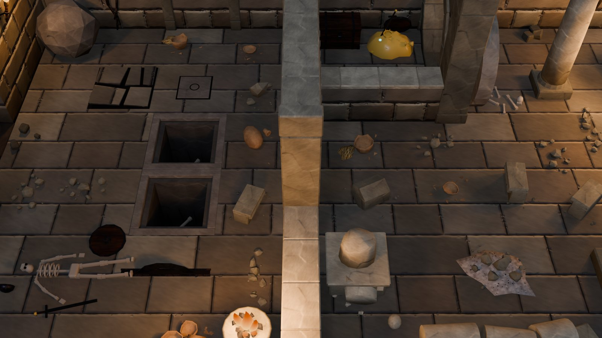
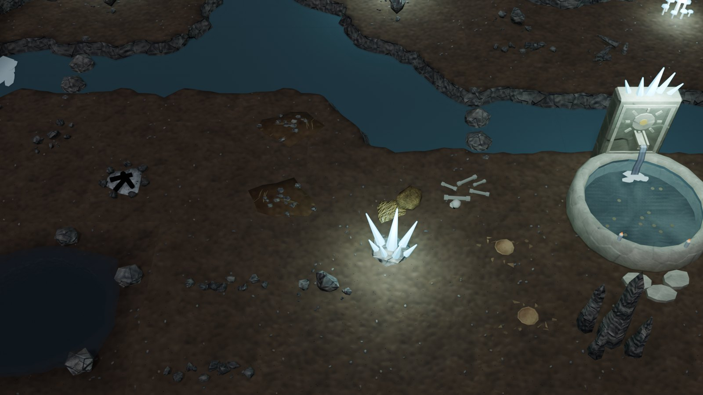
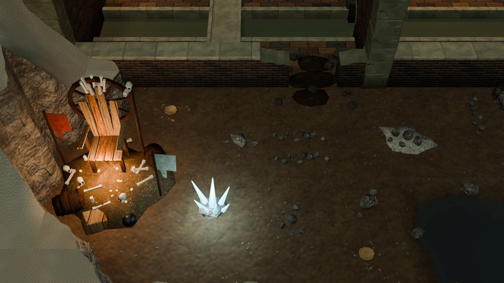
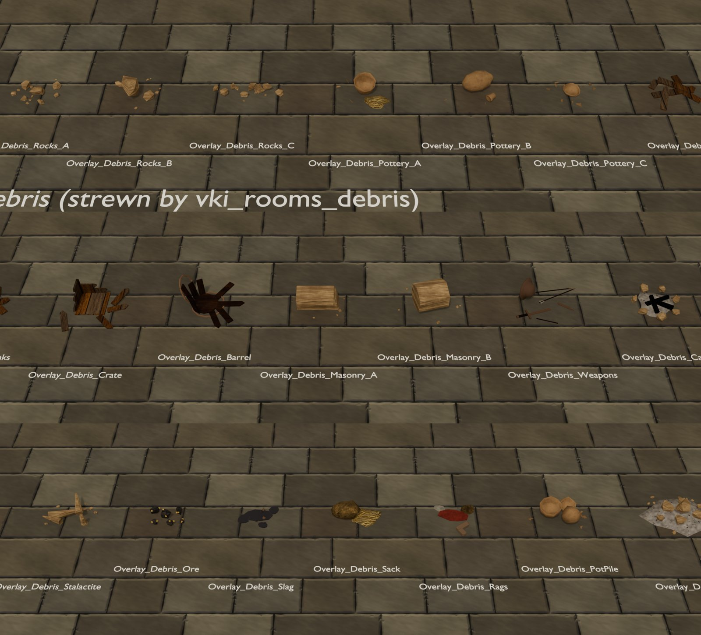
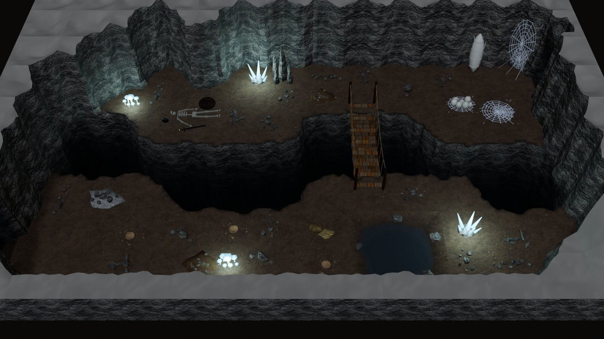

# Debris

Loose debris for the adventure levels ([ADVENTURE_KIT.md](ADVENTURE_KIT.md) and the kits built on it).

These are small pieces meant to be strewn by the dozen: loose rocks, broken pottery, splintered wood, fallen
masonry, lost gear. They are what makes a level look old and used rather than freshly built. The kit has twenty
debris pieces in `vki_props_debris`, plus a scatter pass that strews them over each level by theme when the level
builds.



<table>
<tr>
<td width="50%"><br><sub>By the river (<code>VKI_Cave_Falls</code>): rocks gathered at the rock faces, a cold campfire, bones, sacks and rubble.</sub></td>
<td width="50%"><br><sub>The sewer's grotto (<code>VKI_Sewer_S1</code>): rubble, pots, rocks and a fallen-apart barrel round the rat king's throne.</sub></td>
</tr>
</table>



## 1. The pieces

Every piece is an **overlay** (`vki_class` overlay):
- **Walkable.** `vki_nav` is "none" and there is no collider: the walker's path and the BFS ignore it.
- **Dressing tier.** 400 triangles at most (T9).
- **Placement.** Its origin is on its footprint centre, lying on the floor, at any rotation.
- **Flags.** It carries `vki_debris` 1. Stone pieces also carry `vki_debris_stone` 1 and put their stone on the CAP
  slot, so a level can restyle them to its own stone.

| Piece | What it is | Tris |
|---|---|---|
| `Debris_Rocks_A` | loose rocks, a scatter: seven rocks 0.05–0.12 and chips | 260 |
| `Debris_Rocks_B` | a fallen chunk, 0.45 across, sunk a little, two pieces off it and chips | 220 |
| `Debris_Rocks_C` | scree: a strip of rocks and chips 1.2 m long, laid along a wall or rock face | 320 |
| `Debris_Rubble` | a low heap of rubble (1.3 × 1.0 m): chunks over a mound of grey grit, chips round | 372 |
| `Debris_Pottery_A` | a clay jar broken open where it stood: its lower half with a jagged rim, grain spilt, shards | 318 |
| `Debris_Pottery_B` | a clay amphora toppled on its side, the neck snapped off and lying by it | 300 |
| `Debris_Pottery_C` | shards round a smashed pot's base | 286 |
| `Debris_PotPile` | a pile of broken pots: two standing, one on its side, shards round | 360 |
| `Debris_Planks` | splintered planks, some lying across others | 96 |
| `Debris_Crate` | a smashed crate: its bottom, a corner of two broken sides, boards thrown round | 168 |
| `Debris_Barrel` | a barrel fallen apart: staves standing in a ragged ring on its head, more fallen, a hoop round it and one leaning | 344 |
| `Debris_Masonry_A` | a fallen carved cornice block (course, fillet, roll moulding), one end broken | 256 |
| `Debris_Masonry_B` | a broken column drum lying on its side, twelve flutes | 184 |
| `Debris_Weapons` | lost gear: a sword snapped in two, a dented kettle helm, three arrows (one broken) | 284 |
| `Debris_Campfire` | a cold campfire: a ring of stones round a bed of ash, charred logs | 272 |
| `Debris_Stalactite` | broken stalactites lying across each other, a stub, chips | 200 |
| `Debris_Ore` | ore: chunks of dark rock glinting with gold flecks | 264 |
| `Debris_Slag` | forge slag: glassy black puddles and lumps, cooled drips | 260 |
| `Debris_Sack` | a sack on its side, torn open, spilling grain | 152 |
| `Debris_Rags` | rags left on the floor and a lost boot | 196 |

- **Stone.** Stone debris (rocks, rubble, masonry, the stalactites, the campfire's ring) takes the level's stone.
- **Other materials.**

  | Material | Used for |
  |---|---|
  | clay (`M_VK_Clay`) | pottery |
  | planks, dark oak | wood |
  | rust (`M_VKI_Rust` on the BRICK slot) | old iron: the kit's flat iron read as black lumps on a floor |
  | glassy black (`M_VKI_Slag`) | slag |
  | burlap, straw, cloth, hide | sacks, grain, rags, the boot |
  | gold (TEXTILE) | the ore's flecks |

- **Build note.** An icosphere invalidates vert references held from before it, so every part is moved the moment
  it exists (see [POINTS_OF_INTEREST.md](POINTS_OF_INTEREST.md)).

## 2. The scatter

`vki_rooms_debris(ctx)` runs in `vki_build_scene` after the props and pools. A level turns it on with `R["debris"]`:

```python
debris=dict(density=0.40, seed=19,                      # a fraction of each zone's open cells, and the seed
            zones={"runner": 0.0, "hall": 0.08},        # per-zone densities
            themes={"foundry": "forge"},                # per-zone themes (default: from the zone's floor style)
            kinds={"forge": [("Slag", 3), ("Ore", 2)]}) # per-theme kinds and weights (default VKI_DEB_KINDS)
```

- **Themes.** A zone's theme comes from its floor style:

  | Floor style | Theme | Stone |
  |---|---|---|
  | `CaveFloor` | cave | cave rock |
  | `EarthDamp` | lair | cave rock |
  | `DungeonFlag`, `DungeonFlagWarm` | dungeon | dungeon block |
  | `AncientFlag` | ruins | ancient stone |
  | `SewerFloor` | sewer | sewer block |
  | `DwarfFloor`, `DwarfFlag` | dwarf | dwarf granite |
  | (by level setting) | forge | dwarf granite |

  A zone whose floor maps to no theme (the town interiors) gets no debris.
- **Kinds.** Each theme has a weighted list of kinds: stalactites only in caves, masonry mostly in ruins, slag and ore
  in the dwarf halls and the foundry. The lists also draw on the kit's existing floor overlays:

  | Overlay | Themes |
  |---|---|
  | `Overlay_Gravel` | caves |
  | `Overlay_Bones` | most themes |
  | `Overlay_Refuse` | lairs |
  | `Overlay_Puddle` | dungeons, sewers |
  | `Overlay_Sludge` | sewers |

  A campfire appears at most once per level.
- **Where.** Each piece gets a random point in an open cell: a cell with no rock, chasm, stream, channel, lava or pool
  code. It gets a random rotation, and its rotated footprint must stay clear of:
  - walls (+6 cm, and their whole mesh +4 cm, since breaches and collapsed walls spill past their envelope);
  - posts, links, leaves and pits (+10 cm);
  - props and overlays (+12 cm) and their use points (0.45 m);
  - spawns (0.8 m);
  - the rock's and the ground tiles' colliders (+15 cm);
  - other debris (+15 cm).
- **Gathering at feet.** Heavy stone (rocks B and C, rubble, masonry, stalactites, gravel) takes the nearest of eight
  tries to a wall or rock face, so it gathers at their feet as real rubble does. Scree lies along the nearest wall or
  rock face.
- **Deterministic.** A level rebuilds with the same debris for the same seed.

## 3. The levels

| Level | Density | Pieces | Their triangles | Level triangles |
|---|---|---|---|---|
| `VKI_Dungeon_B1` (gaol) | 0.26; the cells as dungeon | 15 | 3,632 | 41,260 |
| `VKI_Dungeon_B2` (crypt) | 0.26 | 16 | 4,132 | 37,988 |
| `VKI_Dungeon_B3` (ruins) | 0.40 | 22 | 6,180 | 46,922 |
| `VKI_Dungeon_B4` (caverns) | 0.50 | 22 | 5,742 | 32,016 |
| `VKI_Dungeon_B5` (warren) | 0.38 | 16 | 3,772 | 27,814 |
| `VKI_Cave_Breach` | 0.40 | 25 | 6,610 | 56,322 |
| `VKI_Sewer_S1` | 0.36 | 25 | 6,604 | 69,434 |
| `VKI_Cave_Falls` | 0.38 | 32 | 8,398 | 53,212 |
| `VKI_Dwarf_Hall` | 0.40; runner 0, halls 0.08, foundry 0.60 (forge) | 17 | 4,374 | 103,074 |
| `VKI_Cave_Test` (generated) | 0.34 | 79 | 21,764 | 98,484 |

- **Checks.** All ten check at 0 errors, and debris added no warnings (the ones left are listed in their kits' docs).
  `vki_test_all()` passes for all 678 masters.
- **Placed vs wanted.** Fewer pieces land than the density asks for where a level is crowded: a piece needs its whole
  footprint clear.
- **The generator.** `vki_cave_generate` gives its caves `debris=dict(density=0.34, seed=<its seed>)`.



## 4. For Unity

- **Pure dressing.** Every scattered instance carries `vki_debris` 1 and `vki_debris_theme`. Its class is overlay
  and its nav "none": no collision, no pathing.
- **Engine-side scattering.** A Unity level generator could keep the Blender scatter's placements, or rerun the same
  rules itself: the theme tables and the placement rules are simple.
- **Restyled stone.** Stone debris instances use material variants (`VARI_…` meshes with the level's stone on the
  CAP slot), like the walls' styles.

## 5. Code

| Text (`src/interior/`) | Contents |
|---|---|
| `vki_props_debris` | the twenty builders and their helpers (`vki_deb_rock`, `vki_deb_chips`, `vki_deb_shard`, `vki_deb_plank`, `vki_deb_pot_half`, `vki_deb_meta`), `VKI_DEB_NAMES`, the scatter (`vki_rooms_debris`, `VKI_DEB_THEME`, `VKI_DEB_STONE`, `VKI_DEB_KINDS`, `VKI_DEB_HUG`, `VKI_DEB_ALONG`), the catalog group `G34`. Loaded after `vki_props_poi`. |

Other changes:
- `vki_rooms`: `vki_build_scene` calls `vki_rooms_debris`.
- `vki_core`: `M_VKI_Rust`, `M_VKI_Slag` and the load order.
- The level texts: `R["debris"]`, plus the dwarf hall's `foundry` zone.

```python
g0={}; exec(bpy.data.texts["vki_core"].as_string(), g0); g=g0["vki_ns"]()
g["vki_ws_build"]("adventure", g["VKI_DEB_NAMES"]); g["vki_adopt"](g["VKI_DEB_NAMES"])   # new masters
g["vki_rebuild"](g["VKI_DEB_NAMES"]); g["vki_test_pieces"](g["VKI_DEB_NAMES"])          # -> {}
g["vki_build_scene"]("VKI_Dungeon_B3")                                                   # strews its debris
```

## 6. Known limits

- **Walk-through.** Debris is decorative: a walker passes through a smashed crate or a column drum. Keep it low (all
  pieces are under 0.4 m, most under 0.2).
- **One variant per piece.** With twenty pieces and random rotations a level rarely shows a repeat close together,
  but a very large map will.
- **No wall-hung debris yet.** There are no cobwebs beyond the lair's, no hanging chains and no roots.
- **No level-authored overrides beyond density, themes and kinds.** A designer placing a single piece by hand uses the
  props list as for any overlay.
