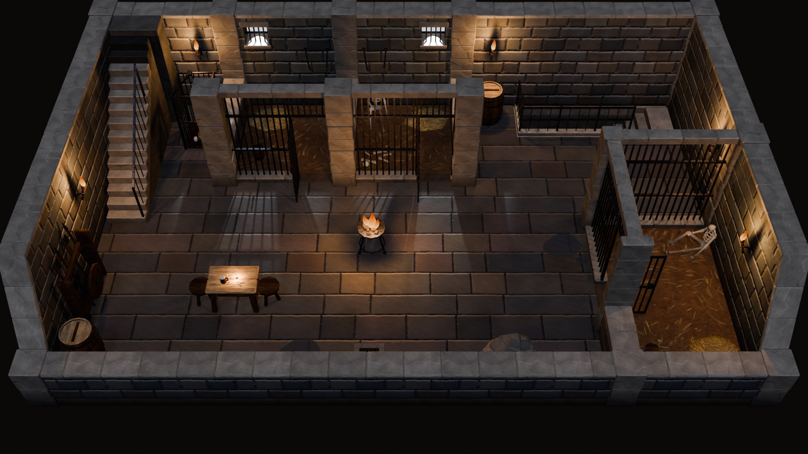
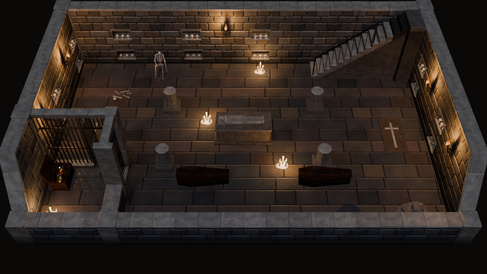
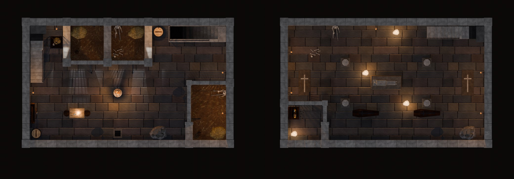

# Dungeon kit

Modular dungeons built on the interior kit ([INTERIOR_KIT.md](INTERIOR_KIT.md)): the same 1.5 m grid, top-down camera,
Full / Cut cutaway, posts, floors, scene links, prop mounts, tests and Unity metadata. Nothing in the interior kit's rules
changes. A dungeon is a set of interior scenes, one per level, linked by stairs. The top level's stair up leads back to
the surface (`@return`).

The kit adds:
- two wall families: **Dungeon** (dark masonry) and **Bars** (iron cell fronts);
- stone stairs;
- iron and barred leaves;
- 14 props and 5 floor overlays;
- two textures;
- a torch-lit **Dungeon** lighting preset;
- two showcase levels.

It has 46 masters and 25,962 triangles in all.



<table>
<tr>
<td width="50%"><br><sub>The crypt (B2): ossuary niches, cut pillars round a sarcophagus, candles, coffins, grave slabs, the stair up and a barred treasure vault.</sub></td>
<td width="50%"><br><sub>Both levels from straight above.</sub></td>
</tr>
</table>

## 1. What it adds

**Wall families.**

| Family | Class (thickness) | Full height | Look | Posts |
|---|---|---|---|---|
| Dungeon | O (0.50) | 3.0 | big coursed dark blocks (`DungeonIn`) with a damp band darkening toward the floor; rough dressed jambs, voussoirs and quoins (`DungeonBlock`); coping tops a step paler (`DungeonCap`) so the cutaway outline reads in the dark | quoin pier / pilaster |
| Bars | P (0.30) | 3.0, **Full only** | square iron bars at a 0.15 m pitch, flat bands at 1.00 and 2.10, on a dressed curb under a dressed lintel | dressed stone piers |

- **Dungeon walls** reuse the Stone family's masonry construction (`vki_sto_*`), so they have the same end profiles, openings and wobble.
- **Bars are never cut.** They hide nothing from the camera, so `vki_cut_to` points to the piece itself and the piece carries `vki_no_cut=1`.
- **See-through pieces.** Bars, barred gates and the cage carry `vki_see_through=1`. The T19 visibility rays pass through them.
- **Post priority** is now Dungeon > Stone > Ashlar > Timber > Wattle > Board > Bars. Where a bars front meets masonry, the Dungeon post wins.

**Dungeon-only wall kinds.**

| Piece | What it is |
|---|---|
| `Window_150_Full` | The dungeon's "window": a high barred light grate (sill 2.05, flat lintel 2.62). A daylight card closes the shaft. A cold spot light sits in the opening, so the bars stripe the pool of light on the floor. It has no Cut twin (`vki_cut_to` Plain_150A_Cut). |
| `Niche_150_Full` / `_Cut` | Ossuary niches, 0.30 deep, with skulls and long bones. Full has two rows, Cut keeps the lower one. Their sills stand 4 cm proud, so no wall-backed props go in front of them. |
| `Plain_150B_Full` | Pop-out blocks keyed to the painted blocks of `T_VKI_DungeonIn`. The texture generator's random draws are replayed in `vki_dun_block_layout`. |

**Leaves and stairs.**

| Piece | Notes |
|---|---|
| `Leaf_Iron_Cut` | Exit leaf of `Door_150_Cut`: dark oak, iron straps and studs. The assembler now places the leaf the door names in `vki_leaf`. |
| `Leaf_BarsGate_Full` | Barred gate of `Bars_Door_150_Full`. Placed open, 90° by default: at 70° the leaf left less than the 0.6 m walker capsule in the doorway. |
| `Stair_Up_150x450_Stone` / `Stair_Down_150x450_Stone` | The timber stairs' footprint, clearances and metadata, in stone. The up flight is solid wedge steps on a masonry spandrel with an iron balustrade. The down flight is stone steps into a lined shaft, with iron railings on low stone upstands. The railings are see-through: solid parapets hid the flight from the camera. |

**Floors, walls and textures.** The floor styles are `DungeonFlag`, `DungeonFlagWarm` and `EarthDamp`. The wall styles are
`DungeonIn`, `DungeonInDamp` and `DungeonInWarm`, and the cap styles are `DungeonCap` and `DungeonBlock`. All of them go
through `vki_place(style=…)` as usual. Two new texture sets come from `vki_tex_dungeon` (the same `vki_gen_blocks`
generator):
- `T_VKI_DungeonIn`: walls, 1.5 m tile;
- `T_VKI_DungeonFlag`: floor slabs, 3 m tile.

**Materials.** Bones use the WAX slot with `M_VKI_Bone`. Gold uses BRONZE. Puddles use `M_VKI_Puddle`, a glossy
alpha-blended film (kind `gloss`).

**Preset `Dungeon`.** There is no sun underground, so the preset has:
- a dim, cold key light (0.45) and fill (0.95), with the world at 0.9;
- torches and braziers that carry the warm light;
- grates that use their Day sockets.

It counts as a dark preset (`VKI_DARK_PRESETS`), so the floor-level target is 0.15, as at Night.

## 2. Plans

The plan legend gains new tokens:

| Token | E-W / N-S | Meaning |
|---|---|---|
| Bars | `\|\|` / `\|` | Bars family, Full; always brings its own family |
| Barred gate | `gg` / `g` | Bars door with an open `Leaf_BarsGate_Full` |
| Niche | `NN` / `N` (Full), `nn` / `n` (Cut) | ossuary niche |
| Grate | `WW` / `W` | light grate (Window kind), used as on any wall |

Room options:

| Option | Meaning |
|---|---|
| `stairs` entries | take an optional 6th field, the piece variant (`"Stone"`) |
| `gates` | `{(ori, k, line): deg}`; a negative angle opens the gate toward face B |
| `pools=False` | turns off the window-pool FX pucks; the grates have their own shafts |

Stairs at rot ±90 now get correct footprint cells and forbidden post nodes, and can run along a north or south wall.

## 3. The showcase levels

| Scene | Size | Walls | Preset | Links | Contents |
|---|---|---|---|---|---|
| `VKI_Dungeon_B1` | 10 × 6 | Dungeon, Bars | Dungeon | `surface` stair up → `@return`, `crypt` stair down → B2 | the gaol: two barred cells under light grates (straw, bucket, chains, a skeleton), a cage, a barred holding pen, a guard table with dice and cards, weapon rack, brazier, puddles, a drain, rubble, seven torches |
| `VKI_Dungeon_B2` | 10 × 6 | Dungeon, Bars | Dungeon | `above` stair up → B1 (same origin and rotation as B1's stair down) | the crypt: ossuary niches, four cut pillars round a sarcophagus with an effigy, floor candles, coffins, grave slabs, a skeleton, bones, rubble, a barred treasure vault with an open chest of gold |

Both levels are 10 × 6 cells and frame at D 20.6. `vki_check` reports **0 errors** in both.

| | B1 | B2 |
|---|---|---|
| Walk BFS reach | 1045 / 1045 | 1175 / 1175 |
| Floor luma | 0.158 | 0.154 |

The remaining warnings are listed in HANDOFF (issue 25).

`VKI_Dungeon_Catalog` shows every dungeon piece, labelled, in five groups, with a camera each (`VKI_DunCat_Cam_G0`…`G4`).

The adventure kit ([ADVENTURE_KIT.md](ADVENTURE_KIT.md)) continues the descent: B2's east wall has a breach (a Dungeon
passage) on to the sunken temple (B3), and B2 gained floor candles by it. The dungeon family also gained a passage,
a dart wall, a secret door and three leaves (iron, secret stone, portcullis); they are listed there.

## 4. Code

| Text (`src/interior/`) | Contents |
|---|---|
| `vki_fam_dungeon` | the Dungeon and Bars families, the damp band, pop-outs, grate, niches, skull and bone helpers, the leaves and the stone stairs (27 masters) |
| `vki_props_dungeon` | props and overlays (19 masters) |
| `vki_rooms_dungeon` | `VKI_PLANS` / `VKI_ROOMS` entries for the two levels, `VKI_DUNGEON_SCENES` and `vki_dungeon_catalog()` |
| `vki_tex_dungeon` | the two texture jobs (run on demand, like `vki_tex`) |

Changes to the shared texts:
- `vki_core`: families, materials, styles, the preset and the load order.
- `vki_rooms`: tokens, gate and exit leaves, stair variants and rotations, pools and dark presets.
- `vki_test`: see-through rays in T19.

The nine interiors rebuild unchanged, with 0 errors and 0 placeholders.

```python
g0={}; exec(bpy.data.texts["vki_core"].as_string(), g0); g=g0["vki_ns"]()
g["vki_rebuild"](g["VKI_DUN_NAMES"] + g["VKI_DPR_NAMES"])   # rebuild the dungeon masters in place
g["vki_build_all"](g["VKI_DUNGEON_SCENES"])                  # rebuild both levels
g["vki_rooms_shots"]("VKI_Dungeon_B1"); g["vki_check"]("VKI_Dungeon_B1", full=True)   # shots first: the palette check reads them
g["vki_dungeon_catalog"]()                                   # the viewer scene
# textures (one per call): g={}; for t in ("vk_tex","vk_texgen","vk_tex2","vk_mat","vki_tex","vki_tex_dungeon"): exec(...)
#   g["vki_tex_run"]("T_VKI_DungeonIn")
```

## 5. Pieces

Triangles, footprint in 1.5 m cells, mount and tier (T9 budget) for each master in `VKI_Pieces`.

### Dungeon walls and posts (18)

| Piece | Tris | Cells |
|---|---|---|
| `SM_VKI_Wall_Dungeon_Plain_150A_Full` | 444 | 1,1 |
| `SM_VKI_Wall_Dungeon_Plain_150A_Cut` | 252 | 1,1 |
| `SM_VKI_Wall_Dungeon_Plain_150B_Full` | 628 | 1,1 |
| `SM_VKI_Wall_Dungeon_Plain_300_Full` | 892 | 2,1 |
| `SM_VKI_Wall_Dungeon_Plain_300_Cut` | 508 | 2,1 |
| `SM_VKI_Wall_Dungeon_Rake_150_L` / `_R` | 680 | 1,1 |
| `SM_VKI_Wall_Dungeon_Door_150_Full` | 1416 | 1,1 |
| `SM_VKI_Wall_Dungeon_Door_150_Cut` | 496 | 1,1 |
| `SM_VKI_Wall_Dungeon_DoorWide_300_Full` | 1796 | 2,1 |
| `SM_VKI_Wall_Dungeon_DoorWide_300_Cut` | 644 | 2,1 |
| `SM_VKI_Wall_Dungeon_Window_150_Full` (grate) | 740 | 1,1 |
| `SM_VKI_Wall_Dungeon_Niche_150_Full` | 1272 | 1,1 |
| `SM_VKI_Wall_Dungeon_Niche_150_Cut` | 676 | 1,1 |
| `SM_VKI_Post_Dungeon_Corner_Full` / `_Cut` | 352 / 132 | 1,1 |
| `SM_VKI_Post_Dungeon_Mid_Full` / `_Cut` | 308 / 132 | 1,1 |

### Bars, leaves and stairs (9)

| Piece | Tris | Cells |
|---|---|---|
| `SM_VKI_Wall_Bars_Plain_150A_Full` | 304 | 1,1 |
| `SM_VKI_Wall_Bars_Plain_300_Full` | 600 | 2,1 |
| `SM_VKI_Wall_Bars_Door_150_Full` | 428 | 1,1 |
| `SM_VKI_Post_Bars_Corner_Full` / `Mid_Full` | 308 | 1,1 |
| `SM_VKI_Leaf_Iron_Cut` | 668 | 1,1 |
| `SM_VKI_Leaf_BarsGate_Full` | 236 | 1,1 |
| `SM_VKI_Stair_Up_150x450_Stone` | 836 | 1,3 |
| `SM_VKI_Stair_Down_150x450_Stone` | 1060 | 1,3 |

### Props and overlays (19)

| Piece | Tris | Cells | Mount | Tier |
|---|---|---|---|---|
| `SM_VKI_Prop_Torch_Wall` | 388 | 1,1 | wall_hung | dressing |
| `SM_VKI_Prop_Brazier` | 1454 | 1,1 | floor | furniture |
| `SM_VKI_Prop_Chains_Wall` | 628 | 1,1 | wall_hung | furniture |
| `SM_VKI_Prop_Skeleton_Sitting` | 868 | 1,1 | wall_floor | furniture |
| `SM_VKI_Prop_Bucket` | 248 | 1,1 | floor | dressing |
| `SM_VKI_Prop_Cage` | 872 | 1,1 | floor | furniture |
| `SM_VKI_Prop_Rubble` | 600 | 1,1 | floor | furniture |
| `SM_VKI_Prop_Sarcophagus` | 944 | 2,1 | floor | hero |
| `SM_VKI_Prop_Coffin` | 208 | 2,1 | floor | furniture |
| `SM_VKI_Prop_Pillar_Cut` | 128 | 1,1 | floor | furniture |
| `SM_VKI_Prop_Pillar_Full` | 216 | 1,1 | floor | furniture |
| `SM_VKI_Prop_Candles_Floor` | 370 | 1,1 | floor | dressing |
| `SM_VKI_Prop_Chest_Treasure` | 908 | 1,1 | floor | hero |
| `SM_VKI_Prop_TableDress_Guard` | 390 | 1,1 | table | dressing |
| `SM_VKI_Overlay_StrawPile` | 140 | 1,1 | floor | dressing |
| `SM_VKI_Overlay_Bones` | 252 | 1,1 | floor | dressing |
| `SM_VKI_Overlay_Puddle` | 104 | 1,1 | floor | dressing |
| `SM_VKI_Overlay_DrainGrate` | 272 | 1,1 | floor | dressing |
| `SM_VKI_Overlay_TombSlab` | 176 | 2,1 | floor | dressing |

Light sockets (`vki_lights`, written to `LGT_*` empties for Unity):

| Piece | Light |
|---|---|
| Torch_Wall | POINT, 110 W, (1.0, 0.55, 0.22), shadows, flicker |
| Brazier | 260 W |
| Candles_Floor | 60 W |
| TableDress_Guard | candle, 15 W |
| Window_150_Full (grate) | SPOT, 1200 W Day |

The torch and the brazier also carry `vki_fx` fire anchors.
