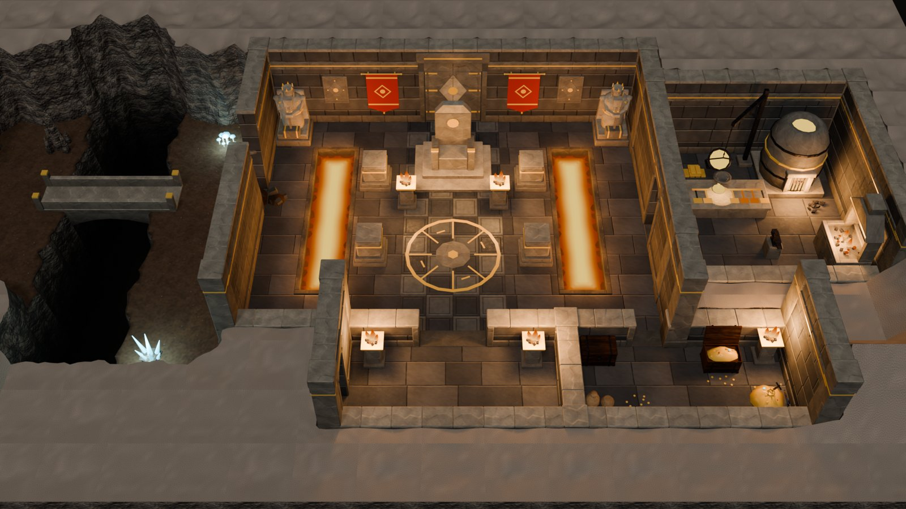
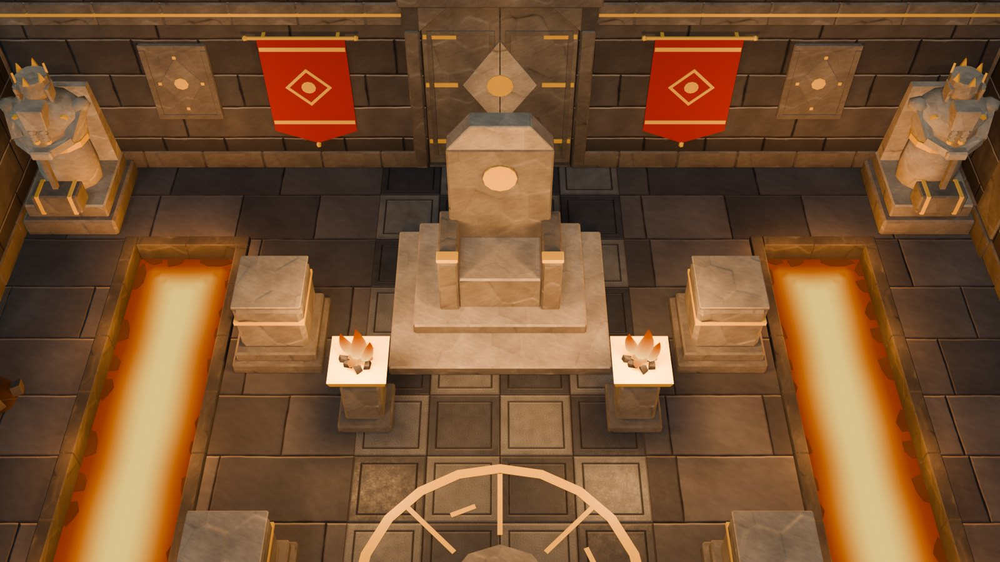
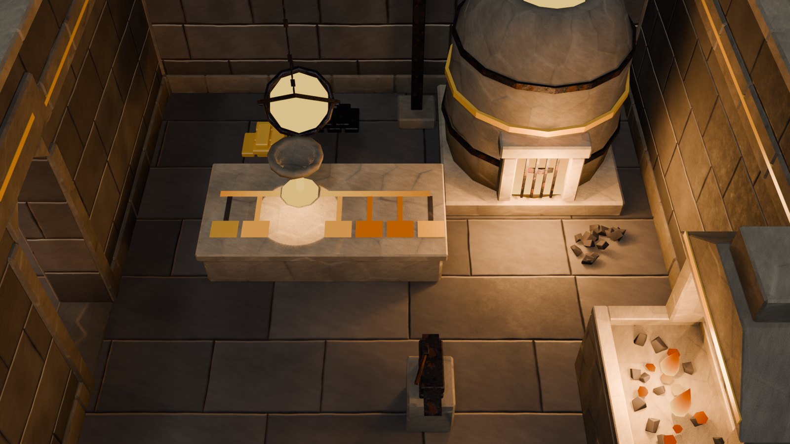
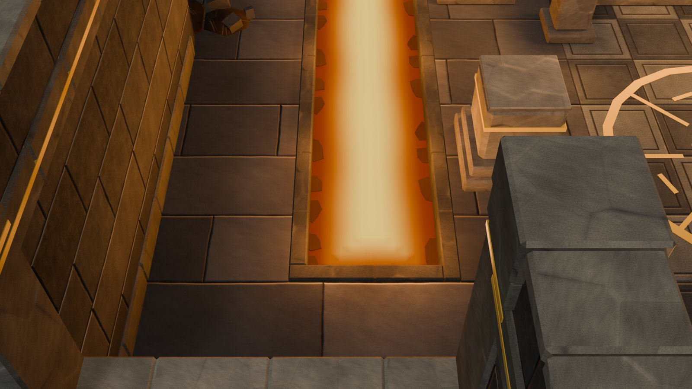
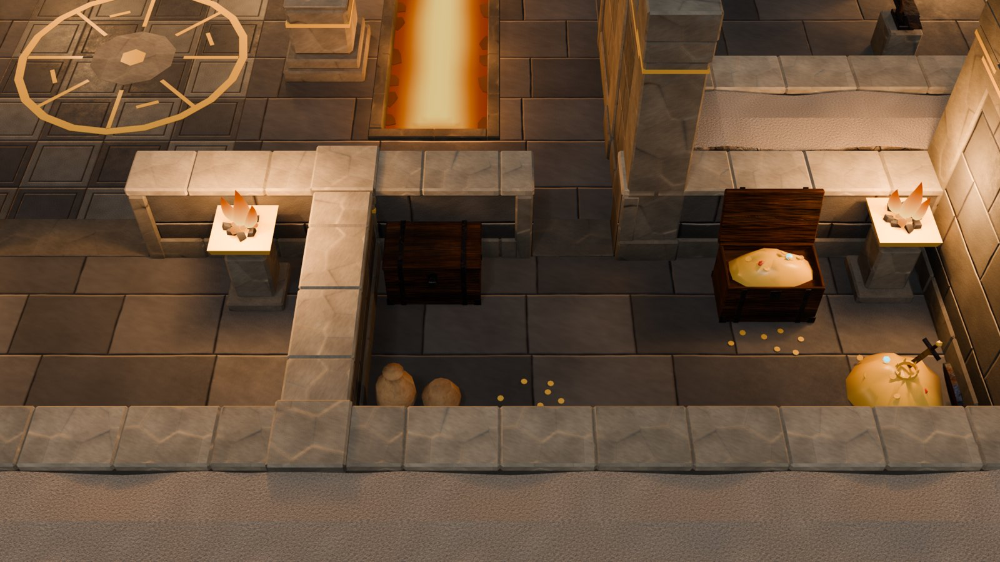
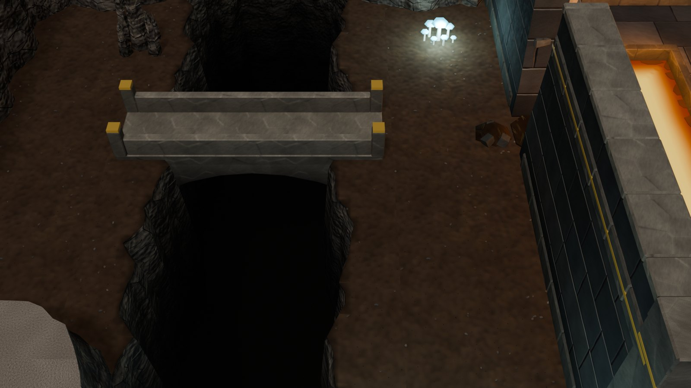
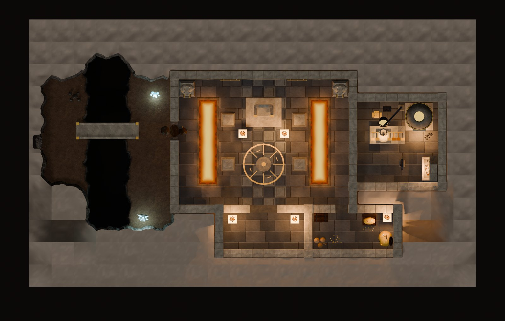

# Dwarf kit

Dwarven halls cut into the mountain, for the interior framework ([INTERIOR_KIT.md](INTERIOR_KIT.md)).

A dwarven level is a cave map ([ADVENTURE_KIT.md](ADVENTURE_KIT.md)): the halls are Dwarf walls drawn inside it and
backed by the rock, lava runs in channels, and natural caves open beside them. The kit adds:
- a granite wall family with a gilded rune band;
- corbelled doorways and a great gate with rune-carved stone leaves;
- lava channels whose surface carries a heat gradient;
- pillars, a throne, king statues, braziers, a forge and anvil, a stone arch bridge, red clan banners and a gold floor
  medallion;
- three textures, eight materials and the **Hall** preset.

That is 36 masters (23,140 triangles) and one level, `VKI_Dwarf_Hall`. The level's landmark is the great crucible in
its foundry, one of the kit's points of interest ([POINTS_OF_INTEREST.md](POINTS_OF_INTEREST.md)).



<table>
<tr>
<td width="50%"><br><sub>The throne on its dais before the sealed great gate. Red clan banners flank the gate, dwarf kings stand in the corners, braziers burn, and the checkered runner leads up to it. The lava channels run either side.</sub></td>
<td width="50%"><br><sub>The foundry through the hall's east door: the great crucible pouring into its casting bed, the furnace behind, the forge on the east wall and the anvil.</sub></td>
</tr>
<tr>
<td width="50%"><br><sub>A lava channel: dark scorched kerbs, a yellow-hot core deepening to red at the banks, crust cooling against the rims. The walkway has plain granite flags and the runner a checker.</sub></td>
<td width="50%"><br><sub>The treasury off the east walkway: an iron chest and an open chest of gold, a gold heap, urns, coins and a brazier. The vestibule's braziers stand to its west.</sub></td>
</tr>
<tr>
<td width="50%"><br><sub>The hall's west wall broken into a natural cave (<code>Wall_Dwarf_Breach_150_Full</code>); a stone arch bridge crosses the chasm to the tunnel on to the mines.</sub></td>
<td width="50%"><br><sub>From straight above: the vestibule and treasury, the great hall with its lava channels, runner and medallion, the foundry, the cave and the bridge.</sub></td>
</tr>
</table>

## 1. The Dwarf wall family

`vki_fam_dwarf`; class O, T 0.50, H 3.0. It uses the Stone family's construction in precise granite ashlar.

- **Body.** `T_VKI_DwarfIn`: three 0.5 m courses, blocks 0.75 and 1.5 m, crisp joints, little chipping.
- **Plinth course.** At 0–0.28 m, 3 cm proud of **both** faces, because partitions show both.
- **Rune band.** On Full walls, a band at 2.20–2.50 m, also 3 cm proud of both faces, with a gilded line
  (2.33–2.37 m, 4 mm proud of the band; gold on the TEXTILE slot). Both courses are cut on the 0.75 grid, so every end
  profile carries them (T2). Where a band stops inside a piece, its gold line stops 1 cm short (T5S).
- **Materials.** A pale polished coping (`DwarfCap`), dark dressed stone (`DwarfBlock`), and a faint grime toward the
  floor.
- **Posts.** A square pier with a two-stepped capital and a gold ring (Corner), and the same as a pilaster (Mid).
- **Post priority.** Cave > Ancient > **Dwarf** > Dungeon > Sewer > Stone > …

| Piece | What it is |
|---|---|
| `Wall_Dwarf_Plain_150A` / `_300`, Full and Cut; `Rake_150_L` / `_R` | plain granite with the plinth (and the band on Full) |
| `Wall_Dwarf_Plain_150B_Full` | a carved relief on face A: a raised frame, a lozenge, a gold rune disc at its heart, gold studs at its points |
| `Wall_Dwarf_Door_150_Full` / `_Cut` | the corbelled doorway: clear x 0.33–1.17 to 2.25, its top corners cut by 45° corbels (0.22) under a massive lintel with a gold band; dressed jambs 4 cm proud of both faces |
| `Wall_Dwarf_DoorWide_300_Full` / `_Cut` | the great gate: the same at 1.80 × 2.45 (corbels 0.32); Full takes `Leaf_DwarfGate_300` |
| `Leaf_DwarfGate_300` | the gate's two stone leaves, closed: raised borders, a lozenge split down the seam under a gold rune disc, gold hinge bands; `vki_leaf_motion` `swing_pair` (hinges at local x 0 and 1.80), `vki_openable` |
| `Wall_Dwarf_Passage_150_Full` | a dark corbelled doorway: a scene link |
| `Wall_Dwarf_Breach_150` / `_300`, Full and Cut | knocked through into a cave; the plinth (and band) stay on the intact ends. The Dwarf breaches use a leaner spill (their plinth costs 88 triangles; the Cut ones must stay under 700 / 1,200). |

## 2. Lava channels

Cells coded `ll` in a cave map.

- **Tiles.** They use the sewer's channel tiles ([SEWER_KIT.md](SEWER_KIT.md): five rotation classes, rotated,
  carrying no floor). The same code builds them (`vki_sew_channel`, which takes a family, channel heights, a liquid,
  the rim tops' slot, and `volumes=False` to leave the liquid to the caller).
- **Kerbs.** Rims 0.15 wide, 6 cm proud, in dark dressed stone (`DwarfBlock` tops, vki_dark 0.45, scorched toward
  the lava). The first rims were pale coping, and with the lava's light on them they read as pale trays.
- **Lava.** The lava is a volume from the bed up to −0.20. Its top is a grid (0.10 m across a bank, 0.25 along it)
  whose vertices carry the **heat**: a smoothstep of the distance from the nearest bank (0.02–0.55 m), bent by a
  slow wobble that fades out at the tile's edges.
  - **Seamless.** The distance is the same from both sides of every tile edge (a cell's centre line), or 0.60 from a
    bank, past the smoothstep's top, so the tiles join.
  - **Material.** `M_VKI_Lava` is a pure emitter on the heat (`vki_rim` = 1 − heat, the flames' mechanism): yellow
    (1.0, 0.70, 0.15) × 1.25 down the middle, deep red (1.0, 0.12, 0) × 0.35 at the banks. Brighter cores went peach
    under AgX.
  - **Open below.** The lava volume is open at the bed (`vki_open_bottom`).
- **Crust.** One or two broad plates per bank, long with it and tucked under the rim (`M_VKI_LavaCrust`: dark, with a
  faint red glow, on the ASH slot). A plate sits in each inner corner, and now and then an island floats in open lava.
  Small plates scattered over the surface read as pebbles.
- **Light.** A 40 W orange light per tile.
- **Unity data.** `vki_water` `lava`, `vki_trap` `burn`, `vki_flow` toward `R["lava_sinks"]` and the heat (`vki_rim`,
  to UV2 or `Col.a` at export) for Unity's shader.
- **Tri budget:** 40–624 per tile.

## 3. Props

| Piece | What it is |
|---|---|
| `Prop_Pillar_Dwarf_Cut` / `_Full` | a square pillar: a stepped base, the shaft 0.72 square with rounded arrises and a gold ring; Cut is cut at 1.00 (a pale section, like the walls' caps), Full has a three-stepped capital cut at 3.00 |
| `Prop_Statue_DwarfKing` | a dwarf king in pale stone on a stepped plinth, 2.2 m (stand it against a north wall). He is squat and broad under a cloak that flares from his shoulders to the plinth, fastened with gold clasps. His helm has cheek guards and gold crown points. A squared beard ends in two braids bound in gold rings, above his hands (which hide anything lower from the camera). His hands rest on a great hammer whose head has two gold bands. 1,300 triangles. |
| `Prop_Throne_Dwarf` | the throne on its own two-step dais (2.40 × 2.00): a massive seat with gold-capped arms and a tall back with a stepped crest and a gold rune disc. The dais is part of the prop, since a cave map has no dais floors. |
| `Prop_Brazier_Dwarf` | a square stepped pedestal and a square gold bowl with coals, embers and fire; light |
| `Prop_Forge_Dwarf` | a stone hearth with a glowing coal bed in a kerb, two piers carrying a stepped hood with a gold band, the flue cut at 2.60; light; stand it against a wall (local +y) |
| `Prop_Anvil_Dwarf` | an anvil with horn and heel on a dressed block, a hammer on its face |
| `Prop_Bridge_Dwarf` | a narrow stone arch bridge 4.2 m long over a two-cell chasm (like the rope bridge): a deck 1.10 wide, parapets 0.35 tall, gold-capped end posts, the arch's underside falling to the abutments. Its `vki_bridge` deck runs 0.2 m past the stone at each end: the chasm's soft rim reaches past the bridge's end. |
| `Prop_Banner_Dwarf` | a clan banner, `wall_hung`, for a Full Dwarf wall under its rune band. A gilded rod on two brackets at 2.08 holds a deep red cloth (`M_VKI_BannerRed` on CLOTH_A) 1.00 wide, falling to a point at 0.50. Gold bands cross its head and foot, a gold lozenge surrounds a rune disc, and a gold tassel hangs at the point. 244 triangles. |
| `Overlay_RuneCircle` | a gold floor medallion 2.8 m across: a ring, eight spokes, rune bars, a dark stone disc with a gold rune |

The level's point of interest, `Prop_POI_Crucible` (the great crucible), is in [POINTS_OF_INTEREST.md](POINTS_OF_INTEREST.md).

## 4. Textures, materials, preset

**Textures**

| Texture | What it is |
|---|---|
| `T_VKI_DwarfIn` | `vki_gen_blocks` with cool dark granite palettes and crisp thin joints |
| `T_VKI_DwarfFloor` | the new `vki_gen_dwarffloor`: square polished slabs (0.75 m) on a checker of a darker and a paler granite, 2.5 mm joints, a carved groove 9 cm inside every slab edge, fine speckle. The hall's processional runner. |
| `T_VKI_DwarfFlag` | plain granite flags from `vki_gen_blocks`: four 0.75 m courses, 1.0–1.5 m long, tight joints, a calm tone (luma 0.369, the checker's 0.380). The walkways, vestibule, treasury and foundry. |

**Materials**

| Material | What it is |
|---|---|
| `M_VKI_DwarfIn` | the walls |
| `M_VKI_DwarfFloor`, `M_VKI_DwarfFlag` | the floors, both tinted 0.56 for the palette rule |
| `M_VKI_DwarfCap` | the pale polished coping |
| `M_VKI_DwarfBlock` | the dark dressed stone |
| `M_VKI_Lava` | the lava, on the heat kind |
| `M_VKI_LavaCrust` | the crust plates |
| `M_VKI_BannerRed` | the banners' cloth |

**Material kinds.** The flat kind takes an emission colour and strength. The new kind **`heat`** is a pure emitter
mixed from a core to a rim colour by the mesh's `vki_rim` (`vki_heat_nodes`; the flames' `M_VKI_GlowIn` uses it
too).

**Styles**

| Slot | Styles |
|---|---|
| wall | `DwarfIn` |
| floor | `DwarfFloor`, `DwarfFlag` |
| cap | `DwarfCap`, `DwarfBlock` |
| water | `Lava` |

**Preset `Hall`.** A cool stone-grey key (0.55 × (.90, .92, 1.0)) and fill. This is about the luminance of the first,
warm key, which flattened the fires' warm pools. It is a dark preset (floor target 0.15).

## 5. The level

**`VKI_Dwarf_Hall`, the great hall** (19 × 11 cells, Hall preset). Links: `gate` → `@surface` (a passage in the
vestibule) and `mines` → `@mines` (a tunnel: the mines are the next kit).

- **The vestibule.** A vestibule from the surface gate has two braziers by its wide corbelled doorway into the great
  hall (8 × 6 cells).
- **The hall.** A checkered runner (`DwarfFloor`, cols 9–10, x 13.5–16.5, on the checker's joints) leads up the aisle
  over the gold rune medallion. The side walkways have plain flags. The lava channels run along the aisle, and the
  pillars stand at its edges.
- **The throne.** The king's throne stands on its dais a metre before the sealed great gate, with braziers either
  side. The camera sees the gate over the throne. The gate is flanked by red clan banners, then relief panels, then
  two dwarf kings in the walkways' north corners.
- **Cross passages.** Along the hall's south and north rows they join the side walkways to the aisle round the lava
  channels' ends. Nothing stands on them but the dais.
- **The treasury** (cols 12–15, rows 1–2). A Cut door (`s2`: `Wall_Dwarf_Door_150_Cut`) leads in from the east
  walkway's south end. It holds an iron chest, an open chest of gold, a gold heap, urns, coins and a brazier. Its wall
  to the vestibule is Cut, so no Full corner post hides it (T19).
- **The foundry** (through the east door; cols 14–17 since it grew a column east). The great crucible backs onto its
  north wall, its moulds and the furnace's mouth toward the camera. The forge stands on the east wall with the anvil
  before it. The hall's Full east wall hides the room's west strip from the camera, so nothing with a use point goes
  there.
- **The cave.** The west wall is broken into a natural cave, where the stone bridge crosses the chasm to the tunnel.
- **Rock.** The halls' walls are backed by the rock (wall-backed tiles).

**Debris** ([DEBRIS.md](DEBRIS.md)) is strewn by zone: none on the runner, a little in the halls (0.08), slag and ore
in the foundry (its own zone, theme `forge`), rocks and rubble in the cave. There are 17 pieces, 4,374 triangles.

It checks at **0 errors and 0 warnings**. Floor luma is 0.222 and cap tops 0.387; BFS reach is 1,221 / 1,351 (the rest
are pockets). It has 103,074 triangles with the debris; before it, 98,700:

| Part | Triangles |
|---|---|
| Rock | 33,656 |
| Walls, posts, gate leaves | 33,124 |
| Props (+ the crucible) | 14,144 + 3,154 |
| Lava (20 tiles) | 6,128 |
| Chasm | 5,242 |
| Floors, overlays | 3,252 |

The adventure catalog has two groups for the kit (`G31`, `G32`) and one for the points of interest (`G33`).

## 6. Critique and improvements (2026-09-30)

The user asked for a critique of the first hall and then improvements.

| Critique | Improvement |
|---|---|
| Invisible faces: the rock, chasm and stream tiles closed their solids underneath, where nothing sees them: 14–25 % of every cave level (21,112 triangles in this one). | The marching-squares mesher leaves them open (`bottom=False`). Such masters carry `vki_open_bottom` (the z of the open rim), which T7 accepts. 278 masters went from 88,468 to 65,218 triangles. Levels: the hall 107,164 → 84,124 before the additions; `VKI_Cave_Test` 107,052 → 74,262; `VKI_Cave_Breach` 58,306 → 47,482; `VKI_Sewer_S1` 74,896 → 60,484; `VKI_Cave_Falls` 60,710 → 43,202. |
| The lava read as a flat pale-orange mat with black spots, in pale trays. | Dark scorched kerbs, the heat gradient (a hot core to deep red banks) and crust cooling against the banks (section 2). |
| The same checker covered every floor, with no processional hierarchy. | A checkered runner up the aisle only; plain granite flags everywhere else. |
| About 40 % of the frame was a flat pale rock band south of the hall. | The treasury now fills its east part. The rock tops stay pale by the palette rule (caps ≥ floor + 0.15). |
| Brown on brown, with no colour accent; the warm key flattened the light pools. | Red clan banners, a cooler key of the same luminance (the fires' pools read), more gold (treasury, statues). |
| The statues were blocky. | A cloak, braided beard, cheek guards, gold clasps and rings, and a bigger gold-banded hammer. |
| The vestibule was empty. | Two braziers by the doorway, and the treasury beside it. |

Then the level gained its point of interest, the great crucible, in the enlarged foundry.

## 7. Code

| Text (`src/interior/`) | Contents |
|---|---|
| `vki_fam_dwarf` | the Dwarf family (walls, doors, the gate and its leaves, passage, posts, breaches through `vki_brk_breach`), the lava tiles (`vki_dwf_lava`, `vki_dwf_lava_quarters`, `vki_dwf_lava_heat`, `vki_dwf_lava_pool`, `vki_dwf_lava_crust`), the props (with `vki_dwf_banner`); `VKI_DWF_NAMES` (36) |
| `vki_rooms_dwarf` | `VKI_PLANS` / `VKI_ROOMS` for `VKI_Dwarf_Hall`, `VKI_DWARF_SCENES`, the two catalog groups |

Changes to shared texts:

| Text | Change |
|---|---|
| `vki_core` | the family, materials (the `heat` kind: `vki_heat_nodes`), styles, the Hall preset, the load order |
| `vki_rooms_adventure` | `vki_cave_channels` lays sewer water and lava (`VKI_CAVE_CHANNELS`, each with its sinks key) |
| `vki_fam_sewer` | `vki_sew_channel` takes a family, channel heights, a liquid, `rim_top` and `volumes` |
| `vki_fam_ancient` | `vki_brk_breach` takes the Dwarf family (its trim, its patch, a leaner spill) |
| `vki_fam_cave`, `vki_fam_water`, `vki_test` | the open bottoms and T7's exemption |
| `vki_tex_dungeon` | the three dwarven textures |

```python
g0={}; exec(bpy.data.texts["vki_core"].as_string(), g0); g=g0["vki_ns"]()
g["vki_ws_build"]("adventure", g["VKI_DWF_NAMES"]); g["vki_adopt"](g["VKI_DWF_NAMES"])   # new masters
g["vki_rebuild"](g["VKI_DWF_NAMES"])                                                     # or in place
g["vki_build_scene"]("VKI_Dwarf_Hall")
g["vki_rooms_shots"]("VKI_Dwarf_Hall"); g["vki_check"]("VKI_Dwarf_Hall", full=True, palette=True)
```

## 8. Known limits

- **Keep the cross passages clear.** Round a lava channel's ends a walker needs the whole cell row: a brazier or a
  statue there cut the side walkways off (found by the BFS and fixed in the demo).
- **The rock between the halls is the heaviest part** (a third of the level after the open-bottom cut). A lighter
  solid-rock tile would help a level that is mostly mountain.
- **Breaches, doors and the passage in north–south walls are edge-on** to the game camera. The great gate faces it
  from the north wall.
- **A Full north–south wall hides a strip behind it** from the camera (the foundry's west side): keep use points out
  of it.
- **Full pillars and the 2.2 m statues hide what is behind them** from the camera. The hall uses the Cut pillars and
  puts the statues against the north wall.
- **One variant per lava tile class**, so a long channel repeats its crust every 1.5 m. Unity's shader will animate
  it.
- **The forge's hood reads as a block from above.** The fire and glow sit under it.
