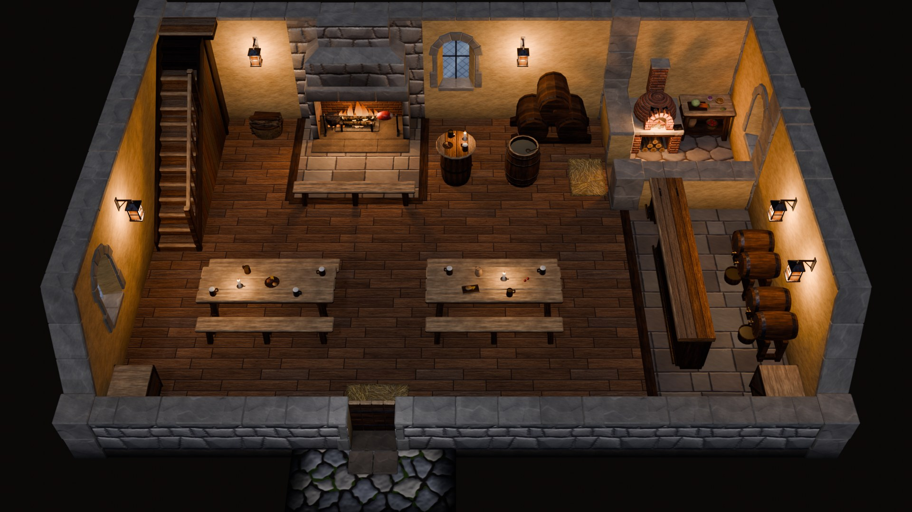
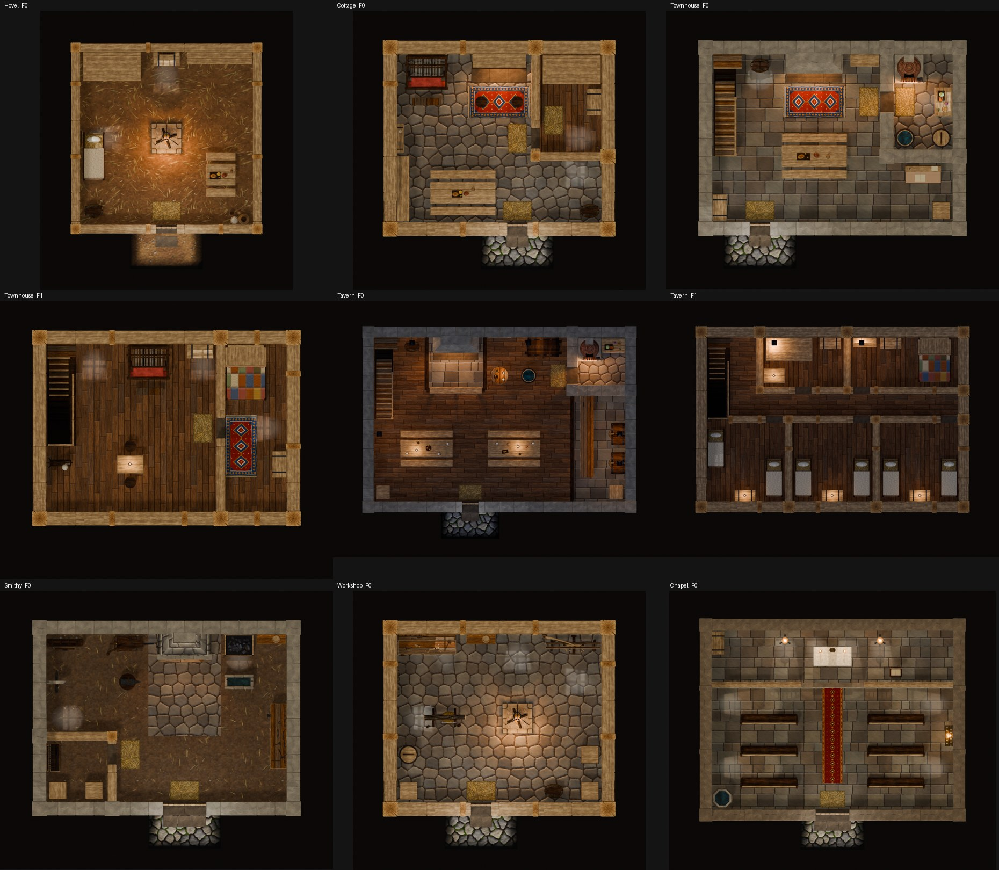

# Interior kit (VKI)

Modular building interiors for a top-down game. The player presses a button on a building's door, and the game loads
that building's interior scene; stairs work the same way between floors. The interiors are built from pieces that snap
to a 1.5 m grid, in the same hand-painted style as the exterior kit, and they may be larger than the houses outside.

Everything is generated by the Python in `src/interior/` (also stored as Blender texts in the .blend), like the rest of
the kit. The design, with every decision and its reasons, is in
[history/interior_design/INTERIOR_SPEC.md](history/interior_design/INTERIOR_SPEC.md) (its §10 lists the changes made
while building).

The dungeon kit builds on this framework with two more wall families (Dungeon, Bars), stone stairs, dungeon props and
two linked levels: [DUNGEON_KIT.md](DUNGEON_KIT.md). The adventure kit adds the Ancient family, organic cave rock
tiles on a dual grid, pits, traps, passages and three more levels: [ADVENTURE_KIT.md](ADVENTURE_KIT.md).


<table>
<tr>
<td width="50%"><br><sub>Tavern ground floor at night: lanterns, the hearth with a spit roast, the bar with cask racks, tables with tankards and candles, the stair up to the guest floor.</sub></td>
<td width="50%"><br><sub>The same nine interiors from straight above.</sub></td>
</tr>
</table>

## 1. How it works

**Camera.** Every piece is judged from the interior game camera: yaw fixed looking north (+Y, north is up on screen),
pitch 50°, lens 38 mm on a 36 mm sensor (vertical field of view 29.8°), distance 14–22 m. A room is framed with
`D_fit = (depth + 1.5 + 1.428·h + 0.4) / 0.737`, where h is the north wall height (0 extra margin for the chapel's
4.5 m walls, which use `h = 3.97`); `vki_fit_camera` computes it.

**Grid.** 1.5 m (half the 3 m exterior cell). Nodes sit at multiples of 1.5 m; every scene's origin is its south-west
node and the floor top is at z = 0. Walls run from node to node.

**Cutaway.** Every wall shape comes as `_Full` and `_Cut`. The cut version is the lower metre of the full one with a
pale cap on top. Default heights:

| Wall | Height |
|---|---|
| North perimeter | Full (it carries windows, the fireplace, shelves and hangings) |
| East and west perimeter | Full, with a `Rake_150` as the south-most piece (it slopes from Cut to Full) |
| South perimeter | Cut |
| Every partition | Cut |

**Placing walls.** A wall piece's origin is its start node on the wall's centre line; the room is on its local −Y side.

| Wall | Rotation | Origin at |
|---|---|---|
| North | 0 | west end |
| East | −90 | north end |
| South | 180 | east end |
| West | +90 | south end |

Rakes: `_L` on west walls, `_R` on east walls (low end south).

**Posts.** Wall ends are open (the end faces are removed so nothing z-fights), so every end must be covered:

| At a node | Post |
|---|---|
| L, T or X junction | `Post_<Family>_Corner`, required |
| A change of height, family or wall class on a straight run | `Post_<Family>_Mid`, required |
| A free end | `Post_<Family>_Mid`, required (an uncovered end is an error) |
| An even node (multiple of 3 m) on a straight run | rhythm `Post_<Family>_Mid`, optional (Timber, Wattle, Board) |

Post family by priority: Ancient > Dungeon > Stone > Ashlar > Timber > Wattle > Board > Bars (the dungeon
and adventure families: [DUNGEON_KIT.md](DUNGEON_KIT.md), [ADVENTURE_KIT.md](ADVENTURE_KIT.md)). Height: the tallest wall end at the node.

**Wall families.**

| Family | Class (thickness) | Full height | Look | Used for |
|---|---|---|---|---|
| Timber | O (0.50) | 3.0 | limewash between oak studs, rails and plates | cottage, townhouse upper floor, tavern guest floor, workshop |
| Stone | O (0.50) | 3.0 | rubble with dressed coping; limewash it with the `wall_a` style | townhouse and tavern ground floors, smithy |
| Board | P (0.30) | 3.0 | upright boards, oak posts | partitions, the smithy store |
| Wattle | P (0.30) | 2.4 | crooked hewn posts, pillowed daub, soot band | hovel |
| Ashlar | O (0.50) | 4.5 | pale dressed stone, string courses, lancet windows with stained glass; pillars instead of rakes | chapel |

Specials: `Fireplace_300` (Timber), `Hearth_300` and `Forge_300` (Stone). They go on Full runs only.

**Floors.** Slabs from z −0.10 to 0 that end on grid lines. The floor textures repeat every 3 m, so `Floor_300` and
`Floor_600` sit on even nodes, and a 1.5 m cell uses the quadrant piece that matches its node:
`Floor_150_Q<i mod 2><j mod 2>`. Floors are never rotated; the plank direction comes from the style
(`Boards_NS` / `Boards_EW`). Floor styles: Boards (plain, dark, pale; NS or EW), Flag, FlagWarm, FlagRustic, Earth,
EarthSooty.

**Doors and exits.** An exit is `Door_150_Cut` + a closed `Leaf_Plank_Cut` + `Apron_300x150` outside (cobble, dirt or
grass) + a `RushMat` inside. Wide exits: `DoorWide_300_Cut` + two leaves (`Leaf_Wide_Cut_L/R` for Stone,
`Leaf_Wide160_Cut_L/R` for the Ashlar pointed door) + `Apron_Wide_300x150`. Every door keeps a free cell on both sides.

**Stairs.** `Stair_Up_150x450_RailR` and `Stair_Down_150x450_RailR` share their origin and rotation on the two floors
(rotation 0/±90, never 180). The up flight rises "through the ceiling"; the down stair is a hole with rails. They are
scene links, like exits.

**Props.** Origin at the footprint centre, back toward +Y. Mounts:

| Mount | Rule |
|---|---|
| `floor` | free-standing, on the 0.75 m lattice |
| `wall_floor` | the back sits on the wall's proud line (0.285 m from an O wall's centre line, 0.185 from a P wall); `vki_place` slides it off posts (`hug`) |
| `wall_hung` | on the face of a Full wall only |
| `table` | origin on the table top (`vki_table_z`: 0.80, 0.78 Table_Small, 0.85 Worktable, 1.05 Table_Barrel) |

Props taller than 1.25 m stand against a Full north wall, so they hide nothing.

**Styles per instance** (`vki_place(..., style={...})`): `floor`, `wall_a` / `wall_b` (PlasterWhite, PlasterCream,
PlasterDaub, PlasterOchre, PlasterRed, StoneIn, StoneInWarm, StoneInCool, AshlarIn, WattleIn, BoardsV, Brick), `cap`,
`wood` (Oak, Dark), `planks`, `shutter` and `cloth` (the exterior colours), `water`, and for Night scenes
`window=Window_Night`, `stained=Stained_Night`.

**Lights.** Pieces that give light carry `vki_lights` sockets (hearths, forge, oven, lanterns, candles, windows).
The Day and Night presets set the key, fill and world; the fire is the brightest thing on screen and the windows are
second. These lights are for Blender renders; the same data is written to `LGT_*` empties for Unity.

## 2. Data for Unity

Export is not done yet (see HANDOFF). Everything a game needs is stored as custom properties:

| Where | Properties |
|---|---|
| Every piece | `vki_class`, `vki_family`, `vki_kind`, `vki_footprint`, `vki_fp_cells`, `vki_collider`, `vki_nav`, `vki_mount`, `vki_cut_pair` / `vki_cut_to` (the Full↔Cut twin), `vki_lights`, `vki_fx` |
| Exit doors and stairs (instances) | `vki_link` (exit / stair_up / stair_down), `vki_link_id`, `vki_target` (`@return` for exits, else a scene name), `vki_prompt`, `vki_trigger` (box in piece-local coordinates), `vki_facing_min` |
| `SPN_<id>` empties | spawn points: `vki_spawn_id`, `vki_facing_deg` |
| `VKI_Root` (one per scene) | `vki_building`, `vki_floor`, camera (`vki_cam_mode`, `vki_cam_dist`, `vki_cam_target`, `vki_cam_pitch` 50, `vki_cam_yaw` 0), `vki_bounds`, `vki_default_spawn` |
| `LGT_*` / `FXA_*` empties | light JSON (`vki_light`) and effect anchors (`vki_fx`) |
| Moving parts | `hinge_axis` (door leaves, chest lid, bar flap), `vki_flap`, `vki_shutter`, `vki_lid_*` |

## 3. The showcase interiors

One Blender scene per floor. Each has a camera `VKI_Cam_<S>` framed by `vki_fit_camera`.

| Scene | Size (cells) | Walls | Preset | Links | Interior for |
|---|---|---|---|---|---|
| `VKI_Hovel_F0` | 5 × 5 | Wattle | Day | exit | hovels, longhouse, log cabins, woodcutter, forester, fisher hut |
| `VKI_Cottage_F0` | 6 × 5 | Timber, Board partitions | Day | exit | one-storey houses |
| `VKI_Townhouse_F0` | 7 × 5 | limewashed Stone | Day | exit, stair up | houses with 2+ storeys, merchant, gable-front, corner and terrace houses |
| `VKI_Townhouse_F1` | 7 × 5 | Timber | Day | stair down | the upper floor of the above |
| `VKI_Tavern_F0` | 9 × 6 | limewashed Stone | Night | exit, stair up | inn, tavern |
| `VKI_Tavern_F1` | 9 × 6 | Timber, Board partitions | Night | stair down | the guest floor |
| `VKI_Smithy_F0` | 7 × 5 | Stone, Board store | Day | wide exit | smithy, blacksmith |
| `VKI_Workshop_F0` | 6 × 5 | Timber | Day | exit | pottery, tannery, dyers, brewery, bakery, mills, smokehouse |
| `VKI_Chapel_F0` | 8 × 6 | Ashlar | Day | wide exit | chapel |

The plans are ASCII in `VKI_PLANS` (`vki_rooms`); the prop list of each room is in `VKI_ROOMS`. The changes made to
the spec's plans while building are listed in `VKI_PLAN_CHANGES`.

## 4. Code and the .blend

| Text (`src/interior/`) | Contents |
|---|---|
| `vki_core` | constants, `VKIKit` (the piece builder), materials, styles, `vki_place`, `vki_rebuild`, scenes, `vki_shot`, workshop helpers |
| `vki_test` | the per-piece and per-scene tests |
| `vki_tex`, `vki_textiles` | the 16 interior texture sets (`T_VKI_*`) and the textile atlas; run on demand |
| `vki_fam_timber`, `vki_fam_stone`, `vki_fam_board`, `vki_fam_wattle`, `vki_fam_ashlar` | the wall families |
| `vki_floors`, `vki_links` | floors, sills, door leaves, aprons, overlays; stairs, dais, window light pool, runners |
| `vki_props_home`, `vki_props_tavern`, `vki_props_smithy`, `vki_props_chapel` | furniture and dressing |
| `vki_rooms` | the plans and the room assembler |
| `vki_fam_dungeon`, `vki_props_dungeon`, `vki_rooms_dungeon`, `vki_tex_dungeon` | the dungeon kit ([DUNGEON_KIT.md](DUNGEON_KIT.md)) |
| `vki_fam_ancient`, `vki_fam_cave`, `vki_props_adventure`, `vki_props_lair`, `vki_rooms_adventure` | the adventure kit ([ADVENTURE_KIT.md](ADVENTURE_KIT.md)) |

| In the .blend | What it is |
|---|---|
| `VKI_Pieces` (in scene `VKI_Test`, hidden) | the 146 piece masters `SM_VKI_*`; instances share their meshes |
| `VKI_<Room>_F<n>` | the nine showcase scenes (collections `_Shell`, `_Props`, `_Logic`, `_Lights`) |
| `VKI_Catalog` | every piece, labelled, in 12 groups with a camera each (`VKI_Catalog_Cam_G00`…`G11`), plus a small assembled room |
| `VKI_LookTest`, `VKI_Test` | the Timber look test and the test rigs |
| `WS_vki_*` | the workshop scenes the package builders used (their test rooms) |
| `Interior_Progress` | a live board: collection instances of every room scene and workshop, with a camera per room |

Common commands (Blender Python, e.g. through MCP):

```python
g0={}; exec(bpy.data.texts["vki_core"].as_string(), g0); g=g0["vki_ns"]()   # kit + interior namespace
g["vki_rebuild"]()                               # rebuild every VKI piece in place (instances update)
g["vki_rebuild"](["SM_VKI_Prop_Chest"])          # just some pieces
g["vki_apply_mats"]()                            # rebuild the M_VKI_* materials
g["vki_build_scene"]("VKI_Cottage_F0")           # rebuild one room (about 3 s); vki_build_all() for all nine
g["vki_check"]("VKI_Cottage_F0")                 # room rules: posts, floors, doors, clashes, reachability, visibility
g["vki_rooms_shots"]("VKI_Cottage_F0")           # game shot + plan into renders/interior/VKI_Cottage_F0/
g["vki_test_pieces"](names)                      # per-piece tests ({} = clean); vki_test_all() for everything
```

`vki_ns()` keeps loading when a package text fails and reports it in `g["VKI_LOAD_ERRORS"]`. Every top-level name in
a `vki_*` text starts with `vki_` / `VKI_` (tested by T18). Never call the exterior `full_rebuild()` or
`apply_pbr_all()` for interior work; the exterior stays untouched (tested by T15).

## 5. Tests

- `vki_test_pieces(names)`: bounds (T1), identical end profiles within a family (T2), the node zone (T3), no coplanar
  overlapping faces inside a piece (T5S, the z-fighting check), closed solids (T7), normals (T8), triangle budgets (T9),
  metadata (T10), wobble limits (T13), material slots (T14).
- `vki_test_all()`: every master, plus instance metadata (T10i), namespace (T18) and, with `t15=True`, exterior
  invariance (T15).
- `vki_check(scene)`: the room rules (T12): posts at every junction and free end, floor coverage, doors with free cells,
  prop clashes, mount hosts, spawns clear of triggers, a walkability search from every spawn to every use point and
  trigger, and visibility from the camera (T19). Palette, light-level and occlusion rules are reported as warnings.

## 6. Pieces

Generated from the masters in `VKI_Pieces` (triangles, footprint in 1.5 m cells, mount).

### Timber walls and posts (core) (17)

| Piece | Tris | Cells | Mount |
|---|---|---|---|
| `SM_VKI_Post_Timber_Corner_Cut` | 44 | 1,1 | – |
| `SM_VKI_Post_Timber_Corner_Full` | 44 | 1,1 | – |
| `SM_VKI_Post_Timber_Mid_Cut` | 44 | 1,1 | – |
| `SM_VKI_Post_Timber_Mid_Full` | 44 | 1,1 | – |
| `SM_VKI_Wall_Timber_Door_150_Cut` | 592 | 1,1 | – |
| `SM_VKI_Wall_Timber_Door_150_Full` | 1008 | 1,1 | – |
| `SM_VKI_Wall_Timber_Fireplace_300_Cut` | 2646 | 2,2 | – |
| `SM_VKI_Wall_Timber_Fireplace_300_Full` | 3994 | 2,2 | – |
| `SM_VKI_Wall_Timber_Plain_150A_Cut` | 504 | 1,1 | – |
| `SM_VKI_Wall_Timber_Plain_150A_Full` | 784 | 1,1 | – |
| `SM_VKI_Wall_Timber_Plain_150B_Full` | 852 | 1,1 | – |
| `SM_VKI_Wall_Timber_Plain_300_Cut` | 856 | 2,1 | – |
| `SM_VKI_Wall_Timber_Plain_300_Full` | 1416 | 2,1 | – |
| `SM_VKI_Wall_Timber_Rake_150_L` | 908 | 1,1 | – |
| `SM_VKI_Wall_Timber_Rake_150_R` | 908 | 1,1 | – |
| `SM_VKI_Wall_Timber_Window_150_Cut` | 616 | 1,1 | – |
| `SM_VKI_Wall_Timber_Window_150_Full` | 1172 | 1,1 | – |

### Stone walls, posts and specials (21)

| Piece | Tris | Cells | Mount |
|---|---|---|---|
| `SM_VKI_Post_Stone_Corner_Cut` | 132 | 1,1 | – |
| `SM_VKI_Post_Stone_Corner_Full` | 352 | 1,1 | – |
| `SM_VKI_Post_Stone_Mid_Cut` | 132 | 1,1 | – |
| `SM_VKI_Post_Stone_Mid_Full` | 308 | 1,1 | – |
| `SM_VKI_Wall_Stone_DoorWide_300_Cut` | 644 | 2,1 | – |
| `SM_VKI_Wall_Stone_DoorWide_300_Full` | 1796 | 2,1 | – |
| `SM_VKI_Wall_Stone_Door_150_Cut` | 496 | 1,1 | – |
| `SM_VKI_Wall_Stone_Door_150_Full` | 1416 | 1,1 | – |
| `SM_VKI_Wall_Stone_Forge_300_Cut` | 3388 | 2,2 | – |
| `SM_VKI_Wall_Stone_Forge_300_Full` | 4248 | 2,2 | – |
| `SM_VKI_Wall_Stone_Hearth_300_Cut` | 3214 | 2,2 | – |
| `SM_VKI_Wall_Stone_Hearth_300_Full` | 4010 | 2,2 | – |
| `SM_VKI_Wall_Stone_Plain_150A_Cut` | 252 | 1,1 | – |
| `SM_VKI_Wall_Stone_Plain_150A_Full` | 444 | 1,1 | – |
| `SM_VKI_Wall_Stone_Plain_150B_Full` | 996 | 1,1 | – |
| `SM_VKI_Wall_Stone_Plain_300_Cut` | 508 | 2,1 | – |
| `SM_VKI_Wall_Stone_Plain_300_Full` | 892 | 2,1 | – |
| `SM_VKI_Wall_Stone_Rake_150_L` | 680 | 1,1 | – |
| `SM_VKI_Wall_Stone_Rake_150_R` | 680 | 1,1 | – |
| `SM_VKI_Wall_Stone_Window_150_Cut` | 400 | 1,1 | – |
| `SM_VKI_Wall_Stone_Window_150_Full` | 1404 | 1,1 | – |

### Board walls and posts (10)

| Piece | Tris | Cells | Mount |
|---|---|---|---|
| `SM_VKI_Post_Board_Corner_Cut` | 44 | 1,1 | – |
| `SM_VKI_Post_Board_Corner_Full` | 44 | 1,1 | – |
| `SM_VKI_Post_Board_Mid_Cut` | 44 | 1,1 | – |
| `SM_VKI_Post_Board_Mid_Full` | 44 | 1,1 | – |
| `SM_VKI_Wall_Board_Door_150_Cut` | 376 | 1,1 | – |
| `SM_VKI_Wall_Board_Door_150_Full` | 748 | 1,1 | – |
| `SM_VKI_Wall_Board_Plain_150A_Cut` | 208 | 1,1 | – |
| `SM_VKI_Wall_Board_Plain_150A_Full` | 480 | 1,1 | – |
| `SM_VKI_Wall_Board_Plain_300_Cut` | 376 | 2,1 | – |
| `SM_VKI_Wall_Board_Plain_300_Full` | 840 | 2,1 | – |

### Wattle walls and posts (15)

| Piece | Tris | Cells | Mount |
|---|---|---|---|
| `SM_VKI_Post_Wattle_Corner_Cut` | 124 | 1,1 | – |
| `SM_VKI_Post_Wattle_Corner_Full` | 124 | 1,1 | – |
| `SM_VKI_Post_Wattle_Mid_Cut` | 124 | 1,1 | – |
| `SM_VKI_Post_Wattle_Mid_Full` | 124 | 1,1 | – |
| `SM_VKI_Wall_Wattle_Door_150_Cut` | 592 | 1,1 | – |
| `SM_VKI_Wall_Wattle_Door_150_Full` | 996 | 1,1 | – |
| `SM_VKI_Wall_Wattle_Plain_150A_Cut` | 460 | 1,1 | – |
| `SM_VKI_Wall_Wattle_Plain_150A_Full` | 728 | 1,1 | – |
| `SM_VKI_Wall_Wattle_Plain_150B_Full` | 816 | 1,1 | – |
| `SM_VKI_Wall_Wattle_Plain_300_Cut` | 768 | 2,1 | – |
| `SM_VKI_Wall_Wattle_Plain_300_Full` | 1304 | 2,1 | – |
| `SM_VKI_Wall_Wattle_Rake_150_L` | 760 | 1,1 | – |
| `SM_VKI_Wall_Wattle_Rake_150_R` | 760 | 1,1 | – |
| `SM_VKI_Wall_Wattle_Window_150_Cut` | 572 | 1,1 | – |
| `SM_VKI_Wall_Wattle_Window_150_Full` | 1452 | 1,1 | – |

### Ashlar walls and posts (12)

| Piece | Tris | Cells | Mount |
|---|---|---|---|
| `SM_VKI_Post_Ashlar_Corner_Cut` | 320 | 1,1 | – |
| `SM_VKI_Post_Ashlar_Corner_Full` | 320 | 1,1 | – |
| `SM_VKI_Post_Ashlar_Mid_Full` | 232 | 1,1 | – |
| `SM_VKI_Wall_Ashlar_DoorWide_300_Cut` | 492 | 2,1 | – |
| `SM_VKI_Wall_Ashlar_DoorWide_300_Full` | 1828 | 2,1 | – |
| `SM_VKI_Wall_Ashlar_LancetTall_150_Full` | 1388 | 1,1 | – |
| `SM_VKI_Wall_Ashlar_Lancet_150_Cut` | 348 | 1,1 | – |
| `SM_VKI_Wall_Ashlar_Lancet_150_Full` | 1408 | 1,1 | – |
| `SM_VKI_Wall_Ashlar_Plain_150A_Cut` | 180 | 1,1 | – |
| `SM_VKI_Wall_Ashlar_Plain_150A_Full` | 588 | 1,1 | – |
| `SM_VKI_Wall_Ashlar_Plain_300_Cut` | 348 | 2,1 | – |
| `SM_VKI_Wall_Ashlar_Plain_300_Full` | 1140 | 2,1 | – |

### Floors, door leaves, aprons, overlays, FX (21)

| Piece | Tris | Cells | Mount |
|---|---|---|---|
| `SM_VKI_Apron_300x150` | 676 | 2,1 | – |
| `SM_VKI_Apron_Wide_300x150` | 784 | 2,1 | – |
| `SM_VKI_FX_WindowPool` | 120 | 1,1 | – |
| `SM_VKI_Floor_150_Q00` | 12 | 1,1 | – |
| `SM_VKI_Floor_150_Q01` | 12 | 1,1 | – |
| `SM_VKI_Floor_150_Q10` | 12 | 1,1 | – |
| `SM_VKI_Floor_150_Q11` | 12 | 1,1 | – |
| `SM_VKI_Floor_300` | 12 | 2,2 | – |
| `SM_VKI_Floor_600` | 12 | 4,4 | – |
| `SM_VKI_Floor_Dais_300` | 40 | 2,2 | – |
| `SM_VKI_Floor_Sill_150` | 44 | 1,1 | – |
| `SM_VKI_Leaf_Plank_Cut` | 492 | 1,1 | – |
| `SM_VKI_Leaf_Plank_Full` | 580 | 1,1 | – |
| `SM_VKI_Leaf_Wide160_Cut_L` | 492 | 1,1 | – |
| `SM_VKI_Leaf_Wide160_Cut_R` | 492 | 1,1 | – |
| `SM_VKI_Leaf_Wide_Cut_L` | 492 | 1,1 | – |
| `SM_VKI_Leaf_Wide_Cut_R` | 492 | 1,1 | – |
| `SM_VKI_Rug_300x150` | 132 | 2,1 | floor |
| `SM_VKI_Runner_150` | 20 | 1,1 | floor |
| `SM_VKI_Runner_300` | 32 | 2,1 | floor |
| `SM_VKI_RushMat` | 124 | 1,1 | floor |

### Stairs (scene transitions) (2)

| Piece | Tris | Cells | Mount |
|---|---|---|---|
| `SM_VKI_Stair_Down_150x450_RailR` | 2220 | 1,3 | – |
| `SM_VKI_Stair_Up_150x450_RailR` | 2464 | 1,3 | – |

### Home furniture (23)

| Piece | Tris | Cells | Mount |
|---|---|---|---|
| `SM_VKI_Prop_Barrel` | 780 | 1,1 | floor |
| `SM_VKI_Prop_Barrel_Water` | 896 | 1,1 | floor |
| `SM_VKI_Prop_Bed_Box` | 1068 | 2,1 | wall_floor |
| `SM_VKI_Prop_Bed_HalfTester` | 1480 | 2,2 | wall_floor |
| `SM_VKI_Prop_Bed_Straw` | 648 | 1,2 | floor |
| `SM_VKI_Prop_Chest` | 816 | 1,1 | wall_floor |
| `SM_VKI_Prop_Crate` | 452 | 1,1 | floor |
| `SM_VKI_Prop_Desk_Merchant` | 764 | 2,1 | floor |
| `SM_VKI_Prop_Dresser` | 1436 | 1,1 | wall_floor |
| `SM_VKI_Prop_Form_150` | 220 | 1,1 | floor |
| `SM_VKI_Prop_Form_300` | 308 | 2,1 | floor |
| `SM_VKI_Prop_Hearth_Open` | 1902 | 1,1 | floor |
| `SM_VKI_Prop_Jars_Cluster` | 992 | 1,1 | wall_floor |
| `SM_VKI_Prop_LogBasket` | 880 | 1,1 | floor |
| `SM_VKI_Prop_Oven_150` | 1354 | 1,1 | wall_floor |
| `SM_VKI_Prop_Pantry_Shelves_300` | 5600 | 2,1 | wall_floor |
| `SM_VKI_Prop_Shelf_Wall_150` | 1216 | 1,1 | wall_hung |
| `SM_VKI_Prop_TableDress_Meal_A` | 388 | 1,1 | table |
| `SM_VKI_Prop_TableDress_Meal_B` | 360 | 1,1 | table |
| `SM_VKI_Prop_Table_Small` | 572 | 1,1 | floor |
| `SM_VKI_Prop_Table_Trestle_150` | 616 | 1,1 | floor |
| `SM_VKI_Prop_Table_Trestle_300` | 616 | 2,1 | floor |
| `SM_VKI_Prop_Worktable_150` | 1440 | 1,1 | wall_floor |

### Tavern and smithy furniture (18)

| Piece | Tris | Cells | Mount |
|---|---|---|---|
| `SM_VKI_Prop_Bar_Counter_150` | 732 | 1,1 | floor |
| `SM_VKI_Prop_Bar_End_150` | 732 | 1,1 | floor |
| `SM_VKI_Prop_Candle_Plate` | 354 | 1,1 | table |
| `SM_VKI_Prop_Candlestick` | 374 | 1,1 | table |
| `SM_VKI_Prop_CaskRack_150` | 1452 | 1,1 | wall_floor |
| `SM_VKI_Prop_CoalBin_150` | 1476 | 1,1 | wall_floor |
| `SM_VKI_Prop_GoodsRack_150` | 1436 | 1,1 | wall_floor |
| `SM_VKI_Prop_IronStock_150` | 772 | 1,1 | wall_floor |
| `SM_VKI_Prop_Lantern_Wall` | 324 | 1,1 | wall_hung |
| `SM_VKI_Prop_PoleLathe` | 1280 | 2,1 | wall_floor |
| `SM_VKI_Prop_QuenchTrough_150` | 448 | 1,1 | floor |
| `SM_VKI_Prop_TableDress_Tavern_A` | 1298 | 2,1 | table |
| `SM_VKI_Prop_TableDress_Tavern_B` | 1302 | 2,1 | table |
| `SM_VKI_Prop_TableDress_Tavern_C` | 938 | 1,1 | table |
| `SM_VKI_Prop_Table_Barrel` | 468 | 1,1 | floor |
| `SM_VKI_Prop_ToolWall_150` | 1148 | 1,1 | wall_hung |
| `SM_VKI_Prop_Workbench_300` | 1300 | 2,1 | wall_floor |
| `SM_VKI_Prop_Workbench_Carpenter` | 1364 | 2,1 | wall_floor |

### Chapel furniture (7)

| Piece | Tris | Cells | Mount |
|---|---|---|---|
| `SM_VKI_Prop_AltarRail_150` | 428 | 1,1 | floor |
| `SM_VKI_Prop_Altar_300` | 1104 | 2,1 | floor |
| `SM_VKI_Prop_CandleStand_Pricket` | 538 | 1,1 | floor |
| `SM_VKI_Prop_Font` | 160 | 1,1 | floor |
| `SM_VKI_Prop_Lectern` | 396 | 1,1 | floor |
| `SM_VKI_Prop_Pew_300` | 1192 | 2,1 | floor |
| `SM_VKI_Prop_VotiveRack` | 1228 | 1,1 | wall_floor |
