# Mine kit

Mines for the interior framework ([INTERIOR_KIT.md](INTERIOR_KIT.md)), reached from the dwarven halls
([DWARF_KIT.md](DWARF_KIT.md)) and from the town: its adit is the valley's mine portal ([WORLD_GRAPH.md](WORLD_GRAPH.md)).

A mine level is a cave map ([ADVENTURE_KIT.md](ADVENTURE_KIT.md)): galleries two cells wide driven through the rock,
stopes where the veins are worked, a shaft down to deeper workings. The kit adds:
- **track:** rails on sleepers in 1.5 m tiles, laid from polylines, with turntables at the junctions;
- **carts:** empty, loaded with ore, and one tipped off the rails;
- **timbering:** timber sets across the galleries, some with lanterns, and one that gave way;
- **timber lining:** a wall family that lines the galleries with boards between posts, cribbed at the corners, drawn
  in a level's plan like any wall;
- **veins:** gold, iron and crystal veins in the rock faces;
- **the shaft:** a timbered shaft, with a point of interest over it: the great treadwheel and its headframe, which
  carries the level's lift down;
- **props:** an ore pile, a wheelbarrow, a tool rack, a sorting bench, a lantern pole, a cave-in, a barricade and a
  stack of spare sleepers;
- **the adit:** a timbered mine mouth, a new tunnel tile;
- **debris:** two new pieces and a "mine" theme for the debris scatter;
- **looks:** three materials and the **Mine** preset.

That is 35 masters (16,758 triangles) and one level, `VKI_Mine_M1`, which links to the dwarf hall, the valley town (the
mine portal) and the deep workings.

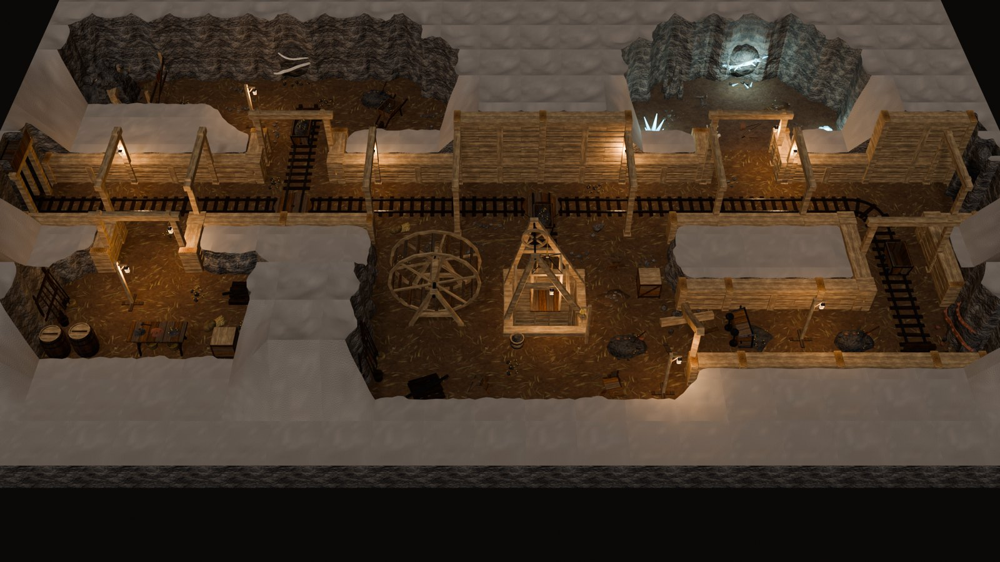

<table>
<tr>
<td width="50%">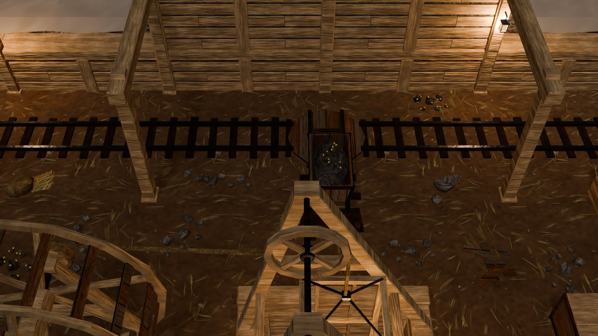<br><sub>The haulage gallery: the track on its centre line under the timber sets, the lining behind it (boards between posts, a wale at 1 m), full height here where the rock behind is Full, a lantern on a set. A spur leaves the main line on a turntable; the headframe stands in the foreground.</sub></td>
<td width="50%">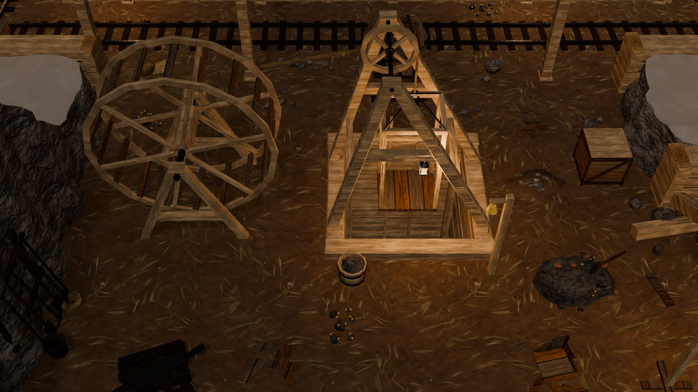<br><sub>The shaft chamber: the headframe over the shaft, its sheave, the cage at the landing, the rope running to the great treadwheel. A signal bell, a kibble of ore and an ore pile stand on the landing. The main line runs behind on the gallery's centre line.</sub></td>
</tr>
<tr>
<td width="50%">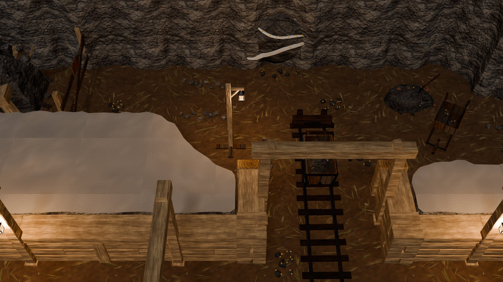<br><sub>The gold stope: quartz seams flecked with gold in the north face, a loaded cart at the end of its spur, ore, a barrow and a lantern pole. West of it the old drift is caved in and barricaded. The drift from the gallery is lined, a timber set over its mouth.</sub></td>
<td width="50%">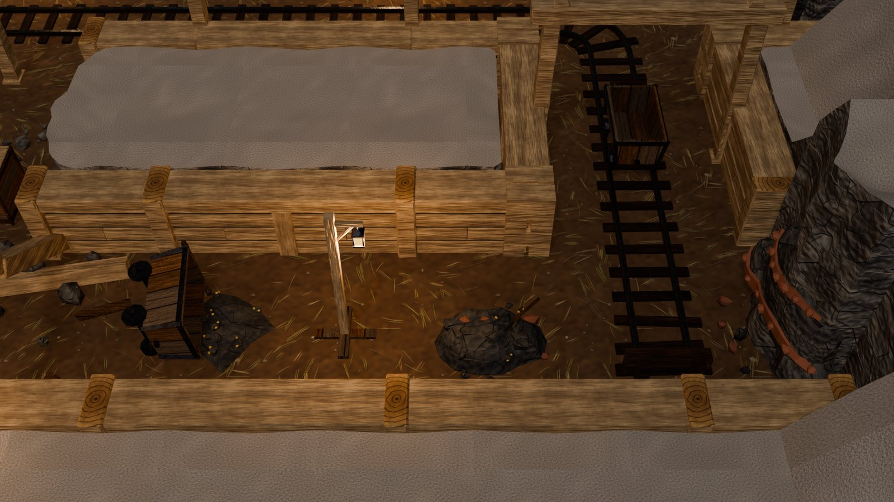<br><sub>The iron drift, lined on both sides: the main line's spur ends at a buffer stop by the iron vein (rust-red bands and nodules). An empty cart stands on the spur, a cart lies tipped with its ore spilt, and a broken set gives way at the drift's mouth.</sub></td>
</tr>
<tr>
<td width="50%">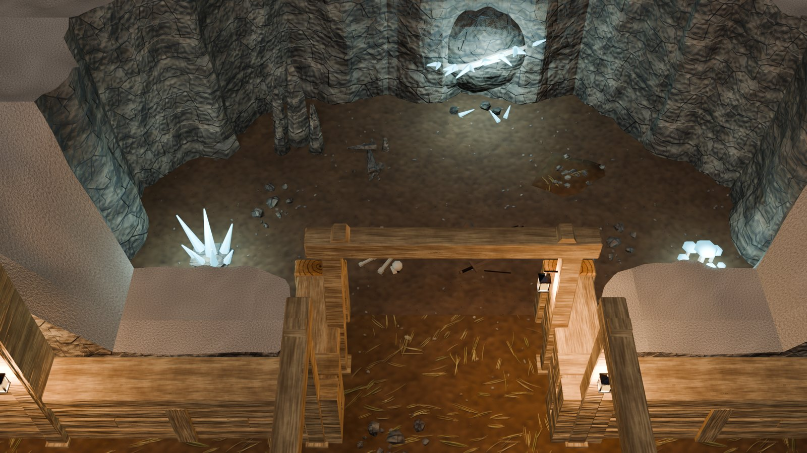<br><sub>The crystal cave the miners broke into, left as natural rock: a crystal vein growing from a quartz seam, crystals, glowing mushrooms and stalagmites. A lamp set frames the lined drift that leads in.</sub></td>
<td width="50%">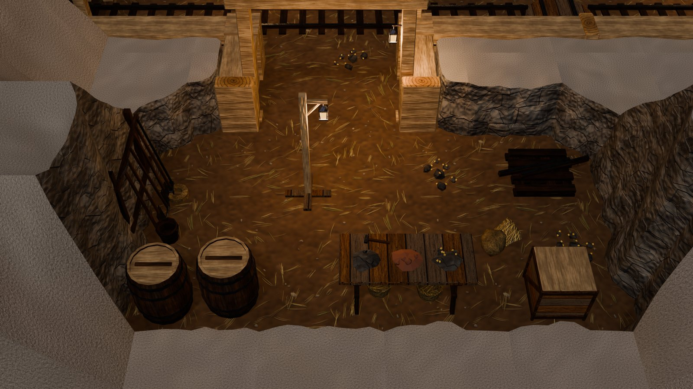<br><sub>The miners' store by the adit: the sorting bench with gold-flecked ore, iron ore and waste in heaps, a tool rack of picks, shovels and a sledge, barrels, a crate, spare sleepers and a lantern pole. Its lined entrance opens from the gallery.</sub></td>
</tr>
</table>

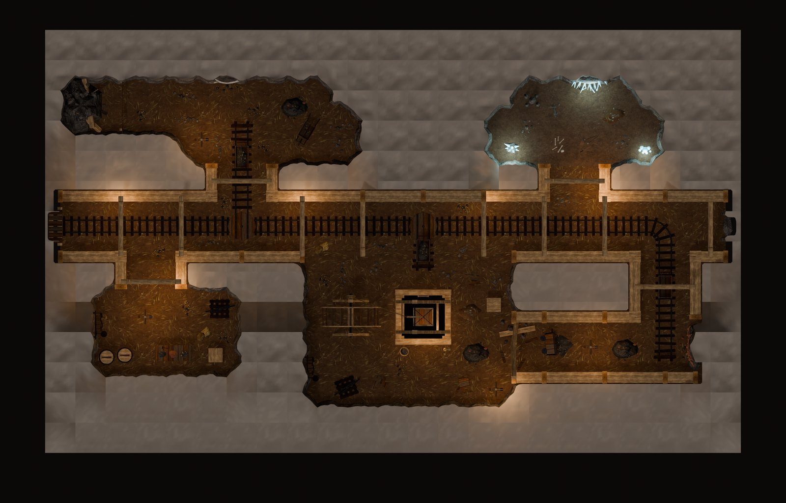

## 1. Track

Track tiles are **overlays**:
- **Walkable.** `vki_nav` is "none", and the walker's path and the BFS ignore them.
- **Anchored.** `vki_wall_anchor` is set, so a rail may run under a rock face's foot.
- **Size.** Each tile is 1.5 m, centred on a track point.

| Piece | What it is | Tris |
|---|---|---|
| `Overlay_Track_Straight` | a straight 1.5 m along local y: four sleepers, two rails | 96 |
| `Overlay_Track_End` | rails from the south edge into a buffer stop: a heavy timber with an iron plate, braced by two posts | 240 |
| `Overlay_Track_Curve` | a quarter turn of radius 0.75 about the tile's south-east corner, south edge to east edge, three radial sleepers | 244 |
| `Overlay_Track_Tee` | a junction: a timber turntable (a planked disc 1.40 m across, an iron band, a pivot boss), rails across it, rail stubs to each connected side | 266 |
| `Overlay_Track_Cross` | the same with four arms | 266 |

- **The rails.** The gauge is 0.60 m. Each rail is oak, 7 cm wide, capped with an iron strap worn bright (`STEEL`),
  which is what reads from the game camera. The rail top is at 0.117 (`VKI_MINE_TOP`), where the carts' wheels stand.
- **The sleepers.** They lie every 0.375 m, so the rhythm carries across tile joints. Each is laid by hand: turned up
  to 3°, shifted along itself, sunk up to 6 mm.
- **Laying it** (`vki_mine_tracks`, called by `vki_cave_layout`; its tiles join the level's auto props). A level lists
  polylines:

  ```python
  tracks=[[(0.0, 10.5, "open"), (30.0, 10.5), (30.0, 4.5)],   # the main line: out of the adit, east, south
          [(9.0, 10.5), (9.0, 15.0)],                          # a spur north (a turntable where it leaves)
          [(18.0, 10.5), (18.0, 9.0)]]                         # a spur to the shaft's rim
  ```

  - **The rules.** Vertices lie on the 0.75 lattice. Segments are axis-aligned and a whole number of tiles long.
  - **The tiles.** A tile stands on every 1.5 m point along the line. Its **connections** (N 1, E 2, S 4, W 8) pick the
    piece and its turn: one connection is an End, two opposite a Straight, two adjacent a Curve, three a Tee, four a
    Cross (`vki_mine_track_piece`).
  - **Junctions and ends.** Polylines that share a point join there. An end marked `"open"` runs on out of the level
    (a Straight into the adit) instead of stopping at a buffer.
  - **Checks.** A tile off open floor, or a bad segment, is a layout problem.
- **The centre line.** Lay the track on the gallery's centre line: between the two cells of a gallery two cells wide.
  There the rails stay 1.2 m from each rock face, clear of the rock's lobes, which intrude up to 0.5 m into a cell.

## 2. Carts

| Piece | What it is | Tris |
|---|---|---|
| `Prop_Mine_Cart` | an open tub of planks battered out (0.66 × 1.10 at the rim), iron corner irons and a rim band, four iron wheels on the rails, axle boxes, a push bar at +y, couplings | 400 |
| `Prop_Mine_Cart_Ore` | the same heaped with ore: a mound of broken rock inside the rim, lumps on it, gold flecks | 796 |
| `Prop_Mine_Cart_Tipped` | a cart off the rails lying on its side, its mouth toward +x, its ore spilt in a fan (walkable) | 840 |

A cart stands on the track with its origin on the centre line, rotated along it. `vki_cart` holds its load ("empty",
"ore", "spilt").

## 3. Timbering

| Piece | What it is | Tris |
|---|---|---|
| `Prop_Mine_Set` | a timber set across a gallery two cells wide: two posts (0.20 × 0.21) battered in 6 cm, from the floor at ±1.30 to the cap at ±1.24, on foot blocks; the cap (3.00 × 0.24 × 0.24, z 2.30–2.54); a blocking wedge over each post | 180 |
| `Prop_Mine_Set_Lamp` | the same with a lantern hung from a spike in the +x post (1.92 m), and its light | 294 |
| `Prop_Mine_Set_Broken` | a set that gave way (details below) | 428 |

- **The broken set.** The −x post leans out. The +x post is kicked out: its stump stands splintered, its upper part
  lies along the gallery. The cap is snapped: one half sags from the post's head to the break at 1.1 m, the other is
  down on the floor, with rocks fallen on it. A way stays open on its −x side.
- **Placement.** Origin on the gallery's centre line, local x across it: rotation 0 in a N-S gallery, 90 in an E-W
  one. The posts may be let into the rock face (`vki_wall_anchor`), and the cap fades when it hides the player
  (`vki_cam_fade`). Lamp sets hang their lantern on the +x post; at rotation 90 that is the north post, so the lantern
  faces the camera.
- **No head boards.** Five head boards across each cap read as ladder rungs from the game camera: a gallery of sets
  looked like a row of ladders. Two small wedges keep the detail.
- **The camera check (T19).** T19 casts rays from spawns and triggers to one camera over the level's centre, and a
  set can sit on those rays. In `VKI_Mine_M1` the sets nearest the tunnels moved until their caps cleared them.
- **In a lined gallery** a set stands at one of the lining's nodes, so its posts merge with the lining. The rhythm post
  there is skipped because the set's post touches the node.

### The lining: the Mine wall family

Timber lining for the galleries (`vki_fam_mine`; family `Mine`, class O, T 0.50, H 3.0 in `VKI_FAMILIES`).

- **How a level draws it.** The walls go on a cave map's inner grid lines, between a gallery's floor and the rock, like
  any partition. The rock tiles on their nodes then become the wall-backed ones: the rock keeps 0.33 m off the line
  and stands straight behind the wall ([ADVENTURE_KIT.md](ADVENTURE_KIT.md), transitions).
- **Heights.** A wall's height follows the rock behind it: Cut (`==`, `:`) where the rock is Cut (open floor within two
  cells north), Full (`##`, `#`) where it is Full, so the camera still sees over it. In `VKI_Mine_M1` most of the
  lining is Cut: the stopes lie just north of the gallery.
- **Both faces.** The walls are symmetric, since a partition may show either face to the gallery.

| Piece | What it is | Tris |
|---|---|---|
| `Wall_Mine_Plain_150A_Full` / `_Cut` | see below | 376 / 120 |
| `Wall_Mine_Plain_300_Full` / `_Cut` | the same, 3 m, with a stud at its middle (the rhythm posts stand at its ends) | 640 / 204 |
| `Post_Mine_Corner_Full` / `_Cut` | a crib: two short hewn beams per course (0.26 wide, 6 cm apart), the courses crossed, ±0.29 | 312 / 120 |
| `Post_Mine_Mid_Full` / `_Cut` | a hewn post ±0.12 along the wall × ±0.31 across, 8 cm proud of the boards, an end-grain top | 44 / 44 |

- **The plain wall** has:
  - a core of packed rock (±0.20), dark between the boards;
  - horizontal lagging boards on both faces (±0.20..0.23, 0.20 high on a 0.25 pitch), their joints staggered row by
    row;
  - a hewn wale at 0.78–1.00 (±0.27, pale top), which is the Cut wall's cap;
  - on Full walls, a wall plate at 2.76–3.00.
- **Posts** come from the layout's rules: Corner at L/T junctions, Mid at free ends and height steps, rhythm Mid posts
  at even nodes.
- **No rakes or doors.** Walls inside a cave map are partitions, and a drift's mouth is left open.
- **Looks.**
  - The boards are the pale hewn wood darkened board by board, so the frame stays the palest and the core shows dark
    between them.
  - The kit's oak read as black panels between the posts, even tinted.
  - The planks texture's seams tiled each board. The boards use the SHUTTER slot, whose grain runs along each board.
  - A square corner post 0.58 m across read as a stump, hence the crib.

## 4. Ore veins

`Prop_Vein_Gold` (1,180 tris), `Prop_Vein_Iron` (1,084), `Prop_Vein_Crystal` (1,056):
- **The outcrop.** Three lumps of dark cave rock bulge 0.10–0.14 m out of a rock face: a broad one (1.7 wide, 1.6
  high) and two low ones. Their backs are buried to local y +0.66.
- **The seams.** Seams cross the outcrop (`vki_mine_seam`): flat bands 2.7 cm proud of the rock that follow a wobbling
  curve over the lumps' front (`vki_mine_vein_front`), swell and pinch, and taper to their ends.
  - **Gold:** two seams of white quartz (`M_VKI_Quartz`) flecked with gold.
  - **Iron:** two rust-red bands (`M_VKI_IronOre`) studded with nodules.
  - **Crystal:** a quartz seam with clusters of glowing crystals growing out of it, and a cold light.
- **At its foot.** Broken ore lies there: gold-flecked lumps, iron ore, or broken crystals.
- **Placement.** Against a rock face, back (local +y) into it, hug off, let into the face. The use point is 0.95 m in
  front, where a miner works it. `vki_vein` holds the ore.
- **Faces reading.** Put veins on north faces. The camera looks north and sees them face-on; on an east or west face
  (the iron drift's end) they read side-on.
- **Why ribbons.** The first version painted the lumps' faces in the seam colour. The triangles made a zigzag like a
  row of teeth; the ribbons read as veins.

## 5. The shaft and the treadwheel

- **`Pit_Shaft_300x300`** (a pit, 2 × 2 cells, 992 tris). Origin at its min corner:
  - a floor strip round its edge (the `EarthDamp` floor);
  - a collar of four heavy timbers round a 2.16 m opening;
  - cribbing lining the shaft into the dark: courses of timbers crossing at the corners like a log cabin, black by
    −2.6 m, a black floor at −3.2;
  - corner posts, and a ladder down the north side whose stiles stand 0.9 m above the collar.

  The camera looks down into it from the south. `vki_shaft` holds its depth and opening.
- **`Prop_POI_Treadwheel`** (a point of interest, 2,144 tris; [POINTS_OF_INTEREST.md](POINTS_OF_INTEREST.md)). Origin
  on the shaft's centre:
  - **The headframe:** two A-frames, their feet on the collar, carrying the sheave at 3.25 m.
  - **The rope:** from the sheave down to the **cage**, a timber cage hanging in the shaft at the landing, open to the
    south; and to the drum of a **great treadwheel**, 3.0 m across, its plane facing the camera, on its trestles west
    of the shaft.
  - **On the landing:** a signal bell on its post, a kibble of ore, a lantern under the headframe.
  - **Space it needs:** 5.3 m clear west of the shaft's centre, and the landing 2.8 m south.
- **The lift link.** The treadwheel carries the level's link down (`vki_link` "lift"): the trigger on the landing, the
  spawn 2.45 m south of the shaft.
  - A level makes it the lift with the props option `{"link": id}`. `vki_rooms_prop_link`, new in `vki_rooms`, handles
    any prop that carries a link: the prompt, the spawn at `vki_spawn_local` facing `vki_spawn_facing`.
  - `vki_lift` records the cage, sheave and wheel positions for the game.

## 6. Props and debris

| Piece | What it is | Tris |
|---|---|---|
| `Prop_Mine_OrePile` | a heap of ore (1.3 × 1.0, 0.45 high): broken rock, lumps flecked with gold, iron ore, a shovel stuck in it | 548 |
| `Prop_Mine_Wheelbarrow` | a barrow of planks on two shafts, the wheel at the front (−y), legs under the tray, ore in it | 356 |
| `Prop_Mine_ToolRack` | a rack against a rock face (back +y): two picks, two shovels, a sledge and a bar on it, a bucket and a coil of rope | 500 |
| `Prop_Mine_Bench` | a sorting bench (1.8 × 0.8) on trestles, ore sorted in three heaps (gold-flecked, iron, waste), a hammer, two baskets under it | 884 |
| `Prop_Mine_LanternPole` | a lantern hung from a short arm on a pole (2.1 m) in a cross of planks; light | 162 |
| `Prop_Mine_CaveIn` | a collapse filling the end of a gallery (3 m wide): a heap of rock 1.35 m high, broken timbers, a pick's haft sticking out | 704 |
| `Prop_Mine_Barricade` | planks nailed across a drift (2.6 m) and a warning board daubed with a red cross | 96 |
| `Prop_Mine_SleeperStack` | spare sleepers stacked crosswise, two loose rails on top | 192 |
| `Overlay_Debris_Tools` | lost gear: a pick with its haft snapped, a shovel, a dented bucket, iron wedges | 180 |
| `Overlay_Debris_Rail` | a loose length of rail, a sleeper and a broken one, spikes | 88 |

- **The mine theme.** The debris scatter ([DEBRIS.md](DEBRIS.md)) gets a **"mine"** theme (`VKI_DEB_KINDS["mine"]`,
  cave stone): rocks, rubble, ore, lost tools, rails, planks, gravel, a few sacks, crates and barrels. A level turns
  it on per zone with `themes={"mine": "mine"}`, since mine floors are `EarthDamp`.
- **Sizes.** Every piece keeps to its tier's budget (T9): props 1,500, overlays 400.

## 7. The adit

`Rock_Cave_OOFF_Adit` (682 tris) is the cave's tunnel tile (`Rock_Cave_OOFF_Tunnel`) timbered like a mine's mouth:
- **The cleft.** It is wider (1.44 m) so the track runs in.
- **The timbering** (`vki_mine_adit_portal`): a set at the mouth and one 0.44 m in, posts let into the cleft's sides,
  caps whose ends run into the rock, breast boards over the front cap up to the rock top, and roof boards over both.
- **The floor.** A floor runs into the dark.
- **How a level takes it:** `R["tunnel_kinds"] = {link id: "Adit"}`. The link, spawn and trigger work as for any
  tunnel (a passage). `vki_cav_tile` accepts a tunnel dict (the cleft's size and a portal builder) for it; the natural
  tunnel is unchanged.

## 8. Materials and preset

| Material | Use |
|---|---|
| `M_VKI_MineWood` | `T_VK_Wood`, weathered: sleepers, rails, carts, tools |
| `M_VKI_Quartz` | flat off-white: the gold and crystal veins' seams |
| `M_VKI_IronOre` | flat rust-red: the iron vein, iron ore |

- **Timber.** The big timbers (sets, collar, cribbing, headframe, treadwheel) are the kit's pale hewn wood (`M_VK_Hewn`)
  on the WOOD slot, whose grain follows the longest axis. It reads against the dark rock.
- **The Mine preset.** Galleries lit by lanterns: a dim neutral key (0.60) and fill (0.95), and the lanterns' warm
  pools (90 W each, no shadows). It counts as a dark preset (floor target 0.15).

## 9. The level

`VKI_Mine_M1`, 22 × 13 cells: the mine under the dwarf hall.

- **The haulage gallery.** It runs the width of the map, two cells wide and timber-lined on both sides. The adit in the
  west (timbered, the link up to the valley town's mine portal) leads to the tunnel back to the dwarf hall in the
  east. The track runs down its centre line under a timber set every few metres, with lanterns on every other set.
- **The lining.** The gallery is lined wherever rock borders it: Full on its north side where the rock behind is Full
  (x 15–21 and 30–33), Cut elsewhere. So are the mouths of the drifts off it (to the stope, the crystal cave, the store,
  the iron drift's spur) and the iron drift. The stope, the shaft chamber, the store and the crystal cave stay natural
  rock.
- **The gold stope.** A spur runs north into it: the vein in the north face, a loaded cart, ore, a barrow. The old
  drift west of it is caved in and barricaded.
- **The shaft chamber** lies south of the gallery: the shaft with the treadwheel over it (the lift down to the deep
  workings) and a spur to its rim. Ore is heaped by the landing, with tools and spare sleepers against the west face.
- **The iron drift** runs south-east: the main line turns south into it, to a buffer stop by the iron vein. A tipped
  cart and a broken set lie at the drift's mouth.
- **The crystal cave** (north-east) is a natural cave the miners broke into.
- **The miners' store** is by the adit: a sorting bench, a tool rack, barrels, a crate, spare sleepers.
- **Links:** `("surface", "passage", VKI_TOWN)` (the adit, to the valley's `mine_adit`; [WORLD_GRAPH.md](WORLD_GRAPH.md)), `("hall", "passage", "VKI_Dwarf_Hall")` (the tunnel),
  `("deep", "lift", "@deep")` (the treadwheel). The dwarf hall's "mines" tunnel now targets `VKI_Mine_M1`.
- **Track:** 29 tiles (23 straights, 2 turntables, 3 buffer stops, a curve).
- **Timber:** 13 sets (6 with lanterns, 1 broken).
- **Light:** 14 lights: lanterns, lantern poles, the treadwheel's lantern, crystals and mushrooms.
- **Lining:** 32 wall pieces and 35 posts; 57 rock tiles are wall-backed.
- **Debris:** 35 pieces, in the mine theme, the store kept tidier (0.18), the crystal cave as a cave.

It checks at **0 errors and 0 warnings**. BFS reach is 2,651 / 2,688 (the rest is behind the cave-in's barricade and
in pockets). Floor luma is 0.152 and cap tops 0.372. It has **98,398 triangles**:

| Part | Tris |
|---|---|
| 227 rock tiles | 51,886 |
| props | 20,528 |
| 35 pieces of debris | 9,104 |
| 32 lining walls | 6,576 |
| 29 track tiles | 3,704 |
| 282 floors | 3,384 |
| 35 lining posts | 2,224 |
| the shaft | 992 |

The lining added about 4,300 triangles: the wall-backed rock tiles are lighter than the free faces they replace
(unlined, the level had 94,140).

The catalog (`VKI_Adventure_Catalog`) has three mine rows:
- `G35`: track, carts, timbering, the adit, debris.
- `G36`: veins, props, the shaft, the treadwheel.
- `G37`: the lining walls and posts.

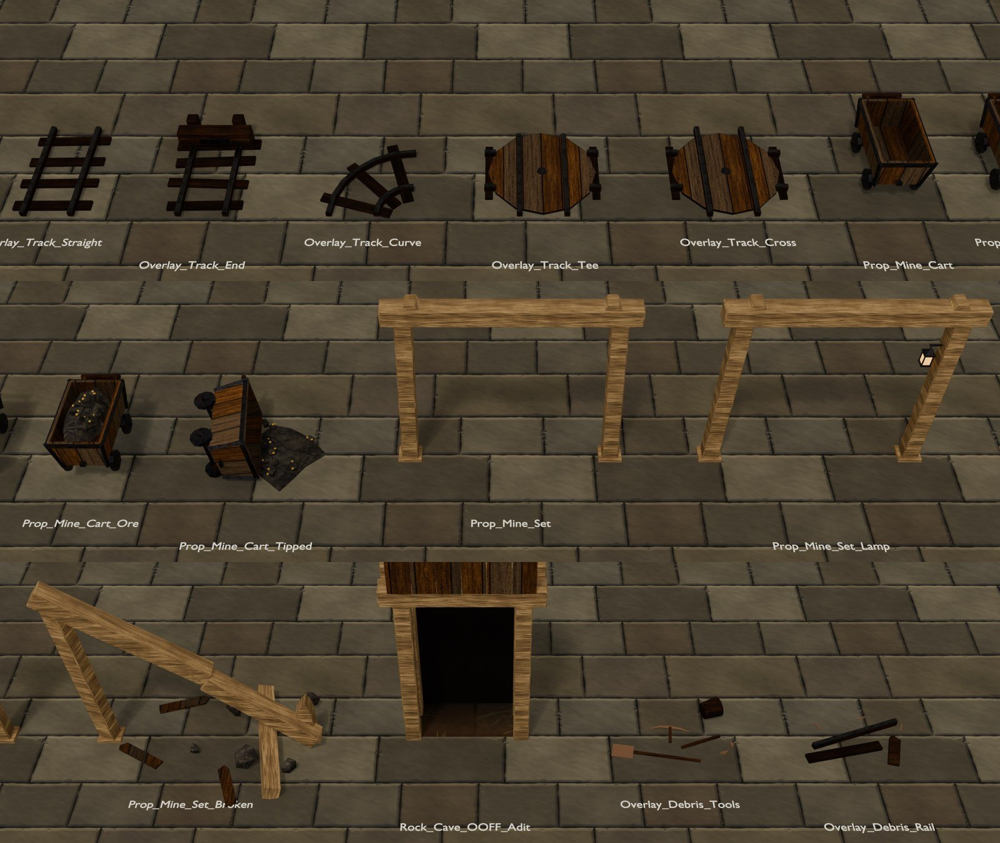

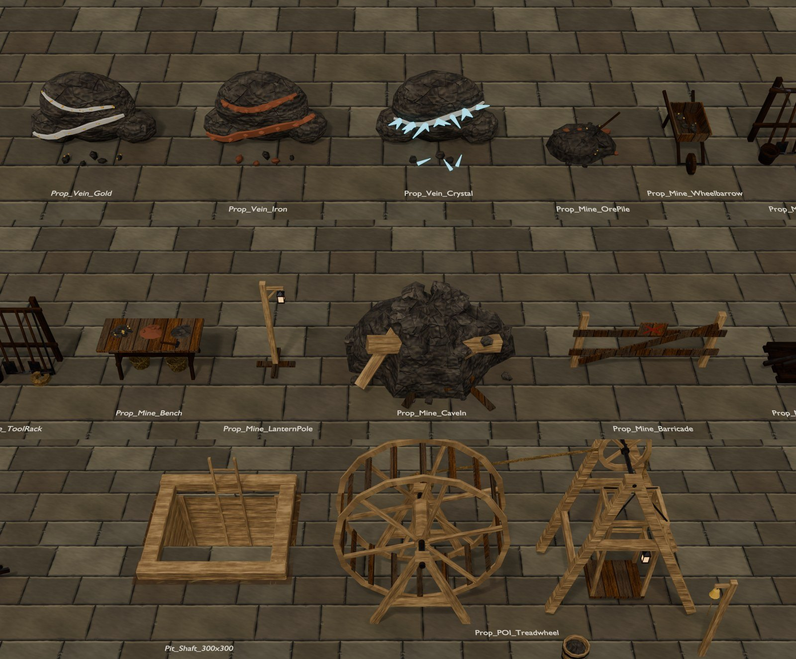

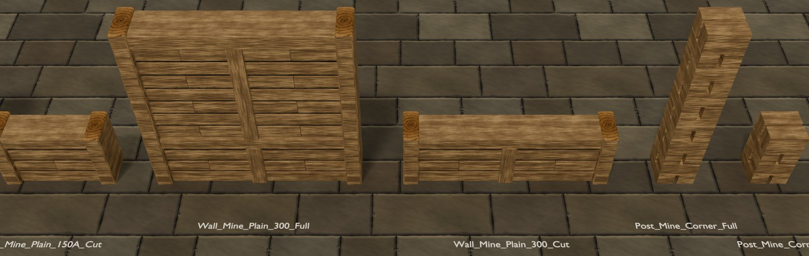

## 10. For Unity

- **Track data.** Every track tile carries `vki_track`:
  - `kind`;
  - `conn`: its connections at rotation 0 (N 1, E 2, S 4, W 8), so turned by its rotation they give the graph a cart
    runs on;
  - `gauge` (0.6) and `top` (0.117, the wheels' height).

  Turntables are where a cart changes line.
- **Carts.** They are props with `vki_cart` (their load). A game can put them on the track graph and push them.
- **Links.** A link kind is new: **"lift"** (the treadwheel's cage). `vki_lift` gives the cage, sheave and wheel. The
  treadwheel is one mesh, so a game animating the wheel, sheave and cage needs them split (or plays the ride as a
  transition).
- **Veins.** `vki_vein` gives the ore; the use point is where a miner works.
- **Lanterns.** Lantern sockets carry `vki_lights` (warm, 90 W, flicker) and `vki_fx` "lantern".
- **The lining.** It is ordinary wall and post pieces (class wall / post, `vki_family` "Mine") with the kit's wall
  metadata, colliders and posts.

## 11. Code

| Text (`src/interior/`) | Contents |
|---|---|
| `vki_fam_mine` | the 35 builders and helpers: `vki_mine_rails`, `vki_mine_sweep`, `vki_mine_sleeper`, `vki_mine_lantern`, `vki_mine_tub`, `vki_mine_seam`, `vki_mine_vein_front`, `vki_mine_tool`, `vki_mine_adit_portal`; the lining `vki_mnw_plain`, `vki_mnw_post` (`VKI_MNW_NAMES`); `vki_mine_track_piece`; `VKI_MINE_NAMES` |
| `vki_rooms_mine` | `vki_mine_tracks` (the track layout), the plan (with the lining's wall tokens) and room of `VKI_Mine_M1` (`partition="Mine"`), the debris "mine" theme, the plan codes (`TW`, `AU`, `FE`, `CY`), the catalog rows `G35`–`G37` |

Other changes:
- `vki_fam_cave`: tunnel dicts in `vki_cav_tile` and `vki_cav_field` (the adit).
- `vki_rooms_adventure`: `R["tunnel_kinds"]`, and the track hook in `vki_cave_layout`.
- `vki_rooms`: `vki_rooms_prop_link`.
- `vki_core`: the three materials, the Mine preset, the load order, and the Mine wall family (`VKI_FAMILIES`,
  `VKI_H_FULL`, `VKI_POST_PRIO`, `VKI_AMP`, `VKI_FAMILY_SLOT_MATS`).
- `vki_rooms_dwarf`: the mines link's target.

```python
g0={}; exec(bpy.data.texts["vki_core"].as_string(), g0); g=g0["vki_ns"]()
g["vki_ws_build"]("adventure", g["VKI_MINE_NAMES"]); g["vki_adopt"](g["VKI_MINE_NAMES"])   # new masters
g["vki_rebuild"](g["VKI_MINE_NAMES"]); g["vki_test_pieces"](g["VKI_MINE_NAMES"])           # -> {}
g["vki_build_scene"]("VKI_Mine_M1"); g["vki_check"]("VKI_Mine_M1", full=True, palette=True, bfs=True)
```

## 12. Known limits

- **Height.** The mine is one level at one height. The shaft and the adit are links, not modelled descents: there
  are no inclines, ramps or winzes inside a level.
- **The track.** It is decoration with data. There are no switches (points); junctions are turntables, as in early
  mines.
- **The lining.**
  - It has no doorway, rake or damaged variant. A drift's mouth is left open; a broken lining (boards burst, rock
    spilling through) would suit the cave-in.
  - On a Cut south wall the camera sees only the cap and the posts: the lagging faces the gallery, away from it.
- **Veins** read best on north faces (see section 4). Each vein has one variant.
- **The barricade** across an E-W drift is seen edge-on from the camera.
- **One POI.** The treadwheel is the mine's one point of interest; a second mine level would want another landmark.
