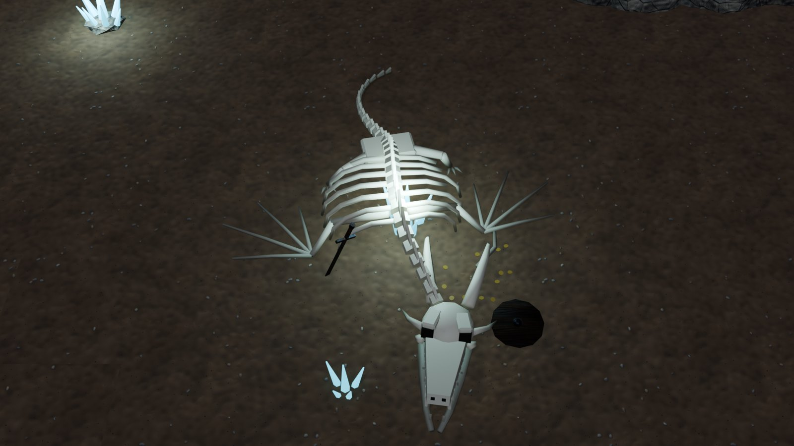
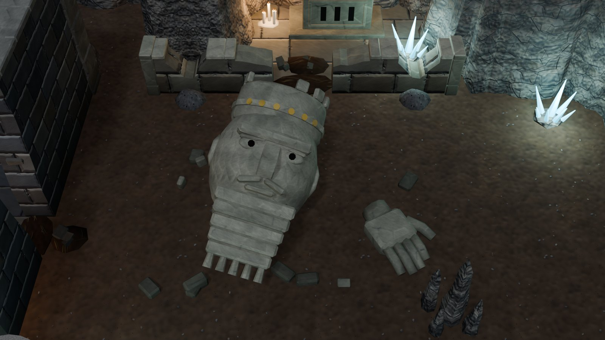
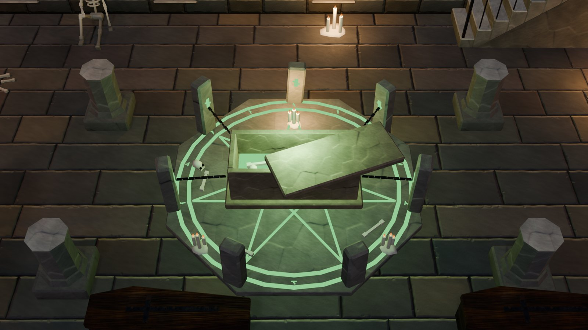
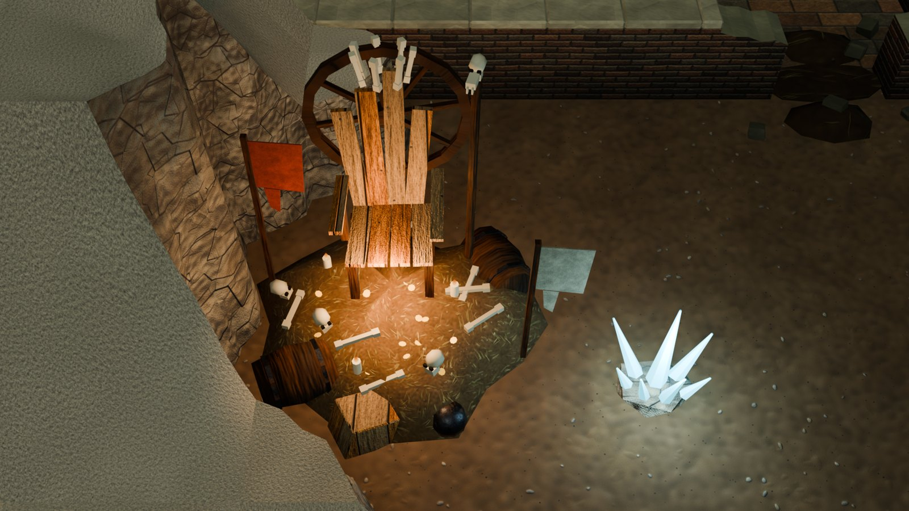
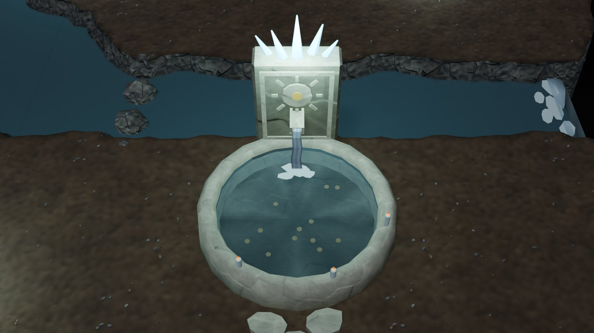

# Points of interest

Landmark pieces for the adventure levels ([ADVENTURE_KIT.md](ADVENTURE_KIT.md) and the kits built on it).

A point of interest (POI) is a single, more elaborate piece, meant to be placed **once** in a level. It is the thing a
level is built round and the player remembers, where the tilesets and dressing are repeated freely. There is one per
theme, seven in all: six in `vki_props_poi`, and the mines' treadwheel in the mine kit ([MINE_KIT.md](MINE_KIT.md)).
Each is placed in a level of its theme.

<table>
<tr>
<td width="50%"><br><sub><b>Caves:</b> <code>POI_WyrmBones</code>. The bones of a great wyrm lie on the cave floor, its skull toward the viewer, jaw fallen open. Its ribs arch out to both sides, wing bones fan across the floor, and crystals glow up through the ribcage. (<code>VKI_Cave_Test</code>, placed by the cave generator.)</sub></td>
<td width="50%"><br><sub><b>Ruins:</b> <code>POI_ColossusHead</code>. A colossal crowned head has toppled from its statue and lies face up, its nose broken off. It has a curled beard and traces of gilding, and the colossus's hand lies beside it. (<code>VKI_Cave_Breach</code>, before the Ancient shrine's broken front.)</sub></td>
</tr>
<tr>
<td width="50%"><br><sub><b>Dwarf halls:</b> <code>POI_Crucible</code>. A round furnace has a glowing throat and mouth. A jib crane tips a crucible of molten metal into a casting bed, whose channels feed six ingot moulds, the far ones cooled to gold. (<code>VKI_Dwarf_Hall</code>, the foundry.)</sub></td>
<td width="50%"><br><sub><b>Dungeon:</b> <code>POI_NecroCircle</code>. A necromancer's circle surrounds an opened sarcophagus: a green sigil with a seven-pointed star, standing stones with glowing runes, and chains binding the tomb, whose shoved lid shows the glow inside. (<code>VKI_Dungeon_B2</code>, the crypt's nave.)</sub></td>
</tr>
<tr>
<td width="50%"><br><sub><b>Sewers:</b> <code>POI_RatKing</code>. The rat king's throne of junk sits on a refuse heap: a broken high-backed chair before a cart wheel, crowned with bones and a rat skull. Rag banners, candles, barrels, bones and stolen gold surround it. (<code>VKI_Sewer_S1</code>, the grotto.)</sub></td>
<td width="50%"><br><sub><b>Water:</b> <code>POI_SpringShrine</code>. A sacred spring: a carved basin, coins on its floor and candles on its rim, is fed by a stele's spout. The stele is carved with a sun round a gold boss and crowned with glowing crystals. (<code>VKI_Cave_Falls</code>, backing onto the river.)</sub></td>
</tr>
</table>

## 1. The pieces

| Piece | Theme | Size (m) | Tris | Lights, FX | Interaction |
|---|---|---|---|---|---|
| `Prop_POI_WyrmBones` | caves | 4.1 × 5.7 × 1.1 | 3,318 | crystal light; — | examine |
| `Prop_POI_ColossusHead` | ruins | 4.8 × 3.6 × 2.0 | 2,848 | —; — | examine |
| `Prop_POI_Crucible` | dwarf halls | 4.3 × 2.8 × 3.0 | 3,154 | furnace, pour; `furnace_fire`, `molten_pour`, `sparks` | cast |
| `Prop_POI_NecroCircle` | dungeon | 3.7 × 3.7 × 1.1 | 3,170 | green ritual light, candles; `ritual_glow`, `rune_pulse` | disrupt |
| `Prop_POI_RatKing` | sewers | 2.7 × 2.4 × 2.5 | 2,738 | candles; — | challenge |
| `Prop_POI_SpringShrine` | water | 2.2 × 2.9 × 2.2 | 1,612 | crystal light (diffuse only); `spring_pour`, `shrine_motes` | drink |
| `Prop_POI_Treadwheel` | mines | 7.1 × 2.8 × 3.7 | 2,144 | a lantern; `lantern` | descend (the lift) |

The first six together are 16,840 triangles, all well under the hero tier's 6,000 (T9); the treadwheel adds 2,144.

- **Wyrm bones.** A spine of 29 vertebrae on a spline, with dorsal spines tallest over the shoulders. The ribs arch
  out to both sides (a few broken, one fallen). The skull has fangs, horns and dark sockets, lifted on its jaw hinge
  so the mouth gapes, with the lower jaw lying on the floor. Both wings' finger bones fan across the floor, and the
  hind legs are folded with claws out. A sword, a shield and coins lie among the bones. It lies north–south, skull
  toward the camera: lying east–west, its ribs read as a fence.
- **The fallen king.** The head is a sub-3 icosphere with a brow, lidded eyes with carved pupils, a broken nose (the
  tip lies nearby), lips, a moustache and a five-row curled beard ending in ringlets. It wears a tall crown with a
  band of gilded rosettes and a crenellated rim, two merlons broken off and fallen. It lies face up and turned to the
  camera, sunk 17 cm into the floor. The colossus's hand lies palm down beside it, with rubble around.
- **The great crucible.** The furnace sits on a plinth, iron-banded and gold-ringed, with a molten throat and a fire
  mouth behind iron bars. An iron jib crane holds the crucible on a chain, tipped 38° to pour. The casting bed has a
  head basin, channels and six moulds. Molten metal uses the lava's heat material, yellow-hot at the pour and deeper
  orange out in the moulds; the far moulds hold cooled gold ingots. Stacks of gold and iron ingots and a heap of coal
  stand by. It backs onto a wall (local +y).
- **The necromancer's circle.** An octagonal dais 0.10 high (walkable: no collider) carries a glowing sigil: two
  rings, a seven-pointed star and runes (`M_VKI_RuneGlow`). Seven standing stones stand on the star's points, with
  the south left open; their runes face in. At the centre is an opened sarcophagus, its lid shoved askew and green
  light welling round the bones inside. Chains bind four stones to the tomb's corners, with candles and scattered
  bones.
- **The rat king's throne.** A refuse heap (`M_VKI_EarthDamp`) carries a plank throne with barrel-stave arms and odd
  boards for its back, before a cart wheel with a spoke gone. A crown of seven bones tops it, with a rat skull on a
  pole. Rag banners, candles stuck in the heap, broken barrels, a crate, a rusty helm, bones, skulls and coins
  surround it.
- **The sacred spring.** A round basin of pale stone holds still water (`M_VKI_StreamWater`), with coins on its floor
  and candles on its rim. Behind it stands a framed stele, carved with a sun and its rays round a gold boss. A stone
  spout pours a thin stream (`M_VKI_WaterFall`) into the basin, foaming where it lands. Glowing crystals crown the
  stele, and three stepping stones lead up to it.
- **The great treadwheel** (`vki_fam_mine`, [MINE_KIT.md](MINE_KIT.md) section 5). A headframe of two A-frames stands
  over the shaft, carrying a sheave at 3.25 m. The rope runs from the sheave down to a timber cage at the landing, and
  to the drum of a treadwheel 3 m across, its plane facing the camera. A signal bell, a kibble of ore and a lantern
  stand on the landing. It is the only point of interest that is also a scene link (`vki_link` "lift").

## 2. What a point of interest carries (for Unity)

- **`vki_poi`**: `{"name", "kind", "theme", "interact", "once": true}`. The game's record: a map marker, a quest hook
  or an interaction. The kinds are `landmark`, `workshop`, `ritual`, `lair` and `shrine`.
- **`vki_tier` `hero`** and **`vki_cam_fade` 1**. The game fades a POI's tall parts (a crane, a stele, a banner pole)
  when they hide the player; this satisfies the R-occ3 rule for tall props over walk lanes.
- **Colliders.** A few boxes round the solid parts only. Low bones, the dais and the casting bed's front can be
  walked over or up to.
- **Use points** stand where the interaction happens, 0.4–0.6 m clear of the colliders.
- **Lights and FX sockets**, as in the rest of the kit. A light may now carry `specular` (0: diffuse only); the
  spring's crystal light uses it, because its image in the still water read as two white discs.
- **Heat**. The crucible's molten metal carries `vki_rim` like the lava, for Unity's shader.

## 3. Placing them

| Level | Point of interest | What changed in the level |
|---|---|---|
| `VKI_Dwarf_Hall` | the great crucible | The forge room grew a column east into a foundry (x 21–27). The crucible backs onto its north wall, moulds and furnace mouth toward the camera. The forge moved to the east wall with the anvil before it. The hall's Full east wall hides the room's west strip from the camera (T19). |
| `VKI_Dungeon_B2` | the necromancer's circle | It takes the nave's centre, in place of the sarcophagus and two candle clusters: its own tomb carries the story on. |
| `VKI_Cave_Breach` | the fallen king | It lies before the Ancient shrine's broken front, where a free-standing rock knob was cleared. A lane about 1 m wide stays clear to the breach. |
| `VKI_Sewer_S1` | the rat king's throne | It sits in the grotto west of the sewer's breaches, in place of the gravel overlay. |
| `VKI_Cave_Falls` | the sacred spring | It stands by the river, its stele backing onto the bank. |
| `VKI_Cave_Test` | the wyrm bones | Placed by the cave generator: `poi=("POI_WyrmBones", 3, 4, "WY")`. |
| `VKI_Mine_M1` | the great treadwheel | Built with the level: over the shaft (`Pit_Shaft_300x300`), the treadwheel west of it, the landing south. It carries the level's lift link (`{"link": "deep"}`). |

- **The generator's `poi` option.** `vki_cave_generate(..., poi=(piece, w, h, code))` puts the POI on the w × h block
  of open cells nearest the map's centre. The block needs a cell of open ground all round and must be clear of the
  chasm. The POI goes in before the pools and the dressing, so they avoid it.
- **Plan codes.** `WY` wyrm, `KH` king's head, `CU` crucible, `NC` necro circle, `RK` rat king, `SP` spring.
- **Place with `{"hug": False}`** (the pieces are free-standing) and leave a clear cell in front of the use point.
- **Room needed:**

  | Piece | Room |
  |---|---|
  | Wyrm | 3 × 4 cells |
  | Colossus | 4 × 3 cells |
  | Crucible | 3 × 2 cells against a wall |
  | Circle | 3 × 3 cells |
  | Rat king | 2 × 2 cells |
  | Spring | 2 × 2 cells |

All six levels check at **0 errors**. The warnings left were there before:
- B2's stair let-in and its cap tops just under floor + 0.15 (HANDOFF issue 25).
- `VKI_Cave_Test`'s floor mean of 0.131, under the 0.15 dark target: the generated cave has few lights for its size.

## 4. Code

| Text (`src/interior/`) | Contents |
|---|---|
| `vki_props_poi` | the six builders, the helpers (`vki_poi_tube`: a continuous tapering tube with parallel-transported rings; `vki_poi_spline`: Catmull-Rom; `vki_poi_aabb`; `vki_poi_meta`), `VKI_POI_NAMES`, the catalog group `G33` and the plan codes. Loaded after the rooms texts, before `vki_test`. |

Other changes:
- `vki_rooms_adventure`: the generator's `poi` option.
- `vki_rooms`: a light's optional `specular`.
- `vki_core`: `M_VKI_RuneGlow` and the load order.
- The five level texts: the placements.

```python
g0={}; exec(bpy.data.texts["vki_core"].as_string(), g0); g=g0["vki_ns"]()
g["vki_ws_build"]("adventure", g["VKI_POI_NAMES"]); g["vki_adopt"](g["VKI_POI_NAMES"])   # new masters
g["vki_rebuild"](g["VKI_POI_NAMES"]); g["vki_test_pieces"](g["VKI_POI_NAMES"])          # -> {}
g["vki_cave_generate"]("VKI_Cave_Test", nc=24, nr=16, seed=7, chasm=True, pools=2, props=18,
                       poi=("POI_WyrmBones", 3, 4, "WY"))
```

**Building note.** Creating an icosphere (`vki_home_ico` / `_ico`) can invalidate the BMVert references held from
before it. A set of "the verts so far" then misses every old vert, and a transform meant for one part moved the whole
piece: the spring's basin took its spout's tilt. So parts with icospheres are built first, or moved the moment they
exist, and colliders are measured at once (see HANDOFF, Gotchas).

## 5. Adding one

- **Size.** Build it at real size with its origin on the footprint centre and its back toward +Y. Stay within
  2,000–4,000 triangles, and give it colliders only for the parts that block.
- **Silhouette.** Give it a strong silhouette from 50° above: shapes that read from the top (arches, fans, rings,
  glows) beat detail on vertical faces, which the camera sees foreshortened.
- **Accent.** Give it one colour accent the level lacks: gold, green light, molten orange, cold crystal.
- **Metadata.** Call `vki_poi_meta(...)`, then add it to `VKI_POI_SPECS` and give it a plan code.
- **Placement.** Place it in a level and check it (`vki_check`: BFS reach to its use point, T19 visibility of it).

## 6. Known limits

- **Proportions.** They are sized for the levels they are in. The wyrm needs a big open floor, and the crucible a
  wall to back onto.
- **One variant each.** A level wanting two landmarks of a theme needs a second design, not a second copy.
- **The catalog row** (`G33`) lays them out tightly. The group's title overlaps the wyrm's skull.
