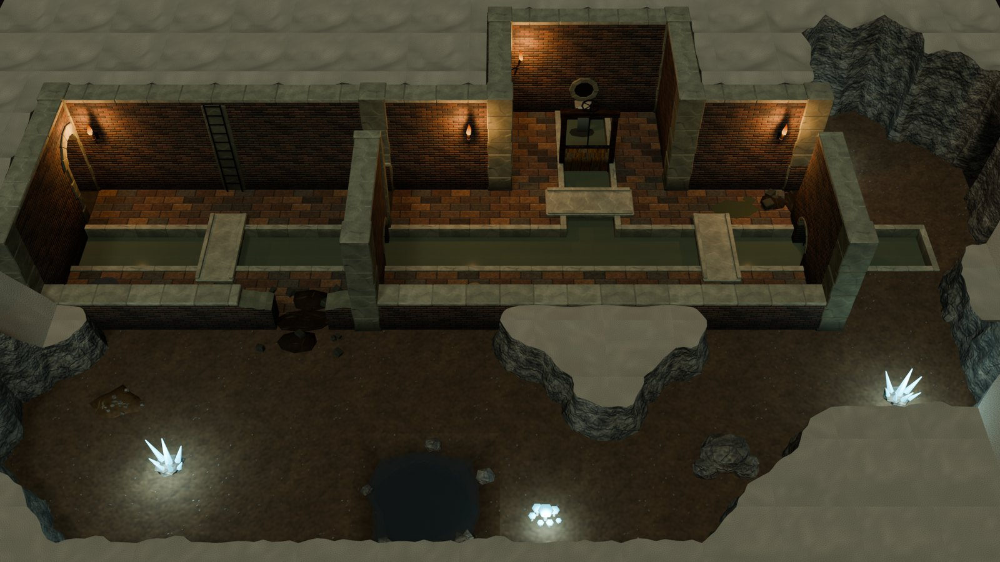
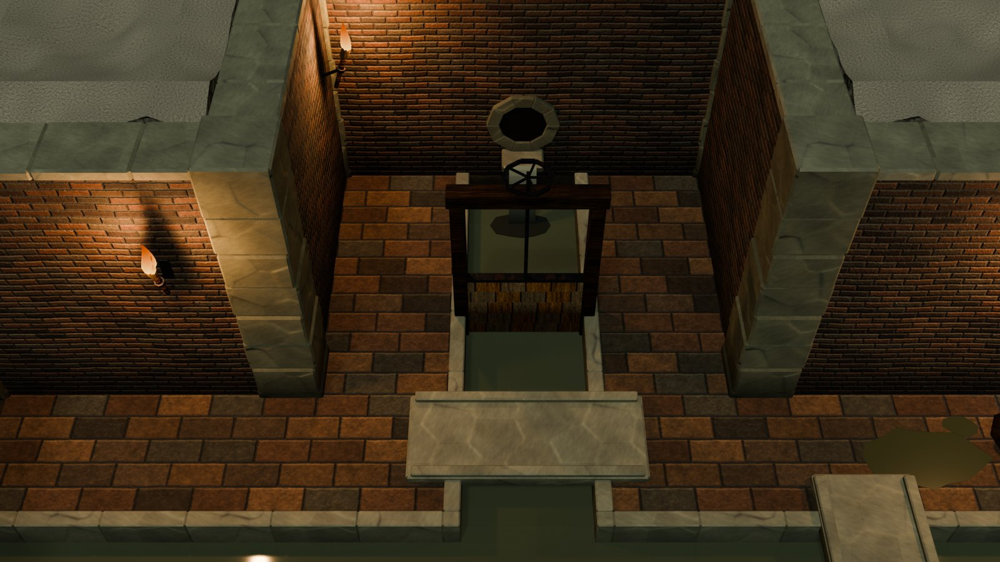
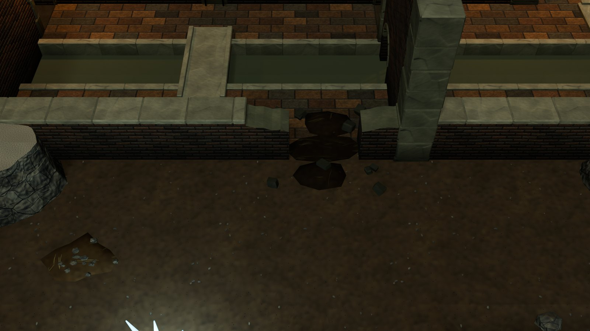
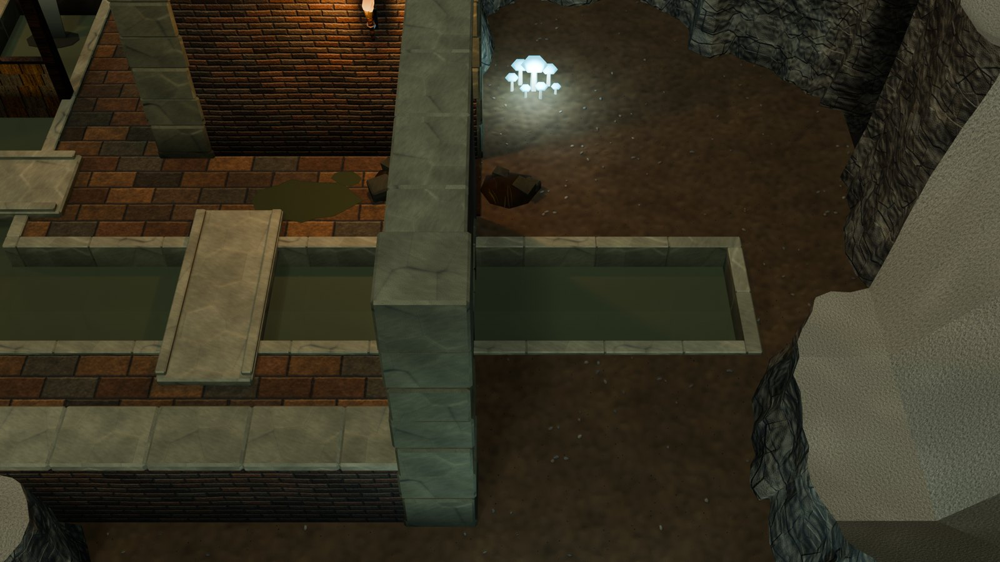
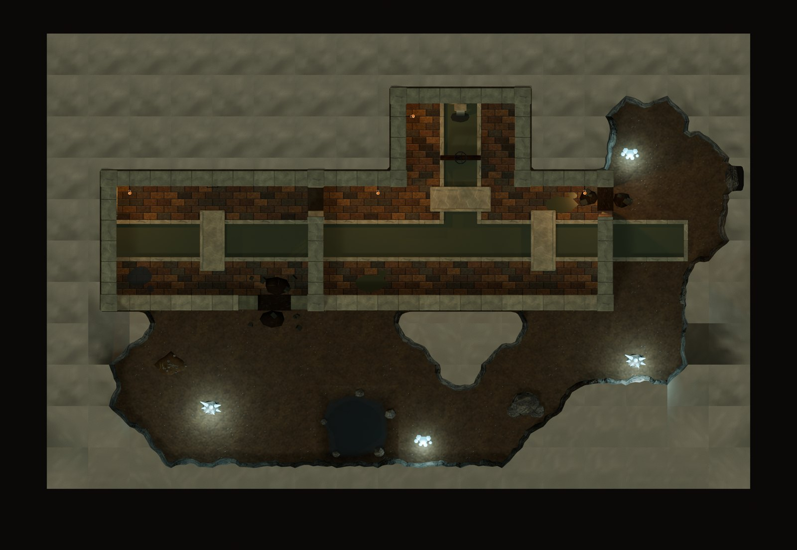

# Sewer kit

Town sewers for the interior framework ([INTERIOR_KIT.md](INTERIOR_KIT.md)): brick tunnels with water channels,
walkways and bridges, a sluice, an outfall, a ladder up to the street, and transitions where the sewers break into
natural caves. It is built on the adventure kit's cave maps and transition tiles ([ADVENTURE_KIT.md](ADVENTURE_KIT.md)).
It adds 30 masters (17,564 triangles), two textures, five materials, a **Sewer** lighting preset and one level,
`VKI_Sewer_S1`.



<table>
<tr>
<td width="50%"><br><sub>The branch from the north: water falls from an outfall into the channel, past a sluice gate, and under a slab bridge across the walkway.</sub></td>
<td width="50%"><br><sub>A transition: the tunnel's low south wall broken through (<code>Wall_Sewer_Breach_300_Cut</code>) into a natural grotto, earth spilling both ways.</sub></td>
</tr>
<tr>
<td width="50%"><br><sub>The east end: the channel passes under the end wall through a culvert and runs out into the cave; a breach beside it opens the walkway onto the cave.</sub></td>
<td width="50%"><br><sub>From straight above: brick tunnels in solid rock, channels, bridges, the grotto and the east cave.</sub></td>
</tr>
</table>

## 1. How a sewer level is made

A sewer level is a **cave map** (`cave=True`, see ADVENTURE_KIT.md §2):

- **Rock.** The ground between the tunnels is rock (`##` cells), shaped by the dual-grid rock tiles. Everything outside
  the map is rock.
- **Tunnels.** The tunnels are brick walls drawn on the map's inner grid lines, in the partition family
  (`family=dict(perimeter="Cave", partition="Sewer")`). Where rock lies behind a wall, the rock tiles on its nodes are
  the wall-backed ones, so the rock stops just behind the brick.
- **Channels.** Channel cells are painted `ww`. Walkways are ordinary floor cells, with the `SewerFloor` zone style.
- **Natural caves.** Caves beside the sewers are open cells with the `CaveFloor` style. The organic rock shapes them,
  and breaches in the brick lead in.

So every transition comes from pieces that already fit together: masonry backed by rock, masonry broken into a cave,
and a channel running out of a culvert into the cave.

## 2. What it adds

**The Sewer wall family** (`vki_fam_sewer`; class O, T 0.50, H 3.0). It uses the Stone family's construction (a
rubble-cored body, 0.75 m coping units, dressed jambs, voussoirs and quoins) in old wet brick.

- **Body:** `T_VKI_SewerBrick`: grimy dark red-brown bricks 0.25 × 0.075 m in running bond, with a few near-black
  overfired ones and dark mortar.
- **Coping:** `SewerCap`, dressed stone a step paler, so the cutaway outline reads in the dark.
- **Dressed stone:** `SewerBlock`, dark and greenish.
- **Slime band:** extra darkening toward the floor, gone by 0.75 m, uniform along the wall so pieces join cleanly.
- **Posts:** a brick pier with stone quoins (Corner) and a pilaster (Mid).
- **Post priority:** Cave > Ancient > Dungeon > **Sewer** > Stone > …, so a dungeon wall meeting a sewer wall keeps
  the dungeon post.

| Piece | What it is |
|---|---|
| `Wall_Sewer_Plain_150A` / `_300`, Full and Cut; `Plain_150B_Full`; `Rake_150_L` / `_R` | plain brick; B has a barred drain low in face A |
| `Wall_Sewer_Door_150_Full` / `_Cut` | a brick round arch (Stone's doorway); leaves `Leaf_Plank_Full` / `Leaf_Iron_Cut` |
| `Wall_Sewer_Culvert_150_Full` / `_Cut` | **the channel passes under the wall**: a low brick arch (crown 0.88) over x 0.33–1.17, open from the footing's bottom (under the water), iron bars across it. Full and Cut are twins below 0.65. Nav block. Put it on a line a channel crosses. |
| `Wall_Sewer_Outfall_150_Full` | a pipe mouth in a ring of dressed stones over a projecting lip; the water falls in a pale sheet into the channel and foams on it (`vki_fx` `water_pour`). Put it over a channel's end. |
| `Wall_Sewer_Ladder_150_Full` | iron rungs up face A to a manhole: a scene link (`R["passages"]`, prompt `Climb up`) |
| `Wall_Sewer_Passage_150_Full` | a dark brick tunnel mouth (the door arch with darkness behind it): a scene link |
| `Wall_Sewer_Breach_150` / `_300`, Full and Cut | knocked through to the floor into a cave (the adventure kit's breach, in brick) |

**Channel tiles** (`SM_VKI_Ground_Sewer_<code>`, class `ground`). Cells coded `ww` are channel.

- **Where they go.** A channel tile stands on every node with channel among its four cells. Its code is SW SE NE NW,
  X (channel) or O. There are five rotation classes (`OOOX`, `OOXX`, `OXOX`, `OXXX`, `XXXX`), placed at
  0/90/180/270 like the rock tiles.
- **What a tile holds.** A tile builds the channel over its X quarters only:
  - dressed stone rims 0.15 m wide, with a kerb 4 cm proud, along every edge where the channel meets floor (shortened
    where two meet, with a corner block at an inner corner);
  - murky water at −0.28;
  - a dark bed at −0.75.
- **No floor.** The tiles carry no floor, so the cells round a channel keep whole `Floor_150` tiles.
  `vki_covers_floor` lists the X quarters, so the floor-coverage check counts them per quarter.
- **Colliders.** The water's colliders are soft, like the chasm's: the walk BFS crosses them only on a bridge deck.
- **Width.** A one-cell channel is 1.2 m of water between its rims. The water reads as green-brown water; darker
  water read as holes.
- **Tri budget:** 48–200 per tile. The level's 36 tiles take 4,096 triangles.
- **Flow, for Unity.** `R["channel_sinks"] = {cell: (dx, dy)}` marks where a channel drains. Every channel tile gets
  `vki_flow`, the direction toward the drain, for Unity's water shader ([WATER_KIT.md](WATER_KIT.md) §1). The level
  drains east into the cave.

**Props.**

| Piece | What it is |
|---|---|
| `Prop_Bridge_Sewer` | a stone slab 0.90 × 2.20 over a one-cell channel, with worn kerbs; its `vki_bridge` deck is where the BFS crosses; no colliders. Put it on the channel cell's centre, rotation 0 for a west–east channel, 90 for a south–north one. |
| `Prop_Sluice` | a sluice gate across a one-cell channel: oak posts on the rims, a head beam, a plank gate half lowered in grooves, an iron screw rod and handwheel (`vki_mechanism` `sluice`, lowered / raised). Rotation 0 for a south–north channel. |
| `Overlay_Sludge` | a slick of dark olive sludge (glossy) |

The sewers reuse `Torch_Wall`, `Overlay_Puddle`, the pool pit and the cave dressing.

**Textures, materials, preset.**

- `T_VKI_SewerBrick` (walls, t 1.5) and `T_VKI_SewerFloor` (brick paving 0.50 × 0.25, t 3.0). Both come from the
  interior brick generator `vki_gen_brick`, which now takes a palette, mortar colour and overfired share; its defaults
  keep `T_VKI_Brick` unchanged.
- Materials `M_VKI_SewerBrick`, `M_VKI_SewerFloor`, `M_VKI_SewerCap`, `M_VKI_SewerBlock`, `M_VKI_SewerWater` (gloss,
  93 % opaque), `M_VKI_Sludge` and `M_VKI_Foam`.
- Styles: wall `SewerBrick`; floor `SewerFloor`; cap `SewerCap`, `SewerBlock`; water `SewerWater`, `Sludge`.
- **Preset `Sewer`:** torch-lit with a faint green cast (key 0.70). It is a dark preset (floor target 0.15). With the
  Dungeon key the brick paving sat under the target.

## 3. The level

**`VKI_Sewer_S1`, the town sewer** (16 × 10 cells, 24 × 15 m, Sewer preset). Links: `gaol` → `VKI_Dungeon_B1` (a
passage), `street` → `@surface` (the ladder), `caverns` → `VKI_Dungeon_B4` (a tunnel in the east cave's rock).

- **The tunnel.** A west–east brick tunnel runs with a walkway either side of the channel. It starts from the gaol's
  drain (a brick passage in the west end wall) and passes a ladder up to a street manhole.
- **The cross wall.** A cross wall has a culvert under it for the channel and a low door on the north walkway.
- **The branch.** A branch comes from the north, fed by an outfall, with a sluice gate. Its channel crosses the main
  walkway under a slab bridge. Two more bridges cross the main channel.
- **Transitions.**
  - The tunnel's walls are backed by rock (25 wall-backed tiles).
  - The low south wall is broken through (`Breach_300_Cut`) into a natural grotto with a pool, crystals and glowing
    mushrooms.
  - At the east end, the channel passes under the end wall through a culvert and runs out into a cave, and a breach
    beside it opens the walkway onto the cave.
  - The cave wraps round to the grotto and leads to the tunnel on to the caverns.
- **Dressing.** Torches, sludge, a puddle, boulders, gravel.

It checks at **0 errors and 0 warnings**, with full BFS reach (1,420 / 1,420). Its floor luma is 0.150 and its cap tops
0.340. It has 74,896 triangles. The rock mass between the tunnels is 41,960 of them (121 tiles), the walls and posts
22,476, and the channel tiles 4,096.

The adventure catalog (`VKI_Adventure_Catalog`) has two more groups (`G24`, `G25`): the sewer walls, posts and breaches;
the channel tiles, the bridge, the sluice and the sludge.

## 4. Code

| Text (`src/interior/`) | Contents |
|---|---|
| `vki_fam_sewer` | the Sewer family (walls, culvert, outfall, ladder, passage, posts, breaches through `vki_brk_breach`), the channel tiles (`vki_sew_channel`), the bridge, sluice and sludge; `VKI_SEW_NAMES` (30) |
| `vki_rooms_sewer` | `VKI_PLANS` / `VKI_ROOMS` for `VKI_Sewer_S1`, `VKI_SEWER_SCENES`, the two catalog groups |

Changes to shared texts:
- `vki_core`: the Sewer family, post priority, materials, styles, the Sewer preset, the load order.
- `vki_rooms`:
  - ground tiles may be rotated;
  - a named piece can be a scene link (the ladder), through `R["passages"]`;
  - `vki_covers_floor` may be a list of rects (the channel tiles' X quarters);
  - `R["rush_mats"] = False` turns off the doorway rush mats.
- `vki_rooms_adventure`: `vki_cave_channels` (the channel tiles in a cave map). The catalog's floor now sizes itself to
  its groups.
- `vki_fam_ancient`: `vki_brk_breach` takes the Sewer family. The breaches' earth in the opening is now an irregular
  patch, and the fallen blocks stay out of the node zones.
- `vki_tex` / `vki_tex_dungeon`: the brick generator's new parameters and the two sewer textures.

```python
g0={}; exec(bpy.data.texts["vki_core"].as_string(), g0); g=g0["vki_ns"]()
g["vki_ws_build"]("adventure", g["VKI_SEW_NAMES"]); g["vki_adopt"](g["VKI_SEW_NAMES"])   # new masters
g["vki_rebuild"](g["VKI_SEW_NAMES"])                                                     # or rebuild them in place
g["vki_build_scene"]("VKI_Sewer_S1")
g["vki_rooms_shots"]("VKI_Sewer_S1"); g["vki_check"]("VKI_Sewer_S1", full=True, palette=True)   # shots first
# textures (one per call): g={}; for t in ("vk_tex","vk_texgen","vk_tex2","vk_mat","vki_tex","vki_tex_dungeon"): exec(...)
#   g["vki_tex_run"]("T_VKI_SewerBrick")
```

## 5. Pieces

| Piece | Tris | Cells |
|---|---|---|
| `SM_VKI_Wall_Sewer_Plain_150A_Full` / `_Cut` | 444 / 252 | 1,1 |
| `SM_VKI_Wall_Sewer_Plain_150B_Full` | 548 | 1,1 |
| `SM_VKI_Wall_Sewer_Plain_300_Full` / `_Cut` | 892 / 508 | 2,1 |
| `SM_VKI_Wall_Sewer_Rake_150_L` / `_R` | 680 each | 1,1 |
| `SM_VKI_Wall_Sewer_Door_150_Full` / `_Cut` | 1416 / 496 | 1,1 |
| `SM_VKI_Wall_Sewer_Culvert_150_Full` / `_Cut` | 1120 / 672 | 1,1 |
| `SM_VKI_Wall_Sewer_Outfall_150_Full` | 1116 | 1,1 |
| `SM_VKI_Wall_Sewer_Ladder_150_Full` | 704 | 1,1 |
| `SM_VKI_Wall_Sewer_Passage_150_Full` | 1428 | 1,1 |
| `SM_VKI_Wall_Sewer_Breach_150_Full` / `_Cut` | 1020 / 700 | 1,1 |
| `SM_VKI_Wall_Sewer_Breach_300_Full` / `_Cut` | 1588 / 1104 | 2,1 |
| `SM_VKI_Post_Sewer_Corner_Full` / `_Cut` | 352 / 132 | 1,1 |
| `SM_VKI_Post_Sewer_Mid_Full` / `_Cut` | 308 / 132 | 1,1 |
| `SM_VKI_Ground_Sewer_OOOX` / `OOXX` / `OXOX` / `OXXX` / `XXXX` | 100 / 112 / 200 / 180 / 48 | 1,1 |
| `SM_VKI_Prop_Bridge_Sewer` | 132 | 1,2 |
| `SM_VKI_Prop_Sluice` | 396 | 1,1 |
| `SM_VKI_Overlay_Sludge` | 104 | 1,1 |

## 6. Known limits

- **Channels are one cell of water between rims** (1.2 m); a two-cell channel is open water between its outer rims.
  There is no diagonal flow (`OXOX` keeps the two quarters apart).
- **The culvert is narrower than the channel** (0.84 m under the arch against 1.2 m of water): the piers stand in the
  water. Its footing stops at −0.30, just under the water surface (T1 keeps wall geometry above −0.30).
- **A breach or culvert in a north–south wall is edge-on** to the game camera: it shows from above and in play. Put
  the transition that should be seen in an east–west wall (the level's south wall).
- **The rock between tunnels is the heaviest part of a sewer level** (56 % of this level's triangles). A denser tunnel
  network would leave less of it.
- **The channel in the cave keeps its masonry rims:** it reads as the drain running on out of the sewer. There is no
  organic stream tile set yet.
