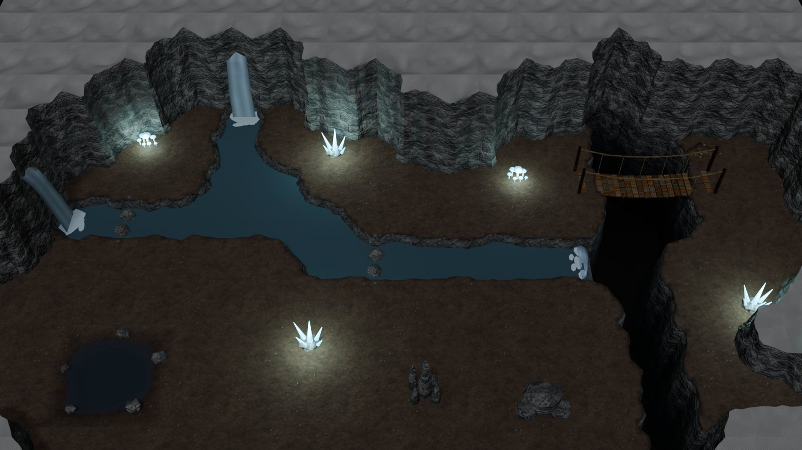
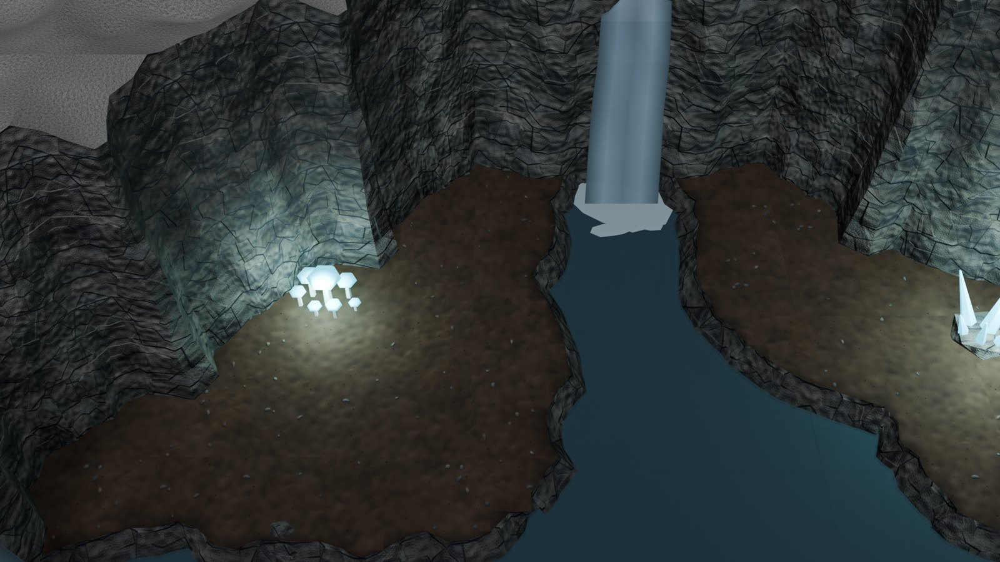
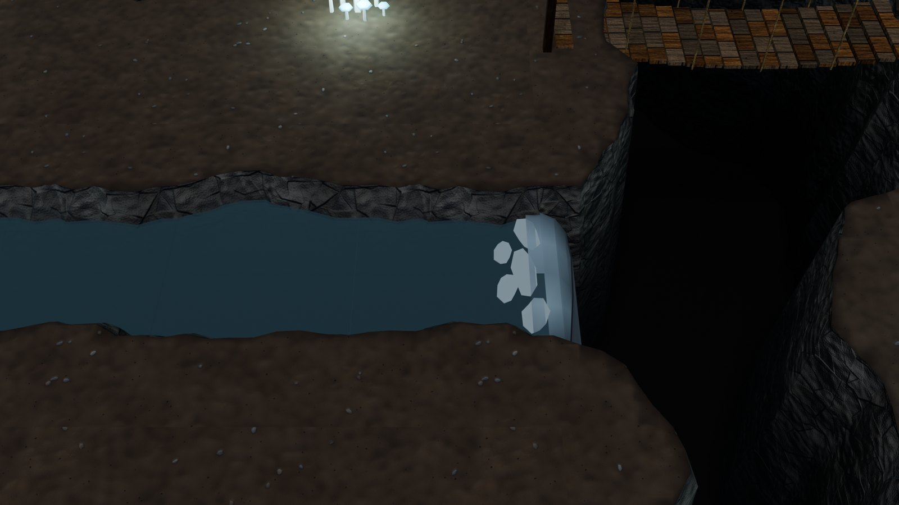
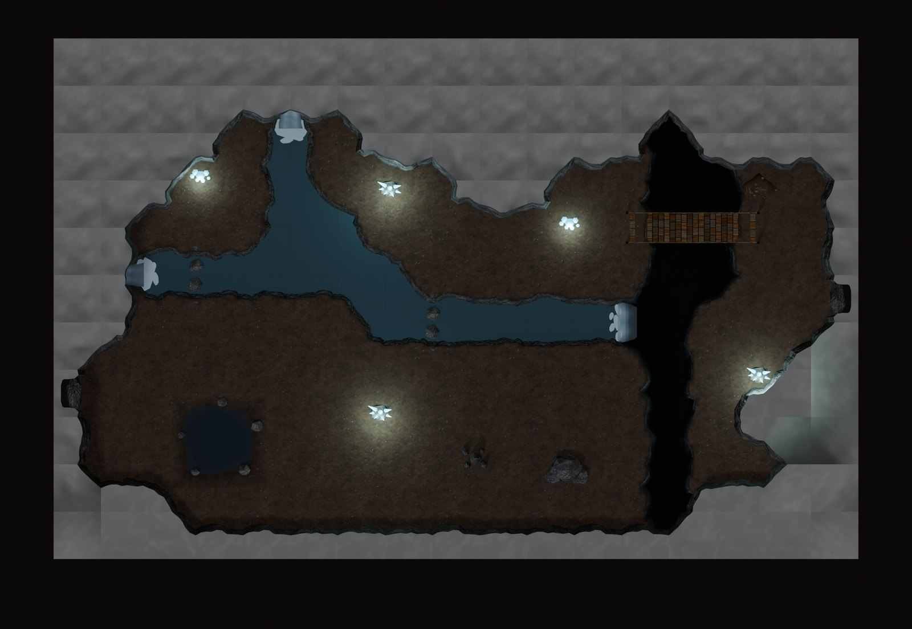

# Water kit

Natural water for the cave maps ([ADVENTURE_KIT.md](ADVENTURE_KIT.md)): streams that wind through a cave, waterfalls
from a rock face and over a chasm's lip, and stepping stones.

The meshes here are the static shapes. The **animation, foam and mist are Unity's job**: every water tile carries a
flow direction (`vki_flow`), and the waterfalls carry `vki_fx` sockets for the particle effects and splash.

The kit adds 61 masters (20,736 triangles), three materials and one level, `VKI_Cave_Falls`.



<table>
<tr>
<td width="50%"><br><sub>The spring: water leaves a cleft high in the north wall and falls into the stream (<code>Prop_Waterfall_Rock</code>); the stream's banks slope into clear water over a pebbly bed.</sub></td>
<td width="50%"><br><sub>The river pours over the lip into the chasm (<code>Prop_Waterfall_Chasm</code>, placed by the assembler); the rope bridge crosses beside it.</sub></td>
</tr>
</table>



## 1. Streams

In a cave map, cells coded `ss` are stream. The stream tiles (`vki_fam_water`, class `ground`) work like the chasm's
ground tiles:

- **Where they go.** A tile stands on every node with stream among its four cells. Its code is SW SE NE NW, X
  (stream) or O.
- **What a tile holds.** Each tile carries the floor of its whole footprint, with the stream's bed cut out by the cave
  field (the bilinear blend plus windowed noise, both ways), so the stream meanders, swells and narrows freely.
  - Banks of wet rock slope in 0.32 m as they fall to the bed.
  - The bed is at −0.45: pebbly cave earth (`M_VKI_StreamBed`, ASH slot).
  - The water is at −0.22: clear (`M_VKI_StreamWater`, WATER slot, 72 % opaque, so the bed shows through).
- **Never rotated.** Like the chasm's, the tiles are never rotated (their floor is world-locked). There are 14 codes ×
  4 node parities, plus `Ground_Stream_XXXX` (water and bed only): 57 masters, 24–508 triangles each.
- **Seams.** Water and bed are closed slabs over the whole tile, 1 mm short of its edges. Inside the bank solid they
  are hidden; across tile edges they meet their neighbours'.
- **Colliders.** A tile's colliders cover the water, not the banks (the stream is shallow). They are soft, like the
  chasm's: the walk BFS crosses them only on a deck (stepping stones, a bridge).
- **Width.** A one-cell stream is about 1.3 m of water; two cells make a river or a pool at a confluence.

**Where a stream goes:**
- **Into a chasm.** A stream cell next to a chasm cell makes the chasm's tiles take the shared nodes (the stream counts
  as chasm there, so it pours in). The assembler puts a `Prop_Waterfall_Chasm` on that stream cell's centre, facing
  the chasm.
- **Under rock.** At its ends a stream can run in under the rock: the rock's foot overhangs its rounded tip, so it
  seems to rise from or sink into the rock.
- **From a spring.** Put a `Prop_Waterfall_Rock` (or `_RockLow` on Cut rock) on the cell edge where the stream starts
  against the rock.

**Flow, for Unity** (`vki_cave_flow`):
- **Sinks.** The level knows where the water leaves: every stream cell next to the chasm, plus
  `R["stream_sinks"] = {cell: (dx, dy)}`.
- **Search.** A breadth-first search from the sinks gives every stream cell a direction toward its neighbour one step
  nearer a sink.
- **Per tile.** Each tile gets the normalised sum of its stream corners' directions as `vki_flow` (world x / y), to
  drive the flow map of Unity's water shader.
- **Still water.** Cells no sink reaches keep no flow.
- **Sewer channels.** They get the same, from `R["channel_sinks"]` ([SEWER_KIT.md](SEWER_KIT.md)).

## 2. Waterfalls and crossings

| Piece | What it is |
|---|---|
| `Prop_Waterfall_Chasm` | the stream pouring over the chasm's lip: a sheet from over the water (z −0.21) curving over and falling 3.6 m, 1.32 m wide at the lip narrowing to 0.92, pale ribs, darkening into the deep; foam on the lip. `vki_fx`: `waterfall` at the lip, `mist` below. Placed by the assembler. |
| `Prop_Waterfall_Rock` | a fall from a cleft in a Full rock face at 2.30 m (the sheet starts 0.40 m inside the face, since the rock's lobes wander), curving out into the stream 0.6 m from the face; foam at its foot; `vki_wall_anchor` (may enter the rock). Local +y into the rock, hug off. |
| `Prop_Waterfall_RockLow` | the same from a Cut rock face (0.85 m) |
| `Prop_SteppingStones` | four flat stones across a one-cell stream, pale dry tops; a 2.4 m `vki_bridge` deck. On a stream cell's centre, rotation 0 for a west–east stream. |

- **The sheets.** Each sheet is a closed 1.2 cm shell in five columns. Its vertex darkness streaks it: paler ribs,
  darker thin edges, and toward the deep for the chasm fall. It reads as falling water in a still render; Unity will
  scroll a texture down it.
- **Materials:** `M_VKI_WaterFall` (pale, 82 % opaque) and `M_VKI_Foam` (now whiter; the sewer's outfall uses it
  too).
- **Tri budget:** 356 per waterfall (T9 prop dressing limit 400), 80 for the stepping stones.

## 3. The level

**`VKI_Cave_Falls`, an underground river** (16 × 10 cells, Cavern preset). Links: `west` → `VKI_Dungeon_B4` and
`east` → `VK_ValleyTown` (tunnels; east comes out at the valley's spring cave, [WORLD_GRAPH.md](WORLD_GRAPH.md)). The caverns have a
`falls` tunnel back.

- **The river.** A spring falls from a cleft high in the north wall into a stream that winds south. A tributary falls
  from the west wall and joins it in a wide confluence (a 2 × 2 pool of stream cells).
- **The fall.** The river runs east under stepping stones and pours over the lip into a chasm that splits the cave.
- **Beyond.** A rope bridge crosses the chasm to the east ledge and the tunnel on. A pool lies in the south-west.
- **The sacred spring.** By the river, its stele backing onto the bank, stands the level's point of interest: a carved
  basin fed from the stele's spout, crystals crowning it (`POI_SpringShrine`,
  [POINTS_OF_INTEREST.md](POINTS_OF_INTEREST.md)).
- **Dressing.** Crystals, glowing mushrooms, stalagmites, boulders.

It checks at **0 errors and 0 warnings**, with full BFS reach (1,823 / 1,823). Floor luma is 0.159, cap tops 0.365.
It has 44,814 triangles with the shrine's 1,612, and 53,212 with its 32 pieces of debris ([DEBRIS.md](DEBRIS.md)). The first build had 60,710 (rock 36,472 in 102 tiles, the stream
10,240 in 31 tiles, the chasm 7,552). The rock, stream and chasm tiles have since dropped the bottom faces nothing
sees ([DWARF_KIT.md](DWARF_KIT.md), section 6).

The adventure catalog has five more groups (`G26`–`G30`): the stream tiles by parity, then the waterfalls and stepping
stones. The chasm fall hangs below the catalog's floor there; see it in the level.

## 4. Code

| Text (`src/interior/`) | Contents |
|---|---|
| `vki_fam_water` | the stream tiles (`vki_wat_stream`, `vki_wat_slabs`), the waterfall sheets (`vki_wat_sheet`, `vki_wat_foam`), the falls and stepping stones; `VKI_WAT_NAMES` (61), `VKI_WAT_STREAM_NAMES` |
| `vki_rooms_water` | `VKI_PLANS` / `VKI_ROOMS` for `VKI_Cave_Falls`, `VKI_WATER_SCENES`, the five catalog groups |

Changes to shared texts:
- `vki_rooms_adventure`:
  - `vki_cave_ground` lays the stream tiles beside the chasm's, applies the stream-into-chasm rule and returns the
    waterfalls;
  - `vki_cave_flow` / `vki_cave_tile_flow` compute the flow;
  - the channel tiles get flow too;
  - `vki_cave_layout` returns `auto_props`.
- `vki_rooms`: the builder writes `vki_flow` on water tiles and places the layout's `auto_props` with the props.
- `vki_core`: materials, styles (`StreamWater`, `WaterFall`), the load order.

```python
g0={}; exec(bpy.data.texts["vki_core"].as_string(), g0); g=g0["vki_ns"]()
g["vki_ws_build"]("adventure", g["VKI_WAT_NAMES"]); g["vki_adopt"](g["VKI_WAT_NAMES"])   # new masters
g["vki_rebuild"](g["VKI_WAT_NAMES"])                                                     # or in place
g["vki_build_scene"]("VKI_Cave_Falls")
g["vki_rooms_shots"]("VKI_Cave_Falls"); g["vki_check"]("VKI_Cave_Falls", full=True, palette=True)
```

## 5. Known limits

- **No mixed water tiles.** A stream may meet the chasm (it pours in) and rock (it runs under), but not a pool pit, a
  sewer channel or another water type at the same node. The layout reports a stream touching a pit, and a channel
  touching a stream or the chasm.
- **A chasm fall facing east or west is seen edge-on** from the game camera, and only its lip shows. A stream reaching
  the chasm from the north shows the sheet falling toward the camera.
- **Banks and chasm walls differ in section** where a stream pours in. The waterfall covers the join.
- **Level water.** Streams are all at one level (−0.22): there are no rapids or steps down within a cave floor; height
  changes happen only at waterfalls.
- **Keep openings two cells wide.** Beside a stream, as everywhere in a cave map, a cell squeezed between rock on both
  sides closes under the 0.6 m walker (the demo lost a rock pillar to this).
