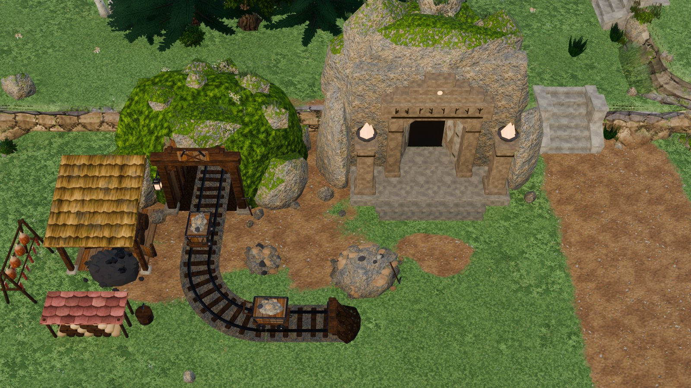
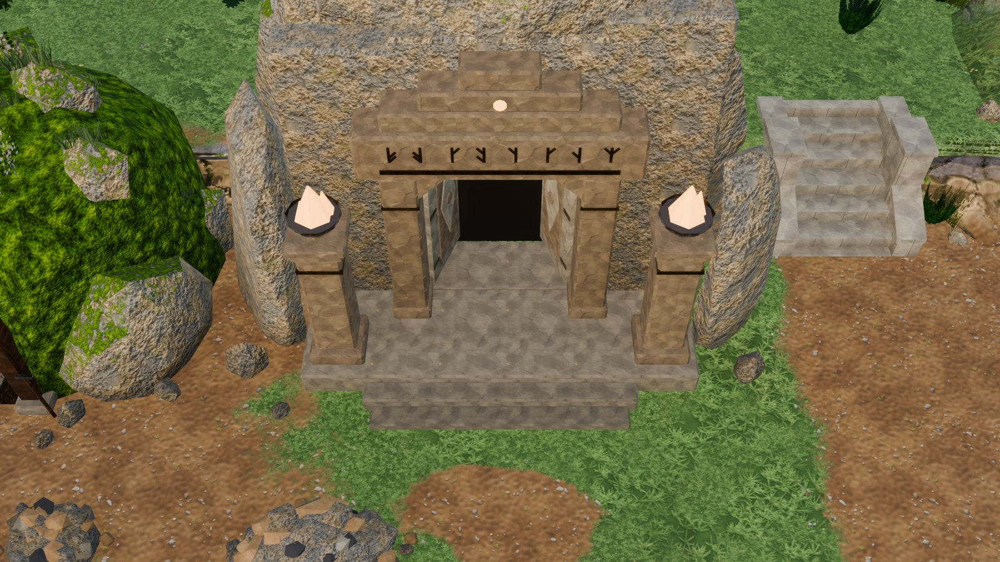
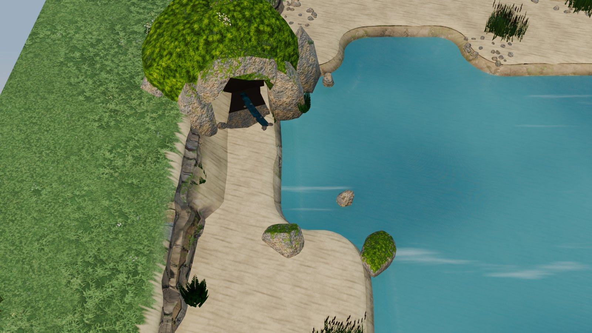
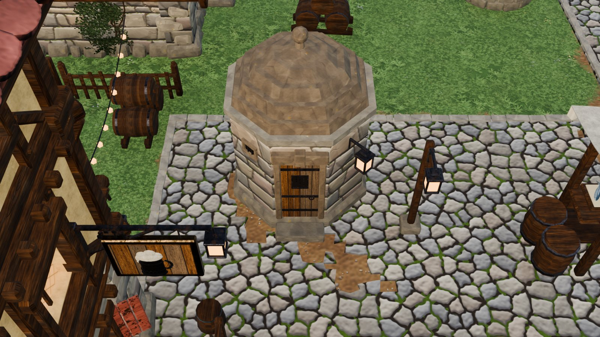
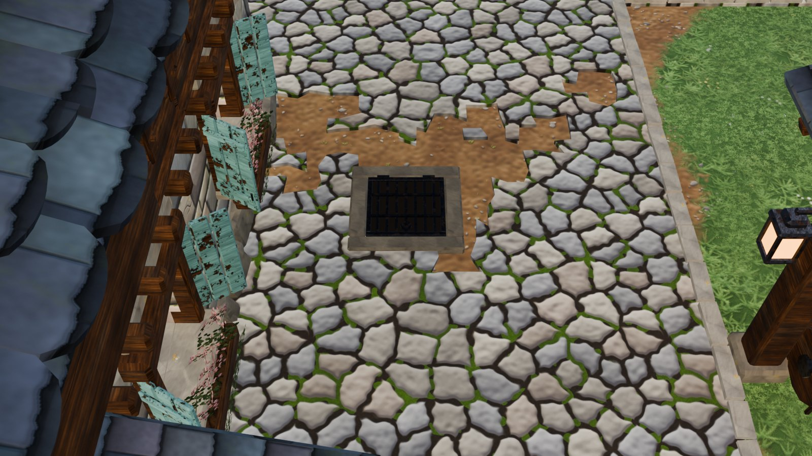
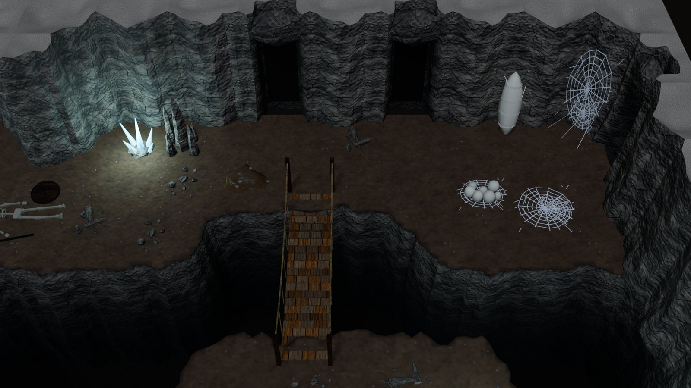

# The town connection (the world graph)

The underground levels now connect to the valley town ([VALLEY_MAP.md](VALLEY_MAP.md)). This covers the dungeon's
descent, the caves, the sewer, the falls, the dwarven halls and the mine.

- **Five ways down.** Five entrances in the valley lead underground.
- **Every link pairs.** Each link from one level to another pairs with a link back, so a walker can reach every
  level and come back the way they went.
- **Two kinds of work.** Four entrances are new exterior pieces (`vk_mod_entrances`). The checks that keep the
  graph whole are in `vki_world`.



## 1. The graph

| From the valley (`VK_ValleyTown`) | Entrance | To | Lands at |
|---|---|---|---|
| `mine_adit` | the mine portal (`SM_VK_Mine_Portal`, the mine yard on the west bench) | `VKI_Mine_M1` | `surface`, the timbered adit |
| `dwarf_gate` | the dwarves' gate (`SM_VK_Entrance_DwarfGate`, west bench, against the ridge, east of the mine) | `VKI_Dwarf_Hall` | `gate`, the great gate's passage |
| `spring_cave` | the spring cave (`SM_VK_Entrance_SpringCave`, at the river's head) | `VKI_Cave_Falls` | `east`, the tunnel past the rope bridge |
| `sewer_grate` | a sewer grate (`SM_VK_Entrance_SewerGrate`, in the main street between the gate and the plaza) | `VKI_Sewer_S1` | `street`, the ladder |
| `gaol_lockup` (stair down) | the lock-up (`SM_VK_Entrance_LockUp`, on the market place by the inn's garden) | `VKI_Dungeon_B1` | `surface`, the stair up |

Underground, the levels form one network (each line is a pair of links):

```
VK_ValleyTown ── mine_adit/surface ── VKI_Mine_M1 ── hall/mines ── VKI_Dwarf_Hall ── gate/dwarf_gate ── VK_ValleyTown
VK_ValleyTown ── gaol_lockup/surface ── B1 ── crypt/above ── B2 ── temple/crypt ── B3 ── caverns/temple ── B4 ── warren/caverns ── B5
VK_ValleyTown ── sewer_grate/street ── VKI_Sewer_S1 ── gaol/sewer ── B1
                                      VKI_Sewer_S1 ── caverns/sewer ── B4
VK_ValleyTown ── spring_cave/east ── VKI_Cave_Falls ── west/falls ── B4
VKI_Mine_M1 ── deep (lift) ── @deep            (no deeper level yet)
```

- **The arrival rule.** Through a link into level B, the walker lands at B's link whose target is the level they
  left, on its `SPN_<id>` spawn. The check (section 6) makes sure there is exactly one such link.
- **Two placeholders** stand for levels outside the graph:

  | Placeholder | Meaning | Used by |
  |---|---|---|
  | `@return` | back to wherever the game came from | the building interiors' front doors, the breach demo |
  | `@deep` | an open end below | the mine's lift |

## 2. The entrances

| Piece | What it is | Tris | Size (m) |
|---|---|---|---|
| `SM_VK_Entrance_DwarfGate` | a corbelled doorway cut into a crag: dark dressed jambs and a massive lintel with a bronze band and a line of runes, a stepped crest with a glowing rune stone, two stone leaves swung in on a dark passage, braziers burning on two piers, three steps up to a platform | 3,022 | 10.1 × 8.8 × 8.7 |
| `SM_VK_Entrance_SpringCave` | a dark mouth between mossy boulders under a lintel rock, its edges ragged, water trickling out of the dark over pebbles, a mossy hill over it | 1,158 | 8.2 × 6.4 × 4.6 |
| `SM_VK_Entrance_SewerGrate` | an iron grate over darkness in a kerb of four dressed stones, hinged on its north side, a ring to lift it by; stands 4 cm proud of the street | 598 | 1.4 × 1.4 |
| `SM_VK_Entrance_LockUp` | the town lock-up: a little octagonal stone house with a stepped stone dome and a ball finial, an iron-strapped door with a barred grille in a dressed surround, a step, a lantern, a barred vent | 1,450 | 3.2 × 3.6 × 4.7 |
| `SM_VK_Mine_Portal` (existing, `vk_mod_industry`) | the timbered mine entrance in a boulder mound | 3,976 | 8.9 × 7.9 × 5.8 |

<table>
<tr>
<td width="50%"><br><sub>The dwarves' gate: braziers on the piers, runes on the lintel, the leaves swung in.</sub></td>
<td width="50%"><br><sub>The spring cave at the river's head, its mouth turned toward the camera.</sub></td>
</tr>
<tr>
<td width="50%"><br><sub>The lock-up on the market place, by the inn's garden: the stair down to the gaol is inside.</sub></td>
<td width="50%"><br><sub>The sewer grate in the main street.</sub></td>
</tr>
</table>

Design notes:
- **No hole in the ground.** The terrain is a heightfield without holes, so every way down starts above ground: a
  passage into a crag, a door, a grate over a darkness card.
  - A passage into a hill must end in front of the cliff behind it, or the ground above would show inside. The
    gate's passage is 2.2 m deep and the cave's 1.9 m.
  - Further in, darkness cards (`M_VK_Void`) take over: the floor, the walls and the roof.
- **Carving, not pushing.** Rock round an opening is carved out of boxes (`ent_cut`, after the mine portal's
  `ind_carve`), and the faces left spanning the opening are deleted.
  - Only pushing vertices out of a box (`ind_keepout`) left faces stretched across the doorway: the first gate showed
    lit rock in its passage.
  - The cave's carved faces are roughened outward (`ent_roughen`), so its mouth has ragged edges, not ruled ones.
- **Seen from the colony camera.** The camera looks north at 50°, so every entrance faces south. Each also stands
  where nothing tall is in front of it: a two-storey house hides the ground up to about 8 m north of it.
  - The lock-up was first meant to go beside the fortified tower house. It did not fit between the wall tower and the
    keep, and east of the keep the merchant house hid its door.
  - On the market place's north half it is seen from every angle the camera has.
- **Bronze is metallic** (a PBR material). Facing the camera, a bronze disc mirrors the ground and reads as a hole. The
  gate's crest has a stone boss with a glowing rune instead, and its leaves have stone bosses.

## 3. Link data

Each placed entrance carries the interior kit's link properties ([INTERIOR_KIT.md](INTERIOR_KIT.md) section 2), so
one loader serves both kits:

| Where | Properties |
|---|---|
| The instance in `VK_ValleyTown` | `vki_link` (the kind), `vki_link_id`, `vki_target`, `vki_prompt`, `vki_trigger` (a box `[cx, cy, cz, sx, sy, sz]` in piece-local metres), `vki_facing_min`, `vki_level` (`VK_ValleyTown`) |
| `SPN_<id>` empties in `VK_ValleyTown` | world position (z on the ground, or on the paving), `vki_spawn_id`, `vki_facing_deg` (a bearing: 0 = +Y, 90 = +X), `vki_link_obj`, `vki_level` |
| The masters (`ENT_META`, written by `ent_stamp_meta`) | `vki_trigger`, `vki_spawn_local` `[x, y, z]`, `vki_spawn_facing`, `vki_prompt_text`, `vki_facing_min`, `vk_entrance` 1 |

| Entrance | Trigger (local) | Spawn (local) | Prompt |
|---|---|---|---|
| mine portal | inside the tunnel, y 1.1–2.4 | just inside the mouth, facing out | "Go into the mine" |
| dwarves' gate | in the passage among the leaves, y 0.75–1.65 | on the platform, facing out | "Enter the dwarven halls" |
| spring cave | inside the mouth, y 0.85–1.65 | on the sand in front, facing out | "Go into the cave" |
| sewer grate | over the grate (any facing: `vki_facing_min` 180) | 1.25 m south of it | "Climb down" |
| lock-up | at the door's step | 2.75 m in front, facing out | "Go down to the gaol" |

## 4. Placement (`vk_town_map`)

| Entrance | Where (map-local) | How it is placed |
|---|---|---|
| dwarves' gate | (21.7, 99.0) | `TOWN_ENTRANCES`, through `town_entrances(T)` |
| sewer grate | (125.4, 88.5) | `TOWN_ENTRANCES`, through `town_entrances(T)` |
| lock-up | (108.5, 106.0) | `TOWN_ENTRANCES`, through `town_entrances(T)` |
| spring cave | (7.9, 44.2), turned 20° | `TOWN_SPRING_CAVE`, in `town_spring` |
| mine portal | (12, 97.5) | `build_mine` (unchanged) |

- **`town_entrances(T)`** runs after the districts and before the infill.
  - Each entrance is registered like a building: its footprint, a clash check and stiff cells.
  - The plaza lamps dodge the lock-up.
  - A trodden patch lies before the gate's steps.
- **`town_spring`.** The spring cave replaces the old rock outcrop; a boulder, a reed clump and a fern also gave way to
  it. The other boulders moved a little (the flat one out into the pool), and two ferns flank the cave.
- **`town_links(T)`** runs last, after the paving lift.
  - It stamps the masters, tags the five instances and puts their spawns.
  - A spawn on cobbles sits on the paving (+0.06).
- **The build log** has no new entries. The known ones are the watermill and smokehouse overhangs, the skyline road
  strip, and the door and level passes.

## 5. The underground side

- **Five links now target the valley** (`VKI_TOWN = "VK_ValleyTown"` in `vki_core`):

  | Level | Link | Was |
  |---|---|---|
  | `VKI_Mine_M1` | `surface` (the adit) | `@surface` |
  | `VKI_Dwarf_Hall` | `gate` | `@surface` |
  | `VKI_Sewer_S1` | `street` (the ladder) | `@surface` |
  | `VKI_Dungeon_B1` | `surface` (the stair up) | `@return` |
  | `VKI_Cave_Falls` | `east` (the tunnel) | `@return` |

- **Three one-way links now have their way back.** The sewer led into the gaol and the caverns, and the falls into the
  caverns, with no link back to land on.
  - `VKI_Dungeon_B1` has a passage in its east wall (row 3; the torch there moved one cell north): `sewer` ↔ S1's
    `gaol`.
  - `VKI_Dungeon_B4` has two tunnels in the north shelf's back wall (nodes (7, 7) and (9, 7)): `falls` ↔ the falls'
    `west`, and `sewer` ↔ S1's `caverns`.



- **The six levels** were rebuilt and check at 0 errors (`vki_check`, full).
  - B1 keeps its warnings (HANDOFF issue 25: the cap palette, wall props near the cut cell walls).
  - B4 keeps the web corner's R-occ3.
  - The falls, the sewer, the dwarf hall and the mine have no warnings.

## 6. The check and the JSON

```python
g0={}; exec(bpy.data.texts["vki_core"].as_string(), g0); g=g0["vki_ns"]()
errors, notes = g["vki_world_check"](built=True)   # -> [], 9 notes
g["vki_world_json"](g["VKI_WORLD_JSON"])           # writes docs/world_graph.json
```

- **`vki_world_check`** reads every level's links (`VKI_ROOMS` and the valley's `ENT_TOWN_LINKS`). It reports:
  - targets that are no level;
  - one-way links;
  - ambiguous arrivals (two links back);
  - two links from one level to one target;
  - kinds that don't pair (passage ↔ passage, stair up ↔ stair down, lift ↔ lift).

  With `built=True` it also finds each link's object and `SPN_` spawn in its built scene (the valley: its
  collection). A level built before its links changed reports "rebuild the level".
- **Today:** 0 errors. The 9 notes are the seven building interiors' and the breach demo's `@return` and the mine's
  `@deep`.
- **[`world_graph.json`](world_graph.json)** lists each level with its kind and links (`id`, `kind`, `target`,
  `arrive`: the link it lands at). The start is the valley.

## 7. For Unity

- **Levels.** A level is a scene. The valley is one exterior level: the `VK_ValleyTown` collection, with its ground in
  `VK_ValleyTerrain`.
  - Its `SPN_` empties are in world coordinates, with the valley at x 1500.
  - Shift them with the map if the valley is exported at the origin.
- **The loader.** When the walker is in a link's trigger, faces it within `vki_facing_min` and takes the prompt:
  1. load `vki_target`;
  2. find the arrival link (`arrive` in the JSON, or the rule);
  3. place the walker on its `SPN_` facing `vki_facing_deg`.
- **`@return`** needs the game to remember where the walker came in: a building's door.

## 8. Known limits

- **Building doors.** The valley's building doors carry no links yet. The building interiors keep `@return`, and which
  buildings are enterable is still an open question (HANDOFF issue 21).
- **Edge-on passages.** B1's sewer passage, like S1's passage to the gaol, is in a north–south wall, edge-on to the
  game camera (ADVENTURE_KIT, HANDOFF issue 30).
- **Shallow passages.** The entrances' passages are shallow (at most 2.2 m), because the terrain has no holes.
- **The spring's trickle** ends on the floor in front of the mouth: the sand slopes to the water past it. It carries no
  `vki_flow`.
- **Geography is loose.** The underground levels do not lie under their entrances at true scale.
- **`@deep`** (the mine's lift) has no level yet.
- **One valley.** A second exterior map would need its own level id and its own entrances.

## 9. Code

| Text | Contents |
|---|---|
| `vk_mod_entrances` (`src/modules`) | the four builders (`ent_dwarf_gate`, `ent_spring_cave`, `ent_sewer_grate`, `ent_lockup`); `ENT_TOWN_SCENE`, `ENT_TOWN_LINKS`, `ENT_META`, `ent_stamp_meta`, `ent_link`; helpers `ent_prism`, `ent_void`, `ent_keep`, `ent_cut`, `ent_roughen`, `ent_rocks`, `ent_tufts`, `ent_oct`; `ENT_NAMES` |
| `vk_kit` | `vk_mod_entrances` added to `KIT_MODULES` (after `vk_mod_industry`, whose rock helpers it uses) |
| `vk_town_map` | `TOWN_ENTRANCES`, `TOWN_SPRING_CAVE`, `town_entrances`, `town_links`, the new `town_spring` |
| `vki_world` (`src/interior`) | `vki_world_links`, `vki_world_check`, `vki_world_json`, `VKI_WORLD_HOLES`, `VKI_WORLD_PAIRS` |
| `vki_core` | `VKI_TOWN`; `vki_world` in the load order |
| `vki_rooms_dungeon`, `vki_rooms_adventure`, `vki_rooms_sewer`, `vki_rooms_water`, `vki_rooms_dwarf`, `vki_rooms_mine` | the links above |

```python
exec(bpy.data.texts["vk_kit"].as_string()); g=vk_kit_ns()
g["full_rebuild"](g["ENT_NAMES"])                                          # the entrance pieces (instances update)
exec(bpy.data.texts["vk_town_map"].as_string(), g); g["build_valley_town"](seed=11)   # places and tags them (60-90 s)
```
