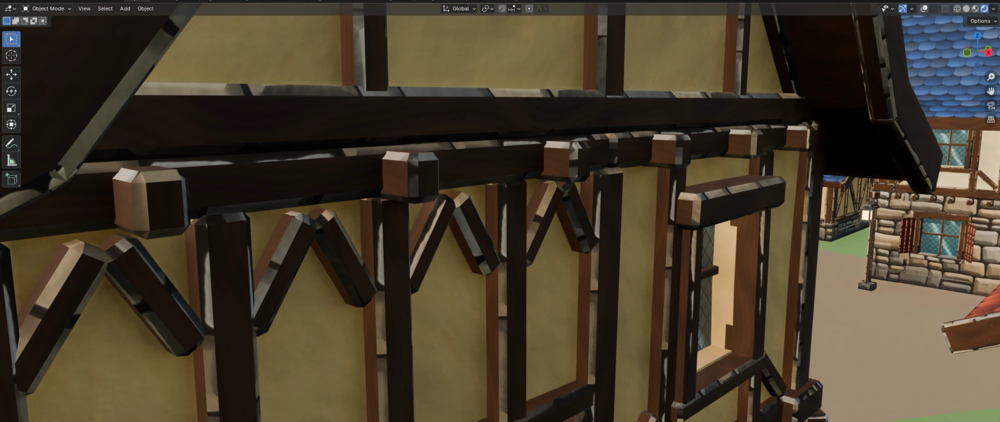
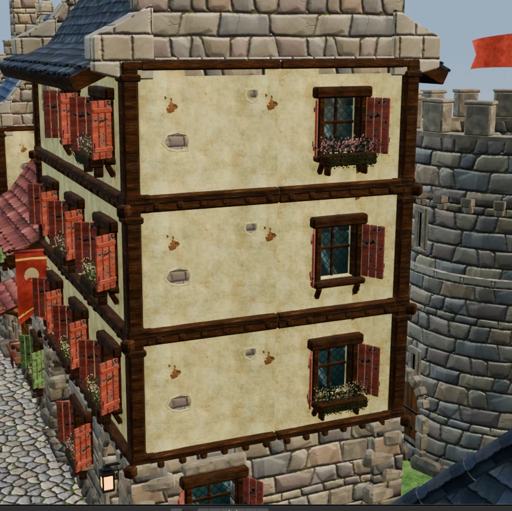
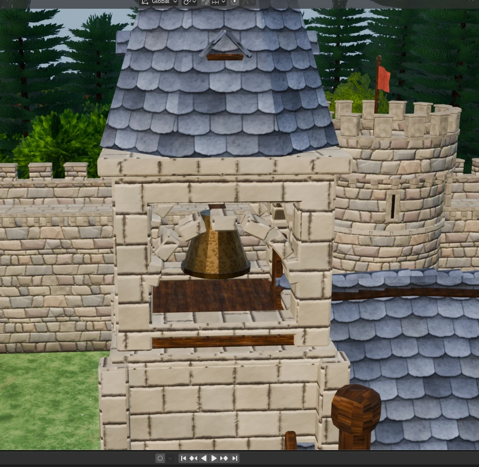
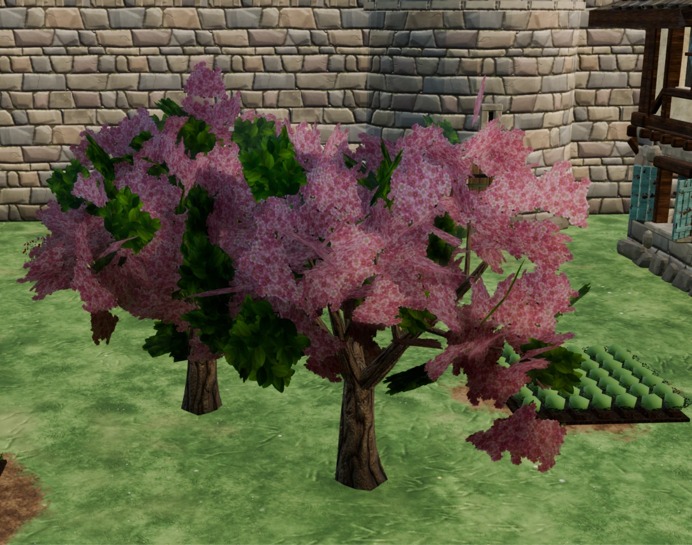
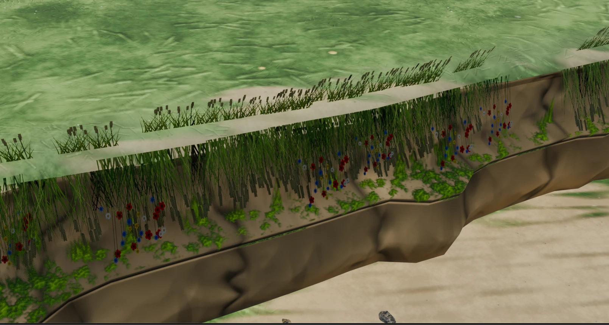
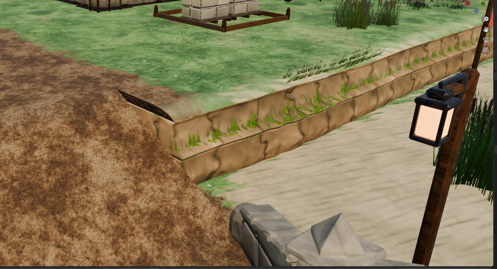
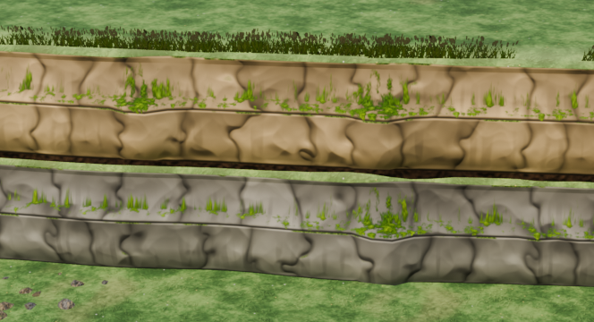
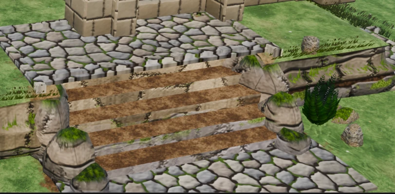

# Conversation prompts: GameArtGeneration and the Medieval Village Kit

Compiled on 2026-09-24 from the Claude Code session transcripts stored on this machine. It reproduces every message typed by the user, word for word, in order. That includes messages sent while Claude was still working and answers to multiple-choice questions. Each message has its time (UTC), any attached screenshot and, for this conversation, a note on what came of it.

## The short answer

**This conversation** (session `421a57cc-0ba3-43b1-888d-34ef79f58bc6`, titled "Medieval colony sim Blender assets") began on 2026-09-23 01:14 UTC with:

> Can you build me something impressive in blender? Maybe for a colony sim in medieval setting.

It was not the first session. An earlier session in the same project folder (session `c44d9816-7c7e-4d61-a094-6fc2606feda6`, titled "Local model capabilities for game art") began on 2026-09-21 22:44 UTC with:

> Hello, can you gain access to my comfy desktop and check out what models I have already downloaded? I'm planning on creating art assets for some game yet to be determined. I want to know what are your capabilities of using these models and my system to generate the art.

That session explored local image models (ComfyUI with Qwen, Flux and Wan) for game art. It concluded that diffusion can't animate reliably and moved toward Blender. This conversation then built the Blender medieval village kit. Both sessions are transcribed in full below.

## Where this comes from

| | This conversation | Earlier session |
|---|---|---|
| Session id | `421a57cc-0ba3-43b1-888d-34ef79f58bc6` | `c44d9816-7c7e-4d61-a094-6fc2606feda6` |
| Title (from the app) | Medieval colony sim Blender assets | Local model capabilities for game art |
| First / last activity | 2026-09-23 01:14 UTC / 2026-09-24 16:17 UTC | 2026-09-21 22:44 UTC / 2026-09-23 02:32 UTC |
| User messages | 48 | 39 |
| Models that replied | claude-opus-5-5 (3098 replies) | claude-opus-5 (718 replies), claude-opus-5-5 (473 replies) |
| Tool calls | 1606 (Blender: 537) | 550 (Blender: 48) |
| Context compactions | 3 (2026-09-23 12:21 UTC, 2026-09-23 18:10 UTC, 2026-09-24 00:18 UTC) | none |
| Multi-agent workflows | 6 runs (listed below) | none |
| Starting folder | a temporary scratch workspace, later moved to `E:\Unity\Projects\GameArtGeneration` | `E:\Unity\Projects\GameArtGeneration` |
| Claude Code version | 2.1.280 | 2.1.275 |
| Transcript file | `%USERPROFILE%\.claude\projects\E--Unity-Projects-GameArtGeneration\421a57cc-0ba3-43b1-888d-34ef79f58bc6.jsonl` (308 MB) | same folder, `c44d9816-7c7e-4d61-a094-6fc2606feda6.jsonl` (69 MB) |

**Setup traced from the transcripts:**
- Claude Code in the Claude desktop app (Code tab) on Windows 11.
- Blender 4.4 driven through the Blender MCP server.
- ComfyUI Desktop at `http://127.0.0.1:8000`, used in the earlier session only.
- Unity projects under `E:\Unity\Projects`.
- Hardware: RTX 4070 Ti SUPER (16 GB), Ryzen 5 5600X, 64 GB RAM.

**Most-used tools in this conversation:** mcp__blender__execute_blender_code ×537, Read ×486, Bash ×296, Edit ×143, Write ×35, Grep ×35, PowerShell ×31, SendUserFile ×21.

## This conversation: every user message

### 1. 2026-09-23 01:14 UTC

> Can you build me something impressive in blender? Maybe for a colony sim in medieval setting.

*What came of it:* First scene: a medieval colony diorama in Blender (scene `MedievalColony`).

### 2. 2026-09-23 01:26 UTC

> Ok, that was good, how about a modular stone wall? something we could build in the game

*What came of it:* Modular stone wall kit (scene `StoneWallKit`): walls, towers, gatehouse; FBX exports in `assets/stone_wall_kit_fbx/`.

### 3. 2026-09-23 01:33 UTC

> The guardhouse needs work on the sides

*What came of it:* Gatehouse sides reworked.

### 4. 2026-09-23 01:35 UTC

> Thank you! looks impressive. Could you make a tree now. Try to make the best treee you can, but remember it is for a videogame asset.

*What came of it:* Hero oak tree (scene `TreeAsset`), first with LODs and an impostor.

### 5. 2026-09-23 01:45 UTC

> I don't need LOD man, I wanted to check the style

*What came of it:* LODs dropped from then on ("no LODs" became a standing rule).

### 6. 2026-09-23 01:47 UTC

> this reminds me of WOW, that is good. I like this direction, but I would remove the inner volume and have only the actual leaves create the volume.

*What came of it:* Foliage rebuilt from leaf cards only, no inner volume.

### 7. 2026-09-23 01:50 UTC

> We need a game for this. I thought the walls were impressive, but they were not the style I was looking for, but this tree is, I think. How about a modular village house? Something we can use to build the entire village?

*What came of it:* Start of the modular village kit (scene `VillageKit`): wall modules, roofs, props.

### 8. 2026-09-23 02:10 UTC

> add the L-corner roof pieces and a market stall. Also improve the variations

*What came of it:* L-corner roof pieces, market stall, more variation.

### 9. 2026-09-23 02:51 UTC

> Why don't you save to disk, though? Just save the file when you feel like it, it is already named medieval diorama. You can even use Save As if you want. 
> I like this scene, keep expanding on the concept of modular village

*What came of it:* `medievalDiorama.blend` saved regularly from here on; textures packed into it.

### 10. 2026-09-23 02:56 UTC

> It's ok you expanded the village, but I wanted to expand the concept - more buildings, more props, etc
> I liked the fences, the well. Don't bother with painting the ground we will use geometry for the ground later. Special buildings for the kit will be nice.

*What came of it:* More building types and props, special buildings; ground painting dropped (terrain to be geometry).

### 11. 2026-09-23 02:58 UTC

> you can give yourself permission for more textures also

*What came of it:* Procedural PBR texture generators.

### 12. 2026-09-23 02:59 UTC

> Also, wood material needs work

*What came of it:* Wood texture reworked (screenshot attached).

### 13. 2026-09-23 03:11 UTC

> Ok, I'm setting you up to spend more credits. Keep expanding on the theme, under your judgement. You can inprove on the current buildings or create new ones. Remember to have things modular. You can expand on materials. It would be interesting if the materials had normals (I understand this means remaking them), or heightmaps, or those things that make them look better. Don't be shy on adding geometry as well, for finer detail.
> I'm off to bed now, I'll be back in a few hours

*What came of it:* PBR maps with normals; kit expanded (multi-agent workflows followed).

### 14. 2026-09-23 03:13 UTC

> (also, remember to take screenshots and evaluate your production, feel free to make changes if you deem they are required)

*What came of it:* Render-and-check loop adopted after every change.

### 15. 2026-09-23 10:42 UTC

> Add more nature features, like new trees, bushes, rocks, etc

*What came of it:* Nature set (`vk_nature`): trees, bushes, rocks, plants (39 pieces).

### 16. 2026-09-23 11:18 UTC

> Keep working on features, you can expand the types of houses and new features for the village. For the terrain we will do tiles that fit in a marching square system, connecting them by their corners. Rework the stone texture

*What came of it:* Design panels, 8 building-module agents, the marching-squares terrain kit, stone texture v2.

### 17. 2026-09-23 15:41 UTC

> Atingi meu limite de uso enquanto você trabalhava, mas ele já foi reiniciado. Por favor, continue de onde parou.

*What came of it:* Resumed after the usage limit.

### 18. 2026-09-23 15:46 UTC

> @"E:\Unity\Projects\MedievalSetting\Assets/"
> I have opened a Unity project you can use as you see fit, It is called MedievalSetting.
> However, my idea is to finish the blender files first, and only later export everything.

*What came of it:* Unity project `E:\Unity\Projects\MedievalSetting` noted as the export target (export deferred until asked).

### 19. 2026-09-23 20:34 UTC

> When the credits come back and you resume working, don't overextend, just finish the tasks we have now. I want to steer the creation in some directions, so we can't spend all the credits all at once.

*What came of it:* Standing rule: finish the current tasks, don't overextend; the user steers.

### 20. 2026-09-23 20:52 UTC

> Ok, first request is to help me control the camera in blender like I do in Unity

*What came of it:* `blender_addons/unity_nav.py`: Unity-style viewport navigation, installed.

### 21. 2026-09-23 21:10 UTC

> plaster needs less variance, we can tell from shit shot it is a texture

*What came of it:* Plaster texture made more even.

### 22. 2026-09-23 21:11 UTC

> Something is wrong on the bell tower, I think that the faces are missing on the top of the arch

*What came of it:* Bell tower arch faces fixed.

### 23. 2026-09-23 21:44 UTC

> This tree looks weird, is there some way we can reduce this billboard effect? I noticed that the very first tree you made didn't have this effect, maybe due to having more polygons?

*What came of it:* Trees rebuilt with denser leaf cards to reduce the billboard look.

### 24. 2026-09-23 21:47 UTC

> What is going on here? Many things probably not right, the plants are upside down, the geometry is weird with holes I think

*What came of it:* Cliff plants flipped upright; holes fixed.

### 25. 2026-09-23 21:51 UTC

> I liked the first tree when you increased the folliage, no lumps for volume. But the foliage in the cherry tree is not as pretty as the foliage on the first tree

*What came of it:* Cherry blossom foliage repainted in the hero oak's style; no solid cores.

### 26. 2026-09-23 22:26 UTC

> Ramps don't look like they are matching, can you fix this? Maybe create a transition tile if necessary

*What came of it:* Ramp/cliff mismatch investigated.

### 27. 2026-09-23 22:33 UTC

> I think the ramp tile should have a special version that connects to the cliff, and the cliff tile should have a special version just to connect to the ramp

*What came of it:* Ramp tile that blends into the cliff (`ramp_blend_shoulder`).

### 28. 2026-09-23 22:40 UTC

> ahh, much better now. Some texture tiling issues, now it is something we can cover with props, if the texture tiling canot be fixed

*What came of it:* Remaining texture seams to be covered with props.

### 29. 2026-09-23 22:46 UTC

> awesome. Now I'm thinking about the cobblestone transition to the grass. Since coblestone has a clear change from grass, it could be something slightly higher than grass, with a trim creating the delimitation. Is that called a curb? There could also be patches on the cobblestone where the stone is missing, revealing the terrain below it (dirt?).

*What came of it:* Cobble paving mesh with curbs and missing-stone patches.

### 30. 2026-09-23 22:56 UTC

> The market stalls are all the same, changing only the color of the fabric. Can you add some variation into them? Perhaps different goods being sold?

*What came of it:* Market stalls in 8 trades, each with its own goods.

### 31. 2026-09-23 23:00 UTC

> why do they all have that weird round thing with them?

*What came of it:* Grain sack redesigned.

### 32. 2026-09-23 23:06 UTC

> Ok, every rpg needs the blacksmiths and the taverns, they need to pop from the general buildings

*What came of it:* Landmark smithy and inn.

### 33. 2026-09-23 23:11 UTC

> You know, all the "venesianas" have this worn out look. It is ok if some building have it, but most of the time they should not look worn out

*What came of it:* About 1 in 5 shutters worn; the rest freshly painted.

### 34. 2026-09-23 23:22 UTC

> Is it time we start a new session or do we keep building on this one?

*What came of it:* Recommended organizing the files and writing a handoff before a new session.

### 35. 2026-09-23 23:23 UTC

> yes, put them in E:\Unity\Projects\GameArtGeneration, somewhere you deem fit. Try to save as much as possible from scripts you created for this, organize them into something coherent.

*What came of it:* Everything organized into `E:\Unity\Projects\GameArtGeneration\MedievalVillageKit`.

### 36. 2026-09-23 23:40 UTC

> Where are you saving these things? How about creating a repo?

*What came of it:* Git repository created.

### 37. 2026-09-23 23:41 UTC

> @"E:\Unity\Projects\GameArtGeneration/"
> You can use this folder

### 38. 2026-09-23 23:49 UTC

> The gitHub can be public, this is why I'm making it.

*What came of it:* Published at https://github.com/danielgruginski/MedievalVillageKit (public).

### 39. 2026-09-23 23:55 UTC

> These are too clean, they don't look natural. You can use more geometry for those, but make them natural, or keep those but add natural choices.

*What came of it:* Natural cliffs: new rock texture, rock relief, stacked ledges, boulders, rubble and plants.

### 40. 2026-09-24 00:11 UTC

> We also need to remove eveything that is synthy from the github. And you know, the renders file does not need to be in the github, right? Can't we ignore that folder? It is over 1Gb of files, and they should not be necessary for people using the stuff. Also, some screenshots showcasing this would be nice.

*What came of it:* Third-party (Synty) names purged from the repo history; renders kept out of git; README gallery added.

### 41. 2026-09-24 00:54 UTC

> stairs should be cobble, though

*What came of it:* Built stairs: cobble treads, dressed-stone risers and side walls.

### 42. 2026-09-24 01:05 UTC

> dude, the stairs have dirt anf stone textures, it should be something manmade

*What came of it:* Found and fixed the bug that reset stair and curb faces to the terrain material.

### 43. 2026-09-24 01:10 UTC

> yes, push it

*What came of it:* Pushed (commit `fe9e9d9`).

### 44. 2026-09-24 01:37 UTC

> I don't like the dirt texture, can you improve it? It looks like dirty, not dirt, does that make sense?

*What came of it:* New dirt texture (`gen_dirt_v2`).

### 45. 2026-09-24 02:15 UTC

> wait, before you push it, also improve the grass, it has the same issue

*What came of it:* New grass texture (`gen_grass_v2`); pushed (commit `a26fce5`).

### 46. 2026-09-24 02:29 UTC

> don't you want to add materials to the cabbages and pumpkins? We can have an atlas of those small details, adding more stuff you believe needs a texture - there is cheese, carrots, tannin racks, bread, fish, maybe even more stuff that could use texture

*What came of it:* Goods atlas `T_VK_Goods` (16 painted cells) on 27 kit pieces.

### 47. 2026-09-24 15:57 UTC

> Hello, someone asked me to the prompt of this conversation, can you retrieve it? Add all the information you can trace back into a new file

*What came of it:* This prompt history, compiled from the transcripts.

### 48. 2026-09-24 16:14 UTC

> Thank you, you can add to the repo as a reference, people have been asking me for this. You can also push the last changes

*What came of it:* This file added to the repo under `docs/conversation/`, and the goods atlas pushed with it.

## Earlier session: every user message

### 1. 2026-09-21 22:44 UTC

> Hello, can you gain access to my comfy desktop and check out what models I have already downloaded? I'm planning on creating art assets for some game yet to be determined. I want to know what are your capabilities of using these models and my system to generate the art.

*What came of it:* Opening prompt of the earlier session.

### 2. 2026-09-21 22:46 UTC

> "Let me look at your existing game-art workflows to understand your pipeline." - > I don't have a workflow, or my workflow sucks

### 3. 2026-09-21 22:47 UTC *(answer to a multiple-choice question)*

> (answer to: What art direction should I tune the pipeline for?) Top-down ortho RPG (Recommended)

### 4. 2026-09-21 22:47 UTC *(answer to a multiple-choice question)*

> (answer to: What should I produce first, so the pipeline proves itself on something real?) ['Characters']

### 5. 2026-09-21 22:54 UTC

> This is the problem with qwen, I think, it has a limited "palette" of drawings, and keeps the shape it has selected. Do you want to try other models? Or is qwen the best at following instructions?

### 6. 2026-09-21 22:57 UTC

> I really liked cam_c_zelda, but it is not the correct angle

### 7. 2026-09-21 22:58 UTC

> wait, can't we setup a manequin in blender?

### 8. 2026-09-21 23:07 UTC

> what about using qwen edit mode instead of a depth field?

### 9. 2026-09-21 23:09 UTC

> I opened a unity project, it has sinthy models, if you want to take a look. Projects/DungeonProject

### 10. 2026-09-21 23:17 UTC

> The folder should also have animations, they could be useful for the posing

### 11. 2026-09-21 23:21 UTC

> I'm importing human basic motions

### 12. 2026-09-21 23:22 UTC

> Look for them in the Kevin Iglesias folder

### 13. 2026-09-21 23:34 UTC

> Are you adding a reference to qwen? For instance, using the first result qwen produced as a source of information for producing the directions. Or perhaps making an image where the reference image is on the left and the desired output is produced by qwen on the right - then we keep only the right.

### 14. 2026-09-21 23:44 UTC

> You know, The subtle changes means it won't work for animation, right? Can we use a model for actual animation for producing the frames?

### 15. 2026-09-21 23:52 UTC

> you can use another model, there is a manequin from Kevin that is HumanM, has higher poly count

### 16. 2026-09-22 00:02 UTC

> let's retry wan, do what you have to do

### 17. 2026-09-22 00:03 UTC

> Or we try qwen with the references frame by frame. In this case, we do only 8 animation frames.

### 18. 2026-09-22 00:50 UTC

> You made no mention about the character having 3 legs in some frames. Also, my idea was that 8 frames would be the total animation, not just the initial part of a 21 frame animation. Realistically how many frames should we have for the walking animation?

### 19. 2026-09-22 00:56 UTC

> Tentar novamente

### 20. 2026-09-22 01:38 UTC

> I stopped the execution because something is not right with the generation

### 21. 2026-09-22 01:41 UTC

> I think cfg 3.0 is important to produce reliable results, even if we are having troubles right now

### 22. 2026-09-22 01:48 UTC

> (ok, maybe it could be too high)

### 23. 2026-09-22 01:59 UTC

> Let's take a step back. Is it even viable to produce things the way we are doing? None of the methods worked so far, and I see artifacts in the production of the next one already. How can we rely on bone animation only, to produce quality graphics for a game that does not look like slop?

*What came of it:* Conclusion (recorded in memory): diffusion can't produce consistent animation frames.

### 24. 2026-09-22 02:05 UTC

> We are trying to produce quality art to be used in a game, trying different styles to see what is better. I don't really like synty  models, I wanted something better, but obviously generative images is not the answer, not for animation at least. What about oxygen not included style of animations? These would be static images animated by bones, right?only problem is that for a top down perspective we would need to repeat the process for rotating the model 8 times, and that is when the discontinuity errors creep in

### 25. 2026-09-22 02:10 UTC

> let's go with 35 degrees, prototype the cut-out rig

*What came of it:* Cut-out rig prototype at a 35-degree camera.

### 26. 2026-09-22 02:29 UTC

> we can't cut the image after it generates, we need to ask qwen to genarate them for that purpose. Ok, but I have no idea how

### 27. 2026-09-22 02:32 UTC

> Forget about the generation, what kind of game can we produce with the assets we can properly bake?

### 28. 2026-09-22 02:44 UTC

> We don't have to use generative AI, I was just expanding on the options, we could use your blender skills as well. And the type of game is also completely open, I just want something that is interesting to  look at. Been checking out itch.io, looking for sprites, but nothing that was interesting for me. Even 2D or 3D, the goal is to get something that looks good, considering your skills for developing it, plus the resources we have at our disposal

### 29. 2026-09-22 02:48 UTC *(answer to a multiple-choice question)*

> (answer to: Which visual direction should I prototype? I'll build a real Blender render, not a mockup.) ['Flat-shaded procedural world']

### 30. 2026-09-22 02:48 UTC *(answer to a multiple-choice question)*

> (answer to: What kind of thing should the prototype depict, so the style test is representative?) Both, side by side

### 31. 2026-09-22 03:12 UTC

> How about that hex map you made, but with items generated in qwen, displayed like bilboards. Game could be a colony sim.

### 32. 2026-09-22 15:59 UTC

> Can you bake me a logo for Unproportional Games?

### 33. 2026-09-22 21:35 UTC

> where is it? I can't see it

### 34. 2026-09-22 21:42 UTC

> Ok, thanks. I'm feeling like trying some more qwen generation. How about we try to produce a tileset? The idea is to make ground textures and then use masks for the qwen to build borders for it. So, what works best for producing a ground texture, qwen or flux? Or other models I have?

### 35. 2026-09-22 21:49 UTC

> it is for a square grid, and I want the marching squares aproach

*What came of it:* Grass/dirt marching-squares tileset with a Unity dual-grid package (`GameArtGeneration/pipeline`, `unity/DualGridTerrain`).

### 36. 2026-09-22 21:53 UTC

> Here is a method I used, but a little complicated. I would do the canvas be a 3x3 grid of tiles. The center tile is the one we are interested in, and the onde the LLM will paint, The surrounding tiles are ones that already exist and we want the current tile to tile into them.

### 37. 2026-09-22 21:57 UTC

> you know those control nodes that dictate the volume of the image? Couldn't they help us create images that need to be flat, like textures?

### 38. 2026-09-23 00:17 UTC

> juwe can do a plat shader.

### 39. 2026-09-23 00:19 UTC

> (wait, 4 variants is better, even though...)

## Multi-agent workflows run in this conversation

| Workflow | Date (UTC) | Agents | Purpose |
|---|---|---|---|
| `village-expansion-design` | 2026-09-23 | 11 | Design panels for the marching-squares terrain tiles, new village buildings and features, and the stone texture rework |
| `village-kit-buildings` | 2026-09-23 | 8 | Eight parallel building agents extended the village kit, each in its own module |
| `village-kit-buildings-continue` | 2026-09-23 | 8 | Resumed the eight building agents after a usage limit, to finish and report |
| `valley-review` | 2026-09-23 | 5 | Multi-lens visual review of the valley town and kit, then a verification pass |
| `nature-mesh-fixes` | 2026-09-23 | 3 | Fixed the willow, birch, pine and hydrangea meshes, then critiqued them from renders |
| `valley-rereview` | 2026-09-23 | 8 | Re-reviewed the rebuilt valley: confirmed the 33 earlier issues fixed and looked for regressions |

The scripts are in [tools/workflows/](../../tools/workflows/), and the agents' reports in [reviews/](../../reviews/).

## Decisions and preferences recorded along the way

From Claude's saved memory notes (earlier session) and the project handoff (`MedievalVillageKit/HANDOFF.md`):

- **Earlier session: what the local image models can and can't do.**
  - Diffusion can't make consistent animation frames. Per-frame Qwen, Wan 2.2 Animate and cut-out rigs from generated art all failed, so animation belongs to deterministic 3D rendering.
  - Qwen-Image ignores camera directions given in text. Flux follows them, but the style LoRAs available here are Qwen-only.
  - Flux Fill heals, Qwen Edit creates: use Flux Fill for seams and removals, Qwen Edit to add detail.
  - At cfg 1.0 the negative prompt has no effect. Use cfg ~3 with the Lightning LoRA off when negatives matter.
  - Tileset decisions: marching squares on a square grid, 4 phase variants chosen by position, and a Unity dual-grid package (matched Python 70/70).
  - Check generated art at full resolution (e.g. a three-legged walk frame) before calling it good.
- **This conversation: working agreements.**
  - Style: hand-painted, World of Warcraft-like, readable from a colony-sim camera. No LODs.
  - Terrain is geometry: marching-squares tiles connected by their corners.
  - Render and check after each change, save the .blend, and finish the task at hand without overextending.
  - Unity export only when asked (target `E:\Unity\Projects\MedievalSetting`).
  - The GitHub repo is public. Keep third-party (Synty) assets, the .blend and renders out of it.
  - Taste notes:
    - Plaster even; tree foliage from dense leaf cards, with no solid cores.
    - Cobbles sit on curbs, with a few missing-stone patches; market stalls sell different goods; the smithy and inn stand out.
    - Most shutters freshly painted; cliffs natural; stairs man-made.
    - Ground textures read as the material, not as grime; small goods textured from an atlas.

## What the work produced

- Repository: https://github.com/danielgruginski/MedievalVillageKit (public).
  - Commits: `251b7d7` initial import (history rewritten to remove third-party names), `6925246` natural cliffs,
    `081ae40` README gallery, `fe9e9d9` built stairs, `a26fce5` new dirt and grass, then the goods atlas and this file.
- Working file: `MedievalVillageKit/blender/medievalDiorama.blend`. It is kept out of git because of its size and third-party content.
- Project docs: [README](../../README.md), [HANDOFF](../../HANDOFF.md), [KIT_README](../KIT_README.md), [VALLEY_MAP](../VALLEY_MAP.md) and [PIECES](../PIECES.md).
- Full history: [archive/script_logs/](../../archive/script_logs/INDEX.md) holds every script run in Blender.
- Earlier session outputs are on the author's disk, outside this repository: `GameArtGeneration/pipeline/`, `GameArtGeneration/unity/DualGridTerrain/` and related folders.

## What is not in this file

- **Claude's replies and tool output.** They're in the transcript files named above (on the author's machine, not in this repository): JSON Lines, one event per line.
- **The system instructions and tool definitions** Claude Code supplies to the model. They aren't the user's prompt and aren't reproduced here.
- **Automatic events:** system reminders, "continue where you left off" context summaries, and background task notifications.
- **Timestamps** are in UTC, as stored in the transcripts.
- **Duplicates:** a message that appears twice (queued, then delivered) is listed once.
